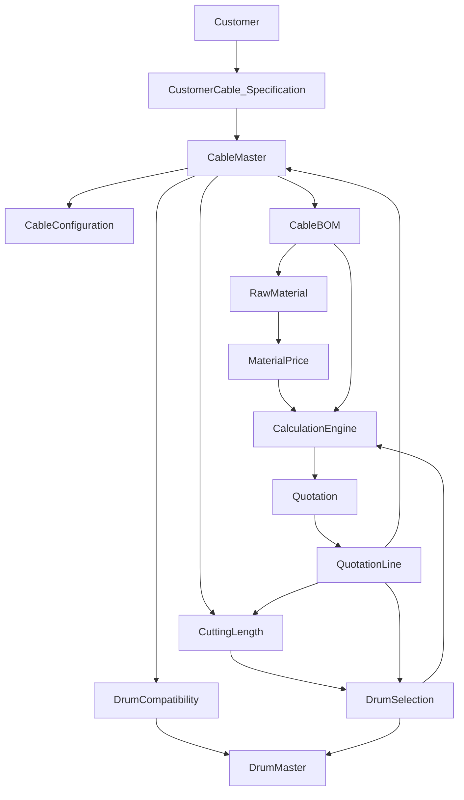

# Drum Master Domain

**Workbook:** [`data/source/Drum List.xlsx`](../data/source/Drum%20List.xlsx) (also `public/source/Drum List.xlsx`)  
**Records:** **103** unique drums  
**This documentation pass:** Increment 3 implements the selection **boundary** only. Prototype K/S/P optimizer and Wood/Steel reel dropdowns remain.

Drum Master **repository already exists** from Increment 2 (`drumMasterService`, `localStorage` `energya_drum_master_v1`). Records are **not** hard-coded in React. They appear only after Import Center commit (`commitDrums`). Prototype optimizer still uses a **separate** K/S/P catalog — preserved; do not delete.

**Automatic EWD selection:** `drumSelectionService.selectDrum({ method: 'AUTOMATIC' })` always returns `CONFIGURATION_REQUIRED` and `selectedDrum: null`.

**Manual EWD link:** quotation Drum Details can store optional `drumMasterCode` on a schedule row without replacing `drumType`.

**Drum Compatibility** is **not implemented** in code (no table, no import kind). Do not fabricate rows.

---

## Source Excel structure

| Item | Value |
|------|--------|
| Sheet | `Sheet1` |
| Columns | Drum Code, Flange, Barrel, Inner Width, Outer Width, Capacity |
| Header + data | 1 + **103** |
| Types | Drum Code string; all others integers |
| Blanks | none |
| Duplicate Drum Code | **none** |
| Pattern | `EWD{flange}-{suffix}` e.g. `EWD630-0`, `EWD630-T06`, `EWD700-3`, `EWD1200-K12`, `EWD3000-7` |
| Flange | 630 … 3000 |
| Barrel | 300 … 1850 |
| Inner Width | 335 … 1900 |
| Outer Width | 403 … 2050 |
| Capacity | 250 … 8000 |
| Clearance / MaxLoad / Empty weight | **Absent** in authoritative workbook (2026-09-01 audit) |
| Inner > Outer | 0 |
| Barrel ≥ Flange | 0 |

Examples (source, not invented):

| Drum Code | Flange | Barrel | Inner Width | Outer Width | Capacity |
|-----------|--------|--------|-------------|-------------|----------|
| EWD630-0 | 630 | 300 | 600 | 760 | 650 |
| EWD630-T06 | 630 | 315 | 335 | 403 | 250 |
| EWD700-3 | 700 | 400 | 600 | 760 | 650 |

**Units are not in the file.** Do not assume mm or metres. Store source numbers; `dimensionUnitNote = SOURCE_UNIT_NOT_IN_FILE`; `capacityUom = CONFIGURATION_REQUIRED`. Retain the name **Barrel** (not renamed to “core diameter” without engineering).

No drum type, tare, material, cost, max weight, or packing factor in this workbook.

---

## Field mapping

| Excel | `DrumMasterRecord` | Notes |
|-------|-------------------|--------|
| Drum Code | `drumCode` | Natural key; `id` = `drm-{code}` on first import |
| Flange | `flange` | Source name Flange; prompt alias flangeDiameter is documentation-only |
| Barrel | `barrel` | Keep business meaning “Barrel” |
| Inner Width | `innerWidth` | Do not call traverse unless source says so |
| Outer Width | `outerWidth` | |
| Capacity | `capacity` | Integer; UOM unknown (`CONFIGURATION_REQUIRED`); source/reference for MaxLoad |
| Clearance Mm (optional TO column) | `clearanceMm` | TO default **50** when blank/absent; required by engine for Ø ≤ 50 |
| Max Load Kg (optional TO column) | `maxWeight` | Permitted cable payload kg; **TO rule:** blank/absent → Capacity |
| Empty Drum Net Weight Kg (optional) | `emptyDrumNetWeightKg` | Logistics only; never blocks suitability |
| — | `drumType` | CONFIGURATION_REQUIRED / omitted |
| — | `status` | ACTIVE on import; deactivate = INACTIVE |
| — | `sourceBatch` | Import batch number |
| — | `createdAt` / `updatedAt` | ISO |

Do **not** map prototype `k-12` onto `EWD1200-K12` without an approved alias table (`K12` suffix is suggestive only).

---

## Validation rules (import — already in `commitDrums`)

- Drum Code required, unique in file and vs ACTIVE master (upsert by code).
- All five numerics required, finite, **> 0**; blank ≠ 0.
- Inner Width ≤ Outer Width.
- Barrel < Flange.
- Invalid rows **not committed**.
- Batch: number, file, user, date, success/error counts, status.

## Duplicate rules

- Same Drum Code in file: ERROR.
- Same dimensions, different codes: allowed (WARNING later).
- Prototype k-* vs EWD*: different identities.

---

## Import strategy

**Reuse Import Center** — type `drums` + official extract load (after RM/cables/BOM in the bundled button). Pipeline: upload → parse → validate → preview/audit → commit → `sourceBatch`. **Never** paste 103 rows into a component.

---

## Relationship to Cable Master

None in the Excel. Link later via **DrumCompatibility** (empty until engineering data). Quotation lines should eventually store `drumMasterId` / `drumCode`, not copy all dimensions.

## Relationship to cutting length

Length is a line/schedule concept (`qty`, `drumDetails.drumsList[].lengthMeters`, V2 cutting section). Required capacity for auto-select = f(length, Ø, kg/km) — **formula pending** except prototype geometry below.

## Relationship to drum selection

```
Cable (Ø, kg/km)
  → Cutting length(s)
  → Required capacity / weight
  → Candidate EWD drums
  → Technical validation / compatibility
  → MANUAL or AUTOMATIC (ranked)
  → Selected drum on quotation line
```

### Manual (existing — preserve)

`DrumDetailsModal`, `DrumOptimizer` (K/S/P catalog), configurator `drumType` strings.

### Automatic (existing — preserve, do not invent new physics)

1. `ContainerAndDrumOptimizerModal`: `cuttingM > 2000 → s-22`, else `> 1200 → k-18`, else `k-14`; missing weight **2.5 kg/m** (silent fallback — defect, do not spread).
2. `cuttingLengthValidationService.calculateDrumCapacityMeters` on **hard-coded** `STANDARD_PRODUCTION_DRUMS`:

```text
L = π × (F² − B²) × W × 0.93 / (4 × D² × 1000)
```

Packing **0.93**. Uses `widthMm` as W — **not mapped to Inner vs Outer Width**. **Not approved ENERGYA plant rule.** Reuse as optional ranking **only if engineering confirms**; else `CONFIGURATION_REQUIRED` and do not auto-pick an unsafe EWD drum.

**Service boundary (Increment 3):** `selectDrum` in `drumSelectionService.ts`. AUTOMATIC never returns an EWD drum. MANUAL may link an ACTIVE EWD code as reference. Rank compatible drums only after engineering data exists.

---

## Future compatibility rules

`DrumCompatibility`: cableFamily, voltage, min/max diameter, maxLength, maxWeight, customerCode, drumCode, priority, status, dates. **Do not invent rows.** Empty table is valid.

---

## Data-quality checks

- Count ACTIVE/INACTIVE drums (Quality dashboard).
- Missing identity / non-positive dimensions.
- Capacity UOM still CONFIGURATION_REQUIRED (WARNING).
- Quotation drum codes not in Drum Master (ERROR when selection is switched to EWD).
- Duplicate codes.

## Audit

`sourceBatch`, created/updated timestamps, deactivate not delete.

## Migration strategy

1. Keep prototype catalogs operational.
2. Import 103 EWD via existing Import Center.
3. Alias table if business maps K-reels to EWD.
4. Point new selection service at Drum Master + existing formula **behind a flag**.
5. PostgreSQL `DrumMaster` later; same service API.

---

## Proposed master-data relationship diagram


