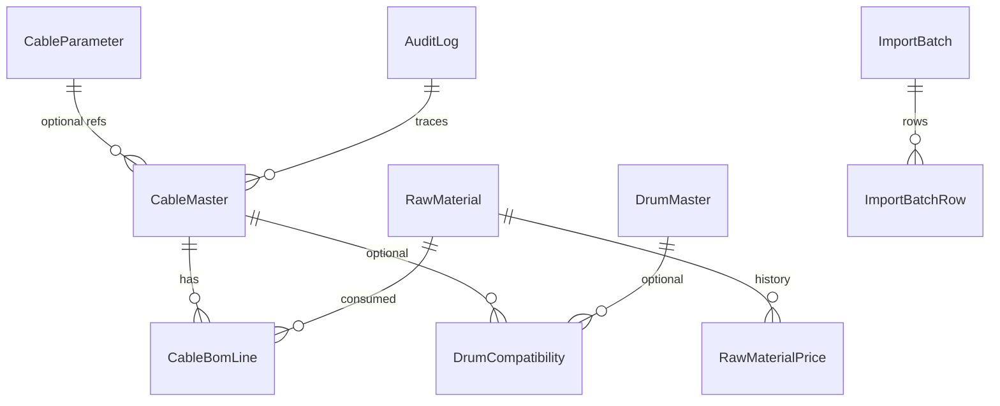

# Increment 2 — Master data model, Excel mapping, APIs

**UI:** protected. No theme/logo/header/login-panel changes.

**Prisma:** used as the Express-friendly schema/migration/client for PostgreSQL. **NestJS is not added.**

---

## A. Target ER model



**Normalized reference:** `CableParameter` (`kind` = FAMILY | VOLTAGE | CONDUCTOR | INSULATION | SCREEN | ARMOUR | SHEATH | CORE_COLOUR | STANDARD). Excel Cable List does **not** contain these as columns; they are optional on Cable Master (parsed from description when present, otherwise null — **not invented**).

**Cable Master** natural key: `materialNumber`. Item code is **not** unique.

**BOM** is versioned (`bomVersion`, default 1). Unique `(materialNumber, rawMaterialCode, bomVersion)`. Duplicate Excel pairs with different weights = ERROR, file transaction rejected.

**Raw Material Price** is a history table. Blank Excel price → material `PRICE_NOT_CONFIGURED`; **no** price row with 0.

**Drum** stores source numbers. Extra engineering fields (`barrelWidth`, `usableWidth`, `maxWeight`, `drumType`) are nullable / `CONFIGURATION_REQUIRED`. Automatic optimization stays out of this increment.

---

## B. Excel → database mapping

### Drum List.xlsx / Sheet1

| Source column | Entity | Field | Type | Required | Validation | Transform | UOM | Effective date |
|---|---|---|---|---|---|---|---|---|
| Drum Code | DrumMaster | drumCode | string PK | Y | unique, non-blank | trim | — | import time |
| Flange | DrumMaster | flange | decimal | Y | > 0, not blank→0 | number | SOURCE_UNIT_NOT_IN_FILE | — |
| Barrel | DrumMaster | barrel | decimal | Y | > 0, barrel < flange | number | SOURCE_UNIT_NOT_IN_FILE | — |
| Inner Width | DrumMaster | innerWidth | decimal | Y | > 0, ≤ outer | number | SOURCE_UNIT_NOT_IN_FILE | — |
| Outer Width | DrumMaster | outerWidth | decimal | Y | > 0 | number | SOURCE_UNIT_NOT_IN_FILE | — |
| Capacity | DrumMaster | capacity | decimal | Y | > 0 | number | CONFIGURATION_REQUIRED | — |
| (absent) | DrumMaster | drumType, barrelWidth, usableWidth, maxWeight | nullable | N | do not invent | — | — | — |

### Energya Cable Master Data.xlsx / Cable List

| Source | Entity | Field | Type | Req | Validation | Transform |
|---|---|---|---|---|---|---|
| Specification Code | CableMaster | customerCode | string | Y | required | trim |
| Item Code | CableMaster | itemCode | string | Y | required; **not unique** | trim |
| Cable Material Number | CableMaster | materialNumber | string | Y | unique | trim |
| Eland Item Number | CableMaster | elandItemNumber | string? | N | empty = WARNING | trim |
| Cable Desc | CableMaster | description | string | Y | required | trim; optional parse → family/voltage/… **nullable if not parseable** |
| Total Cable Weight | CableMaster | weight | decimal | Y | > 0, blank ≠ 0 | number |
| Cable Diameter | CableMaster | diameter | decimal | Y | > 0 | number |
| (absent) | CableMaster | uom | string | — | default CONFIGURATION_REQUIRED | — |

### Energya Cable Master Data.xlsx / Cable Materials (BOM)

| Source | Entity | Field | Req | Validation |
|---|---|---|---|---|
| Customer Code | CableBomLine | customerCode | Y | required |
| Item Code | CableBomLine | itemCode | N | |
| Cable Material Number | CableBomLine | cableMaterialNumber | Y | must exist in Cable Master if catalog non-empty |
| Raw Material | CableBomLine | rawMaterialCode | Y | must exist in RM master if RM store non-empty |
| Weight | CableBomLine | consumption | Y | ≥ 0, blank ≠ 0 |
| Unit/Km | CableBomLine | uom | Y | no PCS→kg conversion |
| (absent) | CableBomLine | scrap, bomVersion | | scrap null; version 1 |

### Raw Material List.xlsx / Sheet1

| Source | Entity | Field | Req | Validation |
|---|---|---|---|---|
| Raw Material Code | RawMaterial | code | Y | unique |
| Description | RawMaterial | description | Y | |
| Unit of Measurement | RawMaterial | uom | Y | |
| Price | RawMaterialPrice / priceStatus | N | blank → PRICE_NOT_CONFIGURED, **never 0**; numeric → history row |

Original xlsx files are not modified.

---

## C. Data quality rules

| Rule | Severity |
|---|---|
| Missing required identity / numeric | ERROR |
| Duplicate material number / drum code / RM code in file | ERROR |
| Duplicate BOM cable+RM with different consumption | ERROR |
| Invalid FK (BOM→cable, BOM→RM) | ERROR |
| Barrel ≥ flange, inner > outer, non-positive dims | ERROR |
| Blank RM price | WARNING (`PRICE_NOT_CONFIGURED`) |
| Empty Eland item | WARNING |
| BOM PCS vs RM kg | WARNING (no conversion) |
| Item code not unique | INFORMATION |

No auto-fix of business data. Any ERROR → **entire import kind rejected** (no silent PARTIAL commit).

---

## D. Database migration / coexistence

```
CURRENT: localStorage services (unchanged as fallback)
        +
NEW:     PostgreSQL via Prisma (authoritative when DATABASE_URL is reachable)
```

On successful Import Center confirm:
1. Validate (no ERROR)
2. Write PostgreSQL in a transaction
3. Write localStorage (existing services) so the current Hub/grids keep working
4. Append Increment 1 audit + ImportBatch

If PostgreSQL is down: localStorage commit still allowed only after validation; API reports `postgresql: false`.

No bulk dump of historical localStorage in this increment.

---

## E. API plan

| Method | Path | Role |
|---|---|---|
| GET | `/api/platform/db` | connectivity |
| GET | `/api/master/cables` | list |
| GET | `/api/master/cables/:materialNumber` | get |
| POST | `/api/master/cables` | create |
| PUT | `/api/master/cables/:materialNumber` | update/deactivate |
| GET | `/api/master/boms` | list |
| GET | `/api/master/raw-materials` | list |
| GET | `/api/master/raw-material-prices` | price history |
| GET | `/api/master/drums` | list |
| GET | `/api/master/reference` | CableParameter rows |
| POST | `/api/master/imports/preview` | validate, no persist |
| POST | `/api/master/imports/commit` | transactional persist |
| GET | `/api/master/imports` | import history |

---

## F. Implementation files

Prisma schema, `src/server/db.ts`, `src/server/masterDataRepository.ts`, `src/server/masterDataRoutes.ts`, `server.ts` mount, import pipeline reject-on-error, Import Center preview counts, tests, `.env.example`.

---

## G. Test plan

- Blank price ≠ 0
- Preview does not persist
- Commit rejected when duplicate BOM
- Drum unique code
- PG health when DATABASE_URL set
- Existing inquiry/drum selection tests still pass
