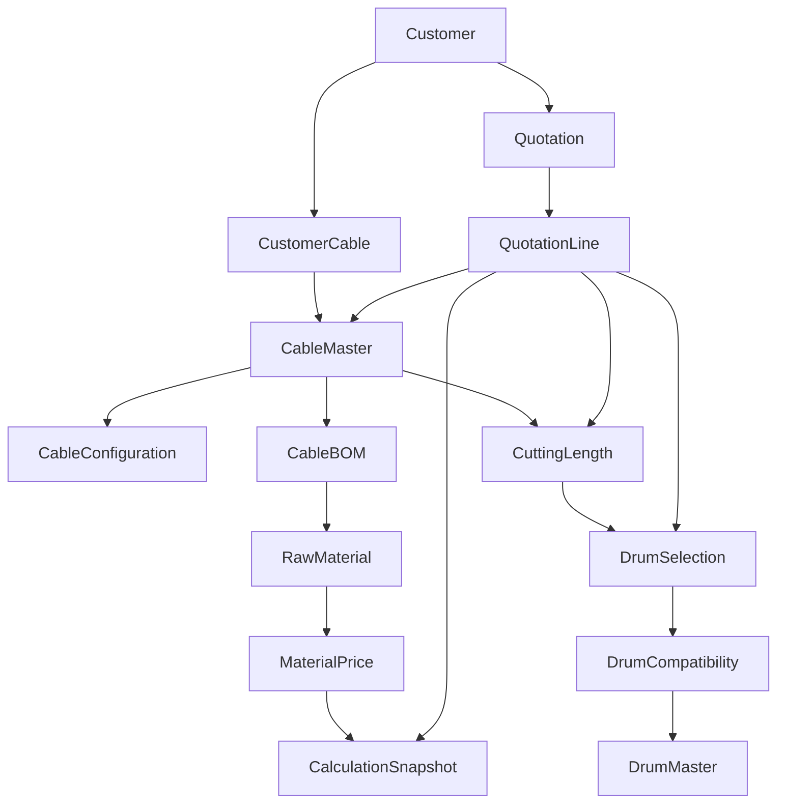

# Master Data Relationship Model

**Date:** 2026-08-19  
**This pass:** design / assessment only. No React, service, or Prisma changes.

**Source files:** [`data/source/Drum List.xlsx`](../data/source/Drum%20List.xlsx), [`Energya Cable Master Data.xlsx`](../data/source/Energya%20Cable%20Master%20Data.xlsx), [`Raw Material List.xlsx`](../data/source/Raw%20Material%20List.xlsx)

Covers prompt items **18–30**: relationships, admin, quality, flows, security, backend, D365, UI, audit, testing, migration, Prisma recommendations.

**Code truth:** Increment 2 master-data **architecture is already in the tree** (`MasterDataHub`, `importPipelineService`, localStorage masters, quality KPIs). Quotation detail, configurator, and drum optimizer were **not** replaced. This document describes as-is vs target. It does **not** authorize Increment 3+ coding.

---

## 18. Target relationship (one commercial domain)

### As-is (prototype + Increment 2 stores)

| Target node | As-is |
|---|---|
| Customer | User record (`companyName`, email). No Customer master table. ELAND is a user, not a Customer Cable mapping. |
| CustomerCable | Excel column **Eland Item Number** exists and is **empty**. No mapping stored. |
| Cable Master | `cableCatalogService` / `MASTER_CABLE_CATALOG` seed + Excel import (`cableCode` = material number). |
| Cable Configuration | Parameter object in configurator / V2; not a separate persisted entity. |
| Cable BOM | `cableBomService` after import; quotation lines still carry `bomDetails` snapshots. |
| Raw Material | `rawMaterialMasterService`; all official prices blank → `PRICE_NOT_CONFIGURED`. Prototype `RAW_MATERIAL_DICTIONARY` still in `cableBomService`. |
| Material Price | Not a dated price table. Costing LME fields live in `CostingPricing.tsx`. |
| Drum Master | `drumMasterService` after Drum List import. |
| Drum Compatibility | **Missing.** Do not invent. |
| Cutting Length | Line qty / `drumDetails` / V2 cutting section / `cuttingLengthValidationService`. |
| Drum Selection | Manual: `DrumDetailsModal`. Automatic: optimizer + K/S/P formula — **not** EWD Master. |
| Quotation / Line | `ErpRequestHeader` + lines (`inquiryQuotationHomeService` + `ErpCustomerRequestView`). |
| Calculation Snapshot | **Does not exist.** |

**Rule:** quotation lines must **reference** Cable Master, not duplicate master attributes except a **frozen snapshot** at calculate time (later increment).

---

## 19. Master data administration (as-is)

Internal **Master Data** opens `MasterDataHub` with tabs:

- Data Quality
- Cable Master
- Cable BOM
- Raw Materials
- Drum Master
- Import Center (existing `MasterDataImport`, extended)

**Not present as tabs:** Drum Compatibility, Cable Parameters (parameters live under Technical Office / configurator masters), Validation Rules as a dedicated grid.

Hub supports search/filter and deactivate on drums/RM. Full column-config / history / create-edit enterprise grids are **partial**. Do **not** replace the hub with primitive CRUD. Extend the existing visual language.

Also still in the sidebar: Technical Office, Costing & Pricing, User Management — preserve.

---

## 20. Data-quality strategy

**As-is:** `masterDataQualityService.computeMasterDataQuality()` + Quality tab. KPIs/issues include cables without BOM, BOM missing RM, orphan BOM, `PRICE_NOT_CONFIGURED`, missing diameter/weight, duplicate material numbers, duplicate BOM pairs.

**Target statuses:** VALID / WARNING / ERROR (issues already use severity).

**Source-file defects (do not “fix” by fabricating data):**

- ~83 duplicate cable+RM pairs with different weights in Cable Materials BOM
- Item Code **not** unique; Cable Material Number **is** unique in Cable List (~432)
- End-cap UOM: RM list **kg** vs BOM **PCS** — do not convert
- Drum units **not in file**
- All 74 RM prices blank

Quality dashboard must remain a **detector**, not an auto-healer.

---

## 21. Customer quotation flow

**Preserve** Login → ELAND/customer Inquiries & Quotes (`price_estimation`) → Inquiry/Quotation Home → `ErpCustomerRequestView` detail → cable search / configurator / drum modals.

**Do not** replace that journey with a generic wizard.

Target long-term: Select cable (existing vs configure) → cutting length → drum (manual/auto) → calculate → technical offer → quotation version → submit → SO → D365. Wire by **extending** engines, not new screens that fork the domain.

ELAND existing-cable vs unknown-cable: V2 **Send to Technical Office**. Missing sample `QT-ELAND-10042` V2 OPEN.

---

## 22. Internal flow (as-is)

Login → Internal portal → Overview, Inquiry/Quotation Home, Technical Office, Configurator hub, Costing, Master Data Hub, Production/Finance/Reports (mostly mock). Planning / MES / WMS / CMMS are **not** execution systems yet.

---

## 23. Security

JWT login/me/roles. `ModulePermissions` on users. ELAND menu restriction in `Sidebar`. Passwords stored in process memory (field named `passwordHash`, plaintext). Quotations persist in browser — **UI checks are not security**.

**Preserve** the permission shape. **Do not** create a second RBAC. Backend authorization is mandatory later.

---

## 24. Backend / production architecture

**As-is:** Vite + React 19 + Express `server.ts` (port **3847**) + in-memory users + `localStorage`.

**Target:** React → Platform API → application services → domain services → repository → PostgreSQL (Prisma). Domain **must not** call D365.

Do **not** add Nest/Prisma in the next drum increment unless explicitly approved (prompt Increment 15).

---

## 25. D365 integration boundary

`/api/d365/sync-status` reports `connected: false` / `NOT_CONNECTED`. **That is not live integration.** Do not build D365 HTTP/OData until Phase 5+ of the approved plan.

Platform owns: cable design/config, quotation, cable BOM, cable costing, drum tracking UX, customer portal.  
D365 owns: finance posting, GL, AR/AP, inventory financials, sales-order posting where agreed.

Baseline: [`D365_FO_QUOTE_TO_CASH_INTEGRATION_SPECIFICATION.md`](./D365_FO_QUOTE_TO_CASH_INTEGRATION_SPECIFICATION.md). Phase 1 gaps: [`D365_FO_QUOTE_TO_CASH_PHASE1_GAP_ANALYSIS.md`](./D365_FO_QUOTE_TO_CASH_PHASE1_GAP_ANALYSIS.md). ADR-004: adapters only.

---

## 26. UI/UX standard

Baseline = Energya Connect (dark enterprise header, grids, modals, badges). New work must match **this** language.

---

## 27. Data quality principles (enforcement)

Never: cable without identity; BOM without cable/RM; calculate without BOM; calculate with missing price as **0**; drum without identity; silent fallbacks.

**Known prototype defects — do not spread:**

- Optimizer missing weight → **2.5 kg/m** (`ContainerAndDrumOptimizerModal`)
- TCR publish price ≈ `conductorSize * 0.12 + 15`

Missing configuration → visible `CONFIGURATION_REQUIRED` / `PRICE_NOT_CONFIGURED`.

---

## 28. Audit strategy

**As-is:** ERP status logs on requests; import batches (`importBatchService`: batch number, file, user, date, counts, errors, status); master rows carry `sourceBatch`, `createdAt`, `updatedAt`, `status` ACTIVE/INACTIVE/SUPERSEDED.

**Target:** created/modified by; effective from/to; no physical delete of imported master where audit would be lost. Deactivate instead.

localStorage overwrite is **not** production audit.

---

## 29. Testing (after future code increments)

`npm install` · `npm run build` · `npm run lint` (tsc) · run app on 3847.

Regression: customer login, ELAND login, My Inquiries & Quotes, New Inquiry, open quotation, lines, cable search, configurator, cutting length, manual drum, automatic drum, calculation, versioning, technical review, internal portal, costing, Import Center.

**This documentation pass does not run a product-behaviour change.**

---

## 30. Migration strategy and Prisma recommendations

1. Keep mocks as seed when a DB appears.
2. Keep dual drum catalogs until an approved alias / selection service.
3. Point calculation at Cable BOM + RM Master **before** inventing a new costing UI.
4. Non-destructive quotation versioning is a **separate** increment (conflicts with in-place `versionNo`).
5. PostgreSQL last among master-data increments (prompt Increment 15).
6. D365 only when instructed.

### Suggested Prisma models (not created)

- `Customer`, `User`, `Role` (map `ModulePermissions`)
- `CableMaster` (unique `cableMaterialNumber`; item code **not** unique)
- `CableConfiguration`
- `RawMaterial`; `MaterialPrice` (price **nullable**; null ≠ 0)
- `CableBomLine` (consumption, uom, consumptionBasis: PER_KM | PER_METER | PER_CUT | PER_DRUM | PER_UNIT)
- `DrumMaster` (flange, barrel, innerWidth, outerWidth, capacity, `capacityUom` CONFIGURATION_REQUIRED)
- `DrumCompatibility` (empty until source rules exist)
- `ImportBatch` / `ImportBatchRow`
- `Quotation` / `QuotationLine` with `versionGroupId` + immutable versions
- `CuttingLength`, `DrumSelection`, `CalculationSnapshot`

---

## Cable / BOM / RM / calculation / cutting / drum (prompt 18–24)

- **Cable:** natural key Cable Material Number. Specification Code = customer/spec family (e.g. N2XH). Example 10009487 / ICO117X101C0002 is **source data**, already used as Excel template sample — not a second catalog.
- **BOM:** references cable material + RM code + consumption + UOM. Duplicate pairs = data-quality ERROR until business merge rule.
- **Raw material:** 74 codes; prices blank. Calculation that needs price must **block**.
- **Calculation:** Cost engine then pricing engine, **outside React**, consuming masters. Snapshot on the line. **Not built.**
- **Cutting length:** existing UI/services. Required drum capacity = f(length, diameter, kg/km) — ENERGYA formula **CONFIGURATION_REQUIRED** except prototype K/S/P geometry.
- **Manual drum:** preserve `DrumDetailsModal` / optimizer UI.
- **Automatic drum:** preserve existing optimizer behaviour; do not auto-pick EWD from an unsigned formula.
- **Compatibility:** schema later; populate **only** from uploaded rules.

---

## Import strategy (prompt 26)

Reuse Import Center. Pipeline already: parse → validate → commit batch → audit. Extend kinds only when a real sheet exists (compatibility). No invalid row committed. Never hard-code Excel into React.

---

## Exact next increment (awaiting approval)

**Do not implement until approved.**

Increment 2 (Master Data architecture) is **already present**.

**Recommended next coded increment: Increment 3 — Drum Master usage boundary**

- Keep K/S/P optimizer and Drum Details **as they are**
- Document/service-bound EWD selection as `CONFIGURATION_REQUIRED` for automatic pick
- Optional: show Drum Master in quotation **only** as a reference lookup, without replacing selection
- **Not** Increment 15 (Prisma)
- **Not** a second configurator, quotation domain, or Import Center
- **Not** fabricating `QT-ELAND-10042` unless explicitly requested

Stop here.
