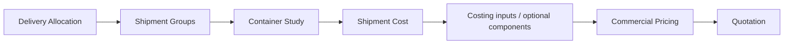
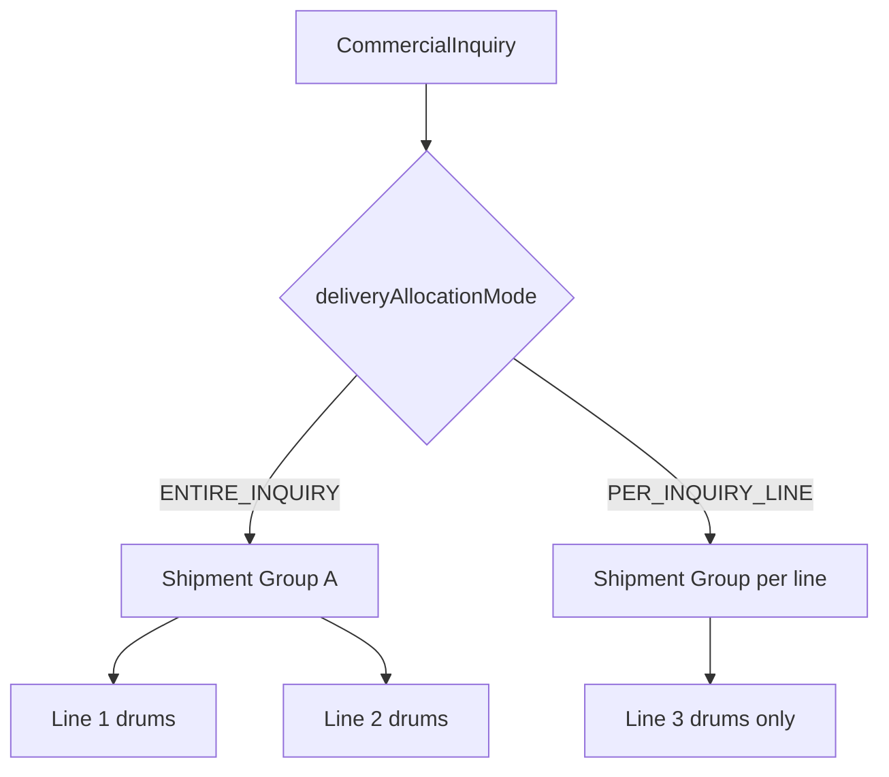
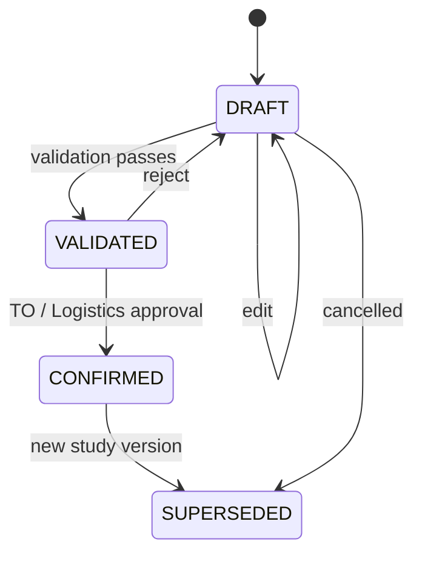
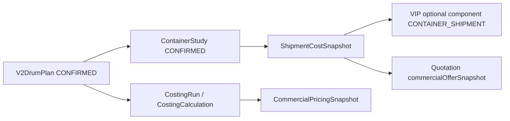
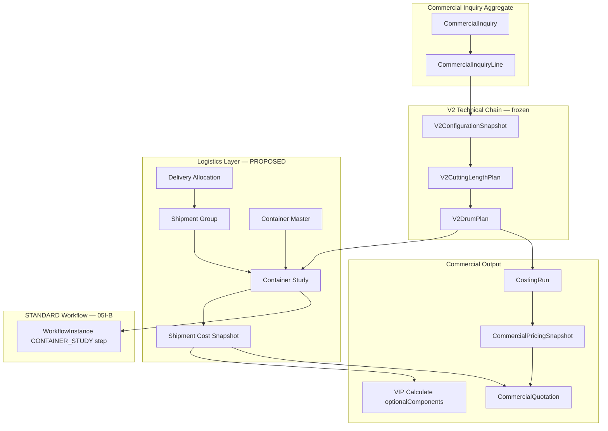

# TASK 05I-DA — Container Study & Shipment Cost Business & Technical Specification

**Date:** 2026-09-05  
**Mode:** DESIGN ONLY — no application code, schema migration, UI, API, or optimization engine  
**Status:** Review-ready for Technical Office, Logistics/Supply Chain, Sales, Costing, IT  
**Frozen bases:**

| Task | Commit | Scope |
|------|--------|-------|
| **05I-C** VIP Calculate orchestrator | `5b5254e` | Optional container shipment = 0 + warning; calculate **not blocked** |
| **05I-B** Workflow runtime | `30d97df` | `CONTAINER_STUDY` workflow stage label (no business engine) |
| **05I-A** Inquiry process | `9471940` | `VIP_FAST_TRACK` \| `STANDARD_WORKFLOW` process codes |

**Related docs:** [36 Inquiry Process Foundation](./36_INQUIRY_PROCESS_FOUNDATION.md) · [37 Workflow Runtime](./37_WORKFLOW_RUNTIME_FOUNDATION.md) · [38 VIP Calculate Orchestrator](./38_VIP_FAST_TRACK_CALCULATE_ORCHESTRATOR.md) · [Drum Master Domain](../DRUM_MASTER_DOMAIN.md) · [05I Architecture](./TASK05I_INQUIRY_PROCESS_WORKFLOW_ARCHITECTURE.md)

---

## Document conventions

| Label | Meaning |
|-------|---------|
| **CONFIRMED** | Frozen in code or accepted business rule — implement as specified |
| **PROPOSED** | Recommended design — requires Technical Office / Logistics / business approval before implementation |
| **TBD** | Decision not yet made — do not implement silently |
| **FUTURE** | Out of scope for 05I-DA / first implementation wave |

**Engineering discipline:** This spec does **not** invent container dimensions, stacking rules, mixed-loading allowances, or freight rates. Where plant data is absent, fields and rules are marked **TBD** and blocked pending master-data approval.

---

## 1. Business context

### 1.1 Commercial chain position

Container Study and Shipment Cost sit **after** drum planning and **before** final commercial pricing inputs that depend on logistics cost. They are **orthogonal** to drum selection.



| Stage | Purpose | Owner (proposed) |
|-------|---------|------------------|
| **Delivery Allocation** | How inquiry lines are grouped for logistics planning | Sales + Logistics (**PROPOSED**) |
| **Shipment Group** | Executable shipment unit(s) for freight costing | Logistics / Supply Chain (**PROPOSED**) |
| **Container Study** | Technical feasibility: which drums fit which containers | Technical Office + Logistics (**PROPOSED**) |
| **Shipment Cost** | Monetary freight/logistics charge snapshot | Logistics / Finance (**PROPOSED**) |
| **Costing** | Manufacturing cost (material, process) — frozen V2 engine | Costing / Technical Office |
| **Commercial Pricing** | Margin/markup on material + commercial adders | Sales / Commercial |
| **Quotation** | Customer-facing offer revision | Sales |

### 1.2 Container Study ≠ Drum Selection

| Concern | Drum Selection (05E — frozen) | Container Study (05I-DA — this spec) |
|---------|------------------------------|--------------------------------------|
| Question | Which drum holds how much cable on **one reel**? | Which **container(s)** hold how many **loaded drums** for **shipment**? |
| Inputs | Cable Ø, kg/km, cutting length, Drum Master geometry | **CONFIRMED** `V2DrumPlan` rows + Container Master + shipment group |
| Output | `V2DrumPlan` (`lifecycleStatus = CONFIRMED`) | Container Study allocation + utilization evidence |
| Blocks VIP Calculate? | **Yes** — drum plan must be CONFIRMED ([38](./38_VIP_FAST_TRACK_CALCULATE_ORCHESTRATOR.md)) | **No** — missing data → 0 + warning only ([38 §5](./38_VIP_FAST_TRACK_CALCULATE_ORCHESTRATOR.md)) |
| Engine status | Implemented (`drumCapacityCalculator`, `V2DrumPlan`) | **Not implemented** — classification stub only (`containerStudyReadiness.ts`) |

### 1.3 Process-specific behaviour

| Process | Container Study role |
|---------|---------------------|
| **VIP_FAST_TRACK** | Optional for Calculate. Missing container data → `containerShipmentCost = 0`, `CONTAINER_DATA_NOT_CONFIGURED` warning. Calculate may proceed to costing → pricing → quotation **DRAFT**. |
| **STANDARD_WORKFLOW** | Workflow stage `CONTAINER_STUDY` exists ([37 §3](./37_WORKFLOW_RUNTIME_FOUNDATION.md)). Stage completion should require **CONFIRMED** study before `COSTING` transition — **PROPOSED** adapter rule (not yet wired). |

### 1.4 Assumptions explicitly avoided

- No default container type (20ft / 40HC) without Container Master approval
- No assumed drum stacking, rotation, or mixed-size loading in container
- No silent use of prototype `ContainerAndDrumOptimizerModal` client math as production engine
- No modification of `costingEngine.ts` metal / BOM logic
- No conflation of empty-drum weight (logistics) with drum **technical suitability**
- No treatment of zero shipment cost as “free shipping” unless an explicit zero rate is configured

---

## 2. Delivery allocation

### 2.1 Concept

**Delivery Allocation** defines whether logistics planning treats the inquiry as **one combined delivery** or **independent line-level deliveries**. It drives how **Shipment Groups** are formed.

| Mode | Code | Meaning |
|------|------|---------|
| Entire inquiry | `ENTIRE_INQUIRY` | All lines share one delivery intent unless technically impossible |
| Per line | `PER_INQUIRY_LINE` | Each line may form separate shipment groups |

**Status:** **PROPOSED** — no persistence field exists today. Recommended storage: `CommercialInquiry.commercialMetadata.deliveryAllocationMode`.

### 2.2 Inputs

| Input | Source | Required | Status |
|-------|--------|----------|--------|
| Allocation mode | Internal user (Sales / Logistics) | Yes, before Container Study | **PROPOSED** |
| Header destination | `CommercialInquiry.deliveryTerms` / `commercialMetadata.deliveryDestination` | Yes (already required for submit/calculate) | **CONFIRMED** |
| Header incoterms | `CommercialInquiry.incoterms` | Yes | **CONFIRMED** |
| Requested delivery date | `CommercialInquiry.requestedDeliveryDate` | Optional | **CONFIRMED** (field exists) |
| Line-level ship-to override | Line metadata (future) | Only when `PER_INQUIRY_LINE` | **TBD** |
| Customer delivery preference | Customer portal / inquiry notes | Informational only | **PROPOSED** |

### 2.3 Ownership & permissions

| Actor | Can view | Can set / change | Status |
|-------|----------|------------------|--------|
| Customer | Own inquiry allocation **status** (read-only summary) | **No** — preference only via notes | **PROPOSED** |
| Sales | Yes | Yes, before Container Study **DRAFT** | **PROPOSED** |
| Logistics / Supply Chain | Yes | Yes, co-owner with Sales | **PROPOSED** |
| Technical Office | Yes | May override for technical infeasibility | **PROPOSED** |

**CONFIRMED principle:** Customer delivery preference **must not override** Technical Office Container Study suitability. Customer input is captured as **requested intent**, not authoritative packing geometry.

### 2.4 Validation rules

| Rule | Status |
|------|--------|
| Mode must be set before first Container Study **DRAFT** | **PROPOSED** |
| Changing mode after a **CONFIRMED** Container Study requires supersession of study + shipment cost | **PROPOSED** |
| `PER_INQUIRY_LINE` with line-level destinations that differ → multiple shipment groups mandatory | **PROPOSED** |
| `ENTIRE_INQUIRY` with incompatible line destinations (port/country mismatch) → `REQUIRES_REVIEW` | **PROPOSED** |

### 2.5 Effect on shipment groups and cost

| Mode | Shipment group formation | Shipment cost aggregation |
|------|-------------------------|---------------------------|
| `ENTIRE_INQUIRY` | Prefer single group; split only when technical rules force | One shipment cost snapshot per inquiry (or per forced split) |
| `PER_INQUIRY_LINE` | One group per line minimum | Cost rolled up at inquiry level for quotation display |

---

## 3. Shipment group

### 3.1 Concept

A **Shipment Group** is the unit of logistics planning: a set of inquiry lines (or drum allocations) that ship together to one destination under one incoterm context.

**Status:** **PROPOSED** — conceptual aggregate; no Prisma model in 05I-DA.

### 3.2 Grouping keys

| Key | Mandatory? | Source | Status |
|-----|------------|--------|--------|
| Destination (country / port / delivery point) | **Mandatory** | Inquiry header (+ line override if `PER_INQUIRY_LINE`) | **CONFIRMED** header fields exist |
| Delivery allocation scope | **Mandatory** | `deliveryAllocationMode` + line membership | **PROPOSED** |
| Incoterms | **Mandatory** | `CommercialInquiry.incoterms` | **CONFIRMED** |
| Requested delivery date | Optional | Header / line | **CONFIRMED** field exists |
| Port of loading / discharge | Optional | `commercialMetadata` | **TBD** |
| Shipment requirements (DG, temperature, max weight) | Optional attribute | Line / header metadata | **FUTURE** |
| Customer account | Implicit | `customerMasterId` | **CONFIRMED** |

### 3.3 Classification

| Category | Attributes |
|----------|------------|
| **Mandatory grouping keys** | Destination, incoterms, delivery allocation membership |
| **Optional attributes** | Requested delivery date, port pair, special handling flags |
| **Future dimensions** | Carrier contract, vessel schedule, consolidation hub, customs regime |

### 3.4 Multiple inquiry lines in one group



**PROPOSED rules:**

1. Lines in the same group must share compatible destination + incoterms.
2. Each line contributes **CONFIRMED** `V2DrumPlan` drum instances (expanded `numberOfDrums × cuttingLengthM`).
3. Container Study operates **per shipment group**, not per inquiry header alone.

---

## 4. Container Master

### 4.1 Purpose

Governed master data for container types used in feasibility checks and shipment cost (count × rate).

**Status:** **PROPOSED** entity — not in Prisma today. Prototype UI references 20ft / 40HC informally; **not authoritative**.

### 4.2 Required attributes

| Attribute | Description | Status |
|-----------|-------------|--------|
| `containerTypeCode` | Natural key (e.g. `20GP`, `40HC`) | **TBD** — code set requires Logistics approval |
| `description` | Human label | **PROPOSED** |
| `internalLengthMm` | Internal length | **TBD** — no approved dimensions in repo |
| `internalWidthMm` | Internal width | **TBD** |
| `internalHeightMm` | Internal height | **TBD** |
| `doorWidthMm` | Door opening width | **TBD** |
| `doorHeightMm` | Door opening height | **TBD** |
| `maxPayloadKg` | Maximum cargo weight | **TBD** |
| `maxGrossWeightKg` | Gross weight limit | **TBD** |
| `tareWeightKg` | Empty container weight | **TBD** |
| `usableVolumeM3` | Derived or sourced | **TBD** |
| `status` | `ACTIVE` \| `INACTIVE` | **PROPOSED** |
| `effectiveFrom` / `effectiveTo` | Rate / spec validity | **PROPOSED** |

**Implementation gate:** Container Study engine **must not** run with invented dimensions. Until Container Master is populated and approved, studies remain `DRAFT` / `REQUIRES_REVIEW` only.

### 4.3 Relationship to ELAND workbook reference

ELAND costing rules reference `ContainerQty × 3500 USD` ([ELAND RULE-H001](../ELAND_COSTING_RULES.md)). That rate is **not** in application master data. Container Master and Freight Rate Master are separate concerns (see §11).

---

## 5. Drum inputs (from Drum Master / Drum Plan)

### 5.1 Authoritative sources

| Data | Source | Status |
|------|--------|--------|
| Drum geometry | `DrumMaster` (POSTGRESQL_SOT per doc 32) | **CONFIRMED** |
| Per-line drum schedule | `V2DrumPlan` + `V2DrumPlanLine` | **CONFIRMED** |
| Drum plan lifecycle | Must be `CONFIRMED` before costing / VIP Calculate | **CONFIRMED** ([38](./38_VIP_FAST_TRACK_CALCULATE_ORCHESTRATOR.md)) |

### 5.2 Frozen drum engineering semantics

From [Drum Master Domain](../DRUM_MASTER_DOMAIN.md) and `drumCapacityCalculator.ts`:

| Rule | Value | Status |
|------|-------|--------|
| Clearance | Default **50 mm** when absent; required for cable Ø ≤ 50 mm | **CONFIRMED** |
| Max load | `maxLoadKg` = Drum Master `maxWeight`; blank → **Capacity** | **CONFIRMED** |
| Capacity | Authoritative integer from source workbook | **CONFIRMED** |
| Empty drum net weight | Logistics / gross weight only; **does not block** suitability | **CONFIRMED** |
| Winding allowance | `1.03` in capacity calculator | **CONFIRMED** (drum selection domain) |

### 5.3 Drum plan fields consumed by Container Study

From `V2DrumPlanLine` (integration mapping only):

| Field | Container Study use |
|-------|---------------------|
| `drumCode`, `drumMasterId` | Lookup flange, barrel, inner/outer width |
| `numberOfDrums` | Expand to discrete drum instances |
| `cuttingLengthM` | Cable weight on drum via kg/km from configuration snapshot |
| `grossLoadedDrumWeightKg` | Payload / weight checks when present |
| `emptyDrumNetWeightKg` | Gross weight; warning if missing — not blocking |
| `maxLoadKg`, `clearanceMm` | Frozen at plan capture time |

### 5.4 Additional data required for container study

| Field | Source | Status |
|-------|--------|--------|
| Loaded drum **outer** dimensions (L × W × H) | **Not in Drum Master today** | **TBD** — Technical Office must define mapping from flange/barrel/width + loading rules |
| Drum orientation | Packing rule set | **TBD** |
| Securing / lashing allowance | Packing rule set | **TBD** |
| Stacking allowed (Y/N) | Packing rule set | **TBD** — default **not allowed** until approved |

**PROPOSED:** Container Study reads drums as **loaded reel units** with dimensions supplied by an approved **Drum Packing Profile** (future master) or explicit TO entry — not inferred silently from flange alone.

---

## 6. Drum → container suitability

### 6.1 Technical model (conceptual)

For each drum instance, evaluate against candidate container type:

```
fit = f(
  drumOuterDimensions,
  drumLoadedWeightKg,
  containerInternalDims,
  containerDoorDims,
  containerMaxPayloadKg,
  orientationPolicy,
  clearanceRules,
  stackingPolicy,
  securingAllowance
)
```

### 6.2 Rule classification matrix

| Rule | Description | Status |
|------|-------------|--------|
| R-01 | Drum must pass door opening (width × height) for at least one approved orientation | **PROPOSED** |
| R-02 | Drum footprint must fit on container floor area with edge clearance | **PROPOSED** — clearance values **TBD** |
| R-03 | Sum of loaded drum weights + dunnage ≤ container `maxPayloadKg` | **PROPOSED** |
| R-04 | Sum of gross weights ≤ `maxGrossWeightKg` when tare known | **PROPOSED** |
| R-05 | Cable Ø ≤ 50 mm → drum clearance **50 mm** for drum **capacity** (drum domain) | **CONFIRMED** (drum selection — not container) |
| R-06 | Vertical stacking of drums | **TBD** — default **disallowed** |
| R-07 | Mixed drum sizes in same container | **TBD** — default **disallowed** |
| R-08 | Drum rotation / axle orientation variants | **TBD** — default **single approved orientation only** |
| R-09 | Mixed inquiry lines in same container | **TBD** — see §10 |
| R-10 | Securing / lashing volume deduction | **TBD** |
| R-11 | Technical feasibility overrides commercial optimization | **CONFIRMED** principle |

### 6.3 Evaluation output per drum instance

| Result | Meaning |
|--------|---------|
| `SUITABLE` | Fits named container type in named orientation |
| `UNSUITABLE` | Does not fit any active container type |
| `REQUIRES_REVIEW` | Missing packing profile / ambiguous orientation |

---

## 7. Container Study

### 7.1 Concepts (no DB models in 05I-DA)

| Concept | Description |
|---------|-------------|
| **ContainerStudy** | Versioned study header for one shipment group |
| **ContainerStudyLine** | One logical row: container type, quantity, utilization metrics |
| **ContainerStudyAllocation** | Maps a drum instance (plan line + instance index) to a container slot |

### 7.2 Lifecycle



| Status | Meaning |
|--------|---------|
| `DRAFT` | Work in progress; not consumed by costing/pricing |
| `VALIDATED` | All mandatory checks passed; pending approval |
| `CONFIRMED` | Authoritative for shipment cost + optional VIP component |
| `SUPERSEDED` | Replaced by newer version; retained for audit |

### 7.3 Inputs

| Input | Required | Status |
|-------|----------|--------|
| Shipment group identity | Yes | **PROPOSED** |
| Delivery allocation mode | Yes | **PROPOSED** |
| CONFIRMED `V2DrumPlan` per contributing line | Yes | **CONFIRMED** |
| Container Master (active types) | Yes for VALIDATED | **TBD** until master approved |
| Packing rule set version | Yes for VALIDATED | **TBD** |
| Inquiry header incoterms / destination | Yes | **CONFIRMED** |

### 7.4 Validations

| Validation | Blocks VALIDATED? | Status |
|------------|---------------------|--------|
| All drums accounted for (allocated \| unsuitable \| review) | Yes | **PROPOSED** |
| No container overweight / oversize | Yes | **PROPOSED** |
| Drum plans reference current snapshot chain | Yes | **CONFIRMED** (same lineage rules as costing) |
| Container Master dimensions present | Yes | **TBD** |
| Unallocated drums without exception | Yes | **PROPOSED** — exception mechanism **TBD** |

### 7.5 Outputs

| Output | Consumer |
|--------|----------|
| Container type list + counts | Shipment Cost engine |
| Utilization metrics (weight, volume, drum count) | UI / audit |
| Unallocated / unsuitable drum report | Technical Office |
| `containerStudyReadiness = CONTAINER_STUDY_READY` | VIP optional component ([38](./38_VIP_FAST_TRACK_CALCULATE_ORCHESTRATOR.md)) |
| Study snapshot JSON (immutable on CONFIRMED) | Quotation / costing lineage |

### 7.6 Approval & versioning

| Rule | Status |
|------|--------|
| CONFIRMED requires Logistics or TO role (exact RBAC **TBD**) | **PROPOSED** |
| New drum plan CONFIRMED → study must re-run or auto-SUPERSEDE | **PROPOSED** |
| CONFIRMED study is **reproducible** from pinned snapshot + master versions | **CONFIRMED** principle |
| Recalculation creates new version; prior CONFIRMED → SUPERSEDED | **PROPOSED** |

### 7.7 Current implementation boundary (05I-C)

Only readiness classification exists:

```typescript
// containerStudyReadiness.ts — metadata key: containerStudyReadiness
'CONTAINER_STUDY_REQUIRED' | 'CONTAINER_STUDY_NOT_READY' | 'CONTAINER_STUDY_READY'
```

Gate `CONTAINER_STUDY` → **WARN**, never **BLOCK** for VIP Calculate.

---

## 8. Optimization objective

### 8.1 Candidate objectives

| Objective | Description |
|-----------|-------------|
| Min container count | Reduce number of containers |
| Min freight cost | Minimize `containers × rate` |
| Max utilization | Weight/volume efficiency |
| Min container type variety | Operational simplicity |

### 8.2 Recommended hierarchy — **PROPOSED — REQUIRES BUSINESS APPROVAL**

```
1. Technical feasibility (all allocated drums fit)     — mandatory pass
2. Min container count                                 — primary
3. Min freight cost (when rates available)             — secondary
4. Max utilization                                     — tie-breaker
5. Min container type variety                          — tie-breaker
```

**CONFIRMED:** Technical feasibility **always overrides** commercial optimization. An infeasible packing is never selected to save cost.

### 8.3 Engine status

**FUTURE** — no optimization algorithm in 05I-C. Prototype modal math is **not** production authority.

---

## 9. Remainder / unallocated drums

### 9.1 Allocation statuses

| Status | Meaning |
|--------|---------|
| `ALLOCATED` | Drum assigned to a container in the study |
| `UNALLOCATED` | Not placed; reason required |
| `UNSUITABLE` | Fails suitability rules for all active container types |
| `REQUIRES_REVIEW` | Missing data or policy ambiguity |

### 9.2 Confirmation rules

| Rule | Status |
|------|--------|
| Cannot `CONFIRM` with unexplained `UNALLOCATED` drums | **PROPOSED** |
| `UNSUITABLE` drums may CONFIRM only with documented remediation path (split shipment, different drum plan, alternate container type) | **PROPOSED** |
| Exception mechanism for deliberate partial allocation | **TBD** |

---

## 10. Mixed drums

Decision matrix — default **conservative** until Technical Office approves packing rules.

| Scenario | Allowed? | Status |
|----------|----------|--------|
| Multiple drums, **same size**, same line | **TBD** | Default **PROPOSED: yes** if feasibility passes |
| Multiple drums, **different sizes**, same line | **TBD** | Default **no** |
| Drums from **different inquiry lines**, same destination | **TBD** | Default **no** |
| Drums from **different destinations** | **No** | **CONFIRMED** — violates shipment group keys |
| Mixed container types in one shipment group | **TBD** | **PROPOSED:** allowed if each type validated independently |

---

## 11. Shipment cost

### 11.1 Purpose

Convert **CONFIRMED** Container Study output into a monetary **Shipment Cost Snapshot** for commercial optional components and (optionally) inquiry-level logistics display.

### 11.2 Future calculation inputs

| Input | Source | Required | Status |
|-------|--------|----------|--------|
| Destination | Inquiry header | Yes | **CONFIRMED** |
| Shipment group | Container Study | Yes | **PROPOSED** |
| Container type + count | Container Study lines | Yes when study CONFIRMED | **PROPOSED** |
| Freight rate | Freight Rate Master | Yes for non-zero cost | **TBD** |
| Currency | Rate card / inquiry | Yes | **PROPOSED** |
| Incoterms | Inquiry header | Yes — drives cost scope | **CONFIRMED** |
| Port charges, THC, documentation | Rate master adders | Optional | **TBD** |
| Insurance (e.g. 0.3% ex-work for DAP) | Business rule | Incoterm-dependent | **CONFIRMED** in ELAND workbook — storage **TBD** |

### 11.3 Missing optional inputs — 05I-C policy (**CONFIRMED**)

Aligned with [38 §4–6](./38_VIP_FAST_TRACK_CALCULATE_ORCHESTRATOR.md) and `vipOptionalComponents.ts`:

| Condition | Behaviour |
|-----------|-----------|
| Container study not ready | `containerShipmentCost = 0`, `source = NOT_CONFIGURED`, `reasonCode = CONTAINER_DATA_NOT_CONFIGURED`, **warning** |
| Study ready but cost not computed | `reasonCode = CONTAINER_SHIPMENT_NOT_CONFIGURED`, **warning** |
| Incoterm makes shipping N/A (e.g. EXW pattern) | `NOT_APPLICABLE`, no warning — **CONFIRMED** for `SHIPPING`; container component follows study readiness |

**CONFIRMED:** Numeric **0** means **not configured**, not free shipping, unless an explicit zero rate record exists in Freight Rate Master.

### 11.4 Shipment Cost Snapshot (conceptual)

| Field | Purpose |
|-------|---------|
| `snapshotId`, `versionNo` | Immutability |
| `containerStudyVersionRef` | Lineage |
| `totalAmount`, `currency` | Quotation / VIP optional component |
| `lineBreakdown` | Per container type count × rate |
| `incotermScope` | What charges are included |
| `status` | `DRAFT` \| `CONFIRMED` \| `SUPERSEDED` |

**Persistence:** **PROPOSED** — `commercialMetadata.containerShipmentCost` is today's interim key ([38](./38_VIP_FAST_TRACK_CALCULATE_ORCHESTRATOR.md)); replace with governed snapshot entity in 05I-DB+.

---

## 12. Costing integration

### 12.1 Handoff model



### 12.2 Rules

| Rule | Status |
|------|--------|
| Manufacturing costing (`costingEngine.ts`) consumes drum plan + BOM — **not** redesigned | **CONFIRMED** freeze |
| Container shipment cost is a **commercial optional component**, not a metal/process costing line | **CONFIRMED** (05I-C) |
| No FX conversion inside costing engine for logistics | **CONFIRMED** — FX at commercial boundary only |
| Costing currency vs commercial pricing currency may differ — document on quotation | **CONFIRMED** platform pattern |
| Historical reproducibility: pin `containerStudySnapshotId` + `shipmentCostSnapshotId` on quotation/costing lineage | **PROPOSED** |
| `CommercialPricingSnapshot` may reference logistics snapshot IDs (parallel to `drumPlanId`) | **PROPOSED** — no schema change in 05I-DA |

---

## 13. Customer experience

### 13.1 Customer can provide

| Input | Used as |
|-------|---------|
| Destination / delivery terms | Header fields — **CONFIRMED** |
| Requested delivery date | Planning hint |
| Delivery preference notes | Non-authoritative intent |
| Incoterms (where allowed) | Header — subject to sales validation |

### 13.2 Customer cannot override

| Item | Reason |
|------|--------|
| Container type selection | Technical / Logistics authority |
| Drum packing / stacking | Technical Office |
| Shipment group split | Logistics |
| Freight rate | Internal master data |
| Container Study CONFIRMED outcome | Technical feasibility |

### 13.3 Status display (customer-safe)

| Status | Meaning |
|--------|---------|
| **Configured** | Confirmed study + shipment cost available |
| **Not Configured** | No study or zero-default path (VIP: calculate still allowed) |
| **Not Applicable** | Incoterm / process excludes container shipment component |
| **Requires Technical Review** | Study blocked on unsuitable / unallocated drums |

---

## 14. Technical Office

### 14.1 Responsibilities

| Area | Owner | Status |
|------|-------|--------|
| Drum plan suitability (05E) | Technical Office | **CONFIRMED** |
| Drum packing profile / loaded dimensions | Technical Office | **TBD** |
| Container Study VALIDATED → CONFIRMED | Technical Office **+** Logistics | **PROPOSED** |
| Exception approval for unallocated drums | Technical Office | **TBD** |
| Freight rates & container master | Logistics / Supply Chain | **TBD** |
| Delivery allocation mode | Sales + Logistics | **PROPOSED** |

### 14.2 TO CONFIRM checklist (before 05I-DB)

1. Approve Container Master dimension table  
2. Approve packing rules (orientation, stacking, mixed loading)  
3. Approve optimization hierarchy  
4. Approve freight rate storage model (incl. ELAND 3500 USD reference)  
5. Assign CONFIRMED approval authority  

---

## 15. Versioning & snapshots

| Artifact | Versioning | Immutability |
|----------|------------|--------------|
| **ContainerStudy** | `studyId` + `versionNo` | CONFIRMED rows frozen; edits → new version |
| **ContainerStudy snapshot** | JSON capture at CONFIRMED | Append-only |
| **ShipmentCostSnapshot** | Linked to study version | Append-only |
| **Quotation** | Existing `versionNo` / `inquirySnapshot` | Must embed logistics snapshot refs — **PROPOSED** |
| **VIP calculate snapshot** | `commercialMetadata.vipLastCalculateSnapshot` | Already persists optional components — **CONFIRMED** |

**CONFIRMED principle:** Re-quotation without re-study must not silently change logistics charges.

---

## 16. Audit

Events via existing `appendServerAudit` — **no AuditEvent redesign**.

| Event | When | Status |
|-------|------|--------|
| `CONTAINER_STUDY_CREATED` | Study DRAFT initialized | **PROPOSED** |
| `CONTAINER_STUDY_VALIDATED` | Passes validation | **PROPOSED** |
| `CONTAINER_STUDY_CONFIRMED` | Approved for use | **PROPOSED** |
| `CONTAINER_STUDY_SUPERSEDED` | New version replaces old | **PROPOSED** |
| `CONTAINER_STUDY_EXCEPTION` | Exception path used | **TBD** |
| `SHIPMENT_COST_CALCULATED` | Snapshot produced | **PROPOSED** |

Existing VIP events unchanged: `VIP_CALCULATE_STARTED`, `VIP_CALCULATE_COMPLETED`, etc. ([38 §9](./38_VIP_FAST_TRACK_CALCULATE_ORCHESTRATOR.md)).

---

## 17. Notification boundary

**FUTURE** — decouple from SMTP/WhatsApp; emit domain events only.

| Event | Audience |
|-------|----------|
| `CONTAINER_STUDY_REQUIRES_REVIEW` | Technical Office / Logistics |
| `CONTAINER_STUDY_CONFIRMED` | Sales owner |
| `CONTAINER_STUDY_EXCEPTION` | TO + Sales |
| `SHIPMENT_COST_UPDATED` | Sales / Commercial |

Wire in 05I-G per [37 §12](./37_WORKFLOW_RUNTIME_FOUNDATION.md).

---

## 18. Security

Use existing RBAC + `customerScope` — **CONFIRMED** platform pattern.

| Permission (proposed codes) | Capability | Status |
|----------------------------|------------|--------|
| `LOGISTICS:CONTAINER_STUDY:VIEW` | View studies | **PROPOSED** |
| `LOGISTICS:CONTAINER_STUDY:EDIT` | DRAFT / VALIDATED edits | **PROPOSED** |
| `LOGISTICS:CONTAINER_STUDY:CONFIRM` | CONFIRM study | **PROPOSED** |
| `LOGISTICS:SHIPMENT_COST:CALCULATE` | Run shipment cost | **PROPOSED** |
| `LOGISTICS:DELIVERY_ALLOCATION:EDIT` | Set allocation mode | **PROPOSED** |
| `COMMERCIAL:INQUIRY:CALCULATE` | VIP Calculate (existing) | **CONFIRMED** |

**Customer boundary:** View own inquiry logistics **summary** only; no edit of study or rates — **PROPOSED**.

---

## 19. Integration with current system

### 19.1 Entity map (no duplicate concepts)

| Existing entity | Role in Container Study chain |
|-----------------|------------------------------|
| `CommercialInquiry` | Header: destination, incoterms, dates, `commercialMetadata` |
| `CommercialInquiryLine` | Line quantities; pointers to V2 chain |
| `V2ConfigurationSnapshot` | Cable Ø, kg/km for drum weight |
| `V2CuttingLengthPlan` | Lineage pin for drum plan |
| `V2DrumPlan` / `V2DrumPlanLine` | **Authoritative drum instances** for packing |
| `DrumMaster` | Drum geometry + capacity + max load semantics |
| `CostingRun` / `CostingCalculation` | Manufacturing cost; optional `drumPlanId` pin |
| `CommercialPricingSnapshot` | Selling price; propose logistics snapshot FK |
| `CommercialQuotation` | `commercialOfferSnapshot.optionalComponents` (VIP) |
| `WorkflowInstance` | STANDARD: `CONTAINER_STUDY` stage adapter target |
| VIP Calculate | `containerStudyReadiness.ts`, `vipOptionalComponents.ts` |

### 19.2 Integration diagram



### 19.3 Metadata keys (interim → target)

| Key | Today (05I-C) | Target |
|-----|---------------|--------|
| `commercialMetadata.containerStudyReadiness` | Readiness enum | Retain as derived status |
| `commercialMetadata.containerShipmentCost` | Manual / future calc | Replace with snapshot ref |
| `commercialMetadata.deliveryAllocationMode` | Absent | **PROPOSED** |
| `commercialMetadata.vipLastCalculateSnapshot` | VIP optional breakdown | **CONFIRMED** |

---

## 20. Open decision register

| ID | Decision | Options | Recommended option | Reason | Owner | Status |
|----|----------|---------|-------------------|--------|-------|--------|
| D-01 | Container type catalog | Ad-hoc UI names / governed Container Master | Container Master with TO-approved codes | Prototype 20ft/40HC not authoritative | Logistics | **TBD** |
| D-02 | Container internal dimensions | Invent defaults / source from shipping line specs | Import from approved carrier spec sheet — no defaults in code | Avoid silent unsafe packing | Logistics + TO | **TBD** |
| D-03 | Max payload per type | Single global / per-type master | Per-type in Container Master | Required for weight feasibility | Logistics | **TBD** |
| D-04 | Drum stacking in container | Allowed / disallowed / conditional | **Disallowed** until TO packing study | No stacking data in Drum Master | Technical Office | **TBD** |
| D-05 | Drum orientation | Free rotation / single orientation / per drum profile | Single approved orientation per **Drum Packing Profile** | Door opening + footprint rules | Technical Office | **TBD** |
| D-06 | Mixed drum sizes in one container | Allow / deny / case-by-case | **Deny** in v1; revisit with profile | Conservative default | Technical Office | **TBD** |
| D-07 | Mixed inquiry lines in one container | Allow / deny | **Deny** in v1 unless same shipment group + TO approval | Commercial traceability | Logistics | **TBD** |
| D-08 | Mixed destinations | N/A | **Always split** shipment groups | Incoterms + customs | Logistics | **CONFIRMED** |
| D-09 | Optimization objective hierarchy | Various orderings | Feasibility → min count → min cost → utilization | Aligns with §8 | Commercial + Logistics | **PROPOSED** |
| D-10 | Freight rate basis | Flat 3500 USD / rate card / carrier contract | **Freight Rate Master** with effective dates; ELAND 3500 as seed reference only | Workbook rate not in app ([ELAND](../ELAND_COSTING_RULES.md)) | Logistics + Finance | **TBD** |
| D-11 | Insurance on DAP | 0.3% ex-work / none / manual | 0.3% when DAP — store as rule not hardcode | ELAND RULE-H002 | Finance | **TBD** |
| D-12 | Exception handling for unallocated drums | Block CONFIRM / approval workflow / split inquiry | Approval workflow with audit `EXCEPTION` | Operational reality | Technical Office | **TBD** |
| D-13 | Delivery allocation ownership | Sales / Logistics / shared | **Shared** — Sales sets intent, Logistics validates | Customer must not override TO | Sales + Logistics | **PROPOSED** |
| D-14 | CONFIRM approval authority | TO only / Logistics only / dual | **Dual sign-off** (TO feasibility + Logistics cost) | Separates technical vs commercial | Operations | **PROPOSED** |
| D-15 | STANDARD workflow gate | Container Study optional / mandatory before COSTING | **Mandatory CONFIRMED** study before COSTING transition | Stage exists in template ([37](./37_WORKFLOW_RUNTIME_FOUNDATION.md)) | Process owner | **PROPOSED** |
| D-16 | VIP Calculate policy | Block / warn / ignore | **Warn + zero default** (frozen 05I-C) | Business rule for fast track | Product | **CONFIRMED** |
| D-17 | Loaded drum outer dimensions | Derive from flange / manual entry / packing profile | **Drum Packing Profile** master | Flange ≠ shipping envelope | Technical Office | **TBD** |
| D-18 | Shipment cost in costing engine | New costing line / optional commercial component | **Optional commercial component** only | Costing V2 freeze | Costing | **CONFIRMED** |
| D-19 | Per-cable shipping allocation | By length / by weight / inquiry-level only | **Inquiry-level** in v1; per-line **TBD** | ELAND RULE-H004 unconfirmed | Finance | **TBD** |
| D-20 | Container Master SoT cutover | LS / PG PRIMARY / PG SOT | PG PRIMARY first, SOT after gates | Follow 04B framework | IT + Logistics | **FUTURE** |

---

## Recommended technical architecture (05I-DB+)

| Layer | Responsibility |
|-------|----------------|
| **Domain (pure)** | Suitability rules, validation, readiness derivation, optimization interface |
| **Master data** | Container Master, Freight Rate Master, Drum Packing Profile (TBD) |
| **Application services** | `containerStudyService`, `shipmentCostService` — orchestrate versions + snapshots |
| **Repositories** | Persist studies, allocations, cost snapshots — **new tables in 05I-DB, not this task** |
| **Workflow adapter** | STANDARD: complete `CONTAINER_STUDY` task when study CONFIRMED |
| **VIP integration** | Map CONFIRMED snapshot → `containerShipmentCost` + `CONTAINER_STUDY_READY` |
| **Audit** | `appendServerAudit` events per §16 |

**Anti-patterns rejected:**

- Embedding packing math in React modals  
- Duplicating drum plan data on container allocation rows (reference `V2DrumPlanLine` + instance index)  
- Mutating CONFIRMED studies in place  

---

## Recommended implementation sequence

| Phase | Task | Depends on |
|-------|------|------------|
| **05I-DA** | This specification + decision sign-off | — |
| **05I-DB** | Container Master + Freight Rate Master schema/import | D-01, D-02, D-03, D-10 |
| **05I-DC** | Drum Packing Profile + suitability engine (no optimization) | D-04, D-05, D-17 |
| **05I-DD** | Container Study persistence + lifecycle UI | 05I-DC |
| **05I-DE** | Optimization engine (feasibility-first hierarchy) | D-09, 05I-DD |
| **05I-DF** | Shipment Cost Snapshot service | D-10, D-11, 05I-DD |
| **05I-DG** | STANDARD workflow stage adapter | D-15, 05I-DD |
| **05I-DH** | VIP optional component wiring to snapshots | **CONFIRMED** policy already in 05I-C |
| **05I-DI** | Notification hooks | §17 |

---

## Impact summary

### VIP Calculate (05I-C — **CONFIRMED**)

- Container Study remains **non-blocking**  
- Missing data → `CONTAINER_SHIPMENT` value **0**, `NOT_CONFIGURED`, warning  
- When study CONFIRMED + cost snapshot present → use configured amount without warning  
- Drum plan CONFIRMED gate **unchanged**  

### Standard Workflow (05I-B — **PROPOSED** adapter)

- `CONTAINER_STUDY` stage should gate transition to `COSTING` on CONFIRMED study  
- Delivery allocation + shipment group setup precedes study DRAFT  
- Customer does not complete Container Study tasks directly  

---

## Out of scope (05I-DA)

- Prisma models, migrations, API routes, UI workspaces  
- Optimization algorithm implementation  
- Shipment-cost calculation engine  
- Modifications to `costingEngine.ts`, Drum Master, BOM governance, V2 configuration/cutting/drum plan, Workflow Runtime core, Commercial Fulfillment, D365  
- 05I-DB implementation  

---

## Sign-off

| Role | Name | Date | Status |
|------|------|------|--------|
| Technical Office | | | Pending |
| Logistics / Supply Chain | | | Pending |
| Sales / Commercial | | | Pending |
| Costing | | | Pending |
| IT / Architecture | | | Pending |

---

*End of TASK 05I-DA specification.*
