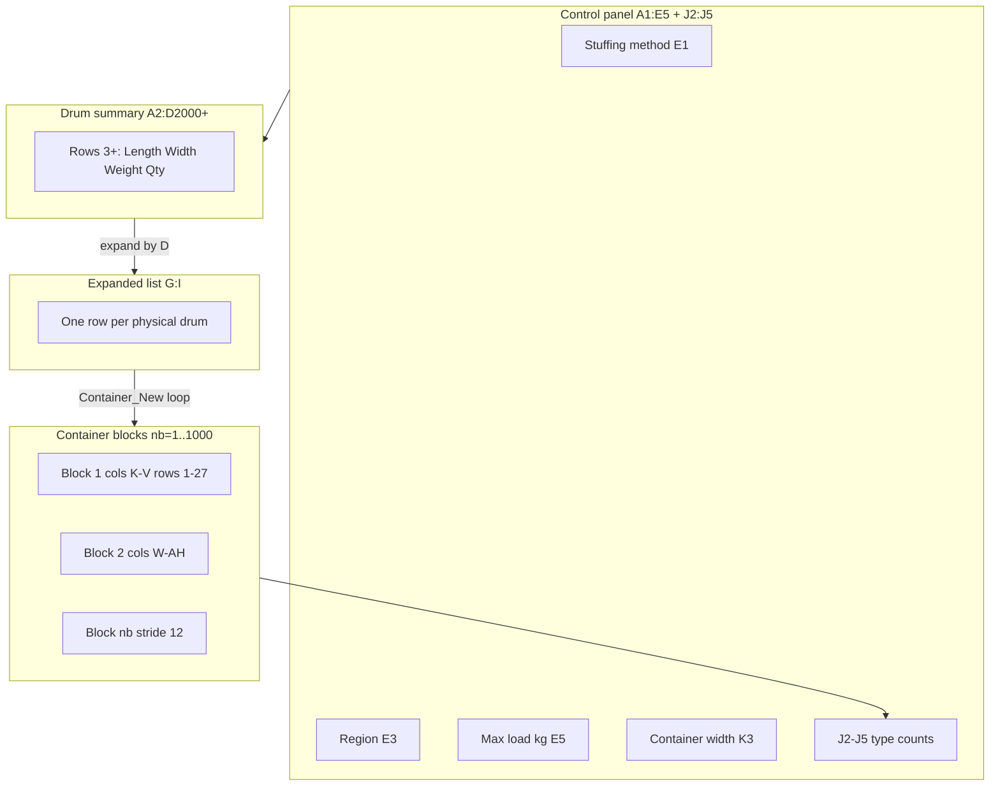
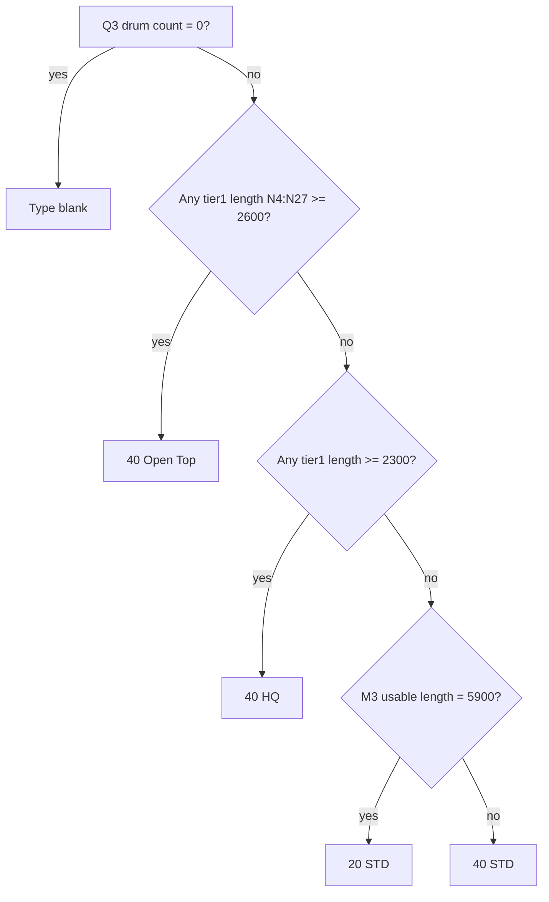
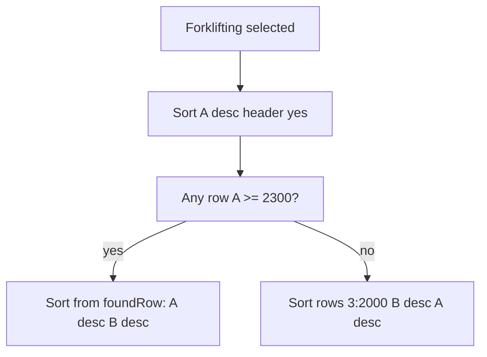
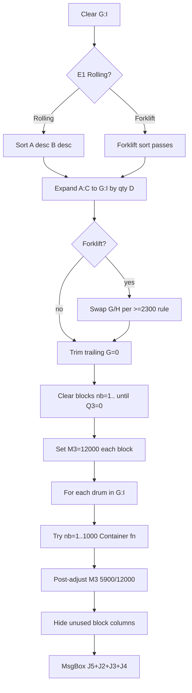
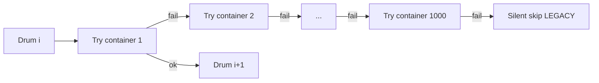
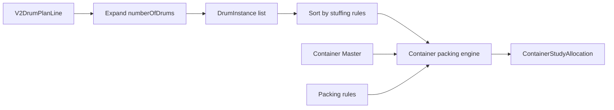

# TASK 05I-DB — Container Study Algorithm Reverse Engineering

**Date:** 2026-09-09  
**Mode:** DESIGN / ANALYSIS ONLY — no application code, schema migration, UI, or API  
**Status:** Review-ready for Technical Office, Logistics, IT (algorithm parity gate before 05I-DC+)  
**Parent spec:** [39 Container Study Business & Technical Specification](./39_CONTAINER_STUDY_BUSINESS_TECHNICAL_SPECIFICATION.md)

**Frozen bases:**

| Task | Commit | Scope |
|------|--------|-------|
| **05I-A** Inquiry process | `9471940` | Process codes; inquiry aggregate |
| **05I-B** Workflow runtime | `30d97df` | `CONTAINER_STUDY` stage label only |
| **05I-C** VIP Calculate orchestrator | `5b5254e` | Container shipment = 0 + warning when not configured |
| **05I-DA** Container Study business spec | `989650b` | Domain model, lifecycle, SaaS mapping intent |

**External source artifacts (not in repo):**

| Artifact | Path |
|----------|------|
| Workbook | `C:\Users\POP\Desktop\SW Projects\B2B Project\Master Data Template\Container Study.xlsm` |
| VBA export | `C:\Users\POP\Desktop\SW Projects\B2B Project\Master Data Template\Contianer study vba code.txt` |

**Related docs:** [36 Inquiry Process](./36_INQUIRY_PROCESS_FOUNDATION.md) · [37 Workflow Runtime](./37_WORKFLOW_RUNTIME_FOUNDATION.md) · [38 VIP Calculate](./38_VIP_FAST_TRACK_CALCULATE_ORCHESTRATOR.md) · [39 Container Study Spec](./39_CONTAINER_STUDY_BUSINESS_TECHNICAL_SPECIFICATION.md) · [Drum Master Domain](../DRUM_MASTER_DOMAIN.md)

---

## Document conventions

| Label | Meaning |
|-------|---------|
| **CONFIRMED** | Extracted from active workbook formulas and/or active VBA — treat as parity requirement |
| **CACHED** | Observed in saved workbook state — **NEEDS EXECUTION** to re-verify after macro run |
| **LEGACY** | Present in workbook/VBA but undesirable for SaaS (silent skip, integer truncation, no audit) |
| **PROPOSED** | Recommended SaaS behaviour per doc 39 — not necessarily identical to Excel |
| **NEEDS EXECUTION** | Regression case not yet run in controlled environment |

**Column notation:** Excel column letters used for workbook parity. For container block `nb` (1-based): `index = (nb - 1) × 12`, `baseCol = 11 + index` (column K for nb=1).

---

## 1. Purpose & scope

This document reverse-engineers the **active** Container Study algorithm embedded in the ELAND `Container Study.xlsm` workbook. It is the algorithmic companion to doc 39 and the **parity gate** for any future TypeScript implementation (05I-DC+).

**In scope:**

- Workbook layout, formulas, constants, control inputs
- Active `Container_New` macro and `Container()` function semantics
- Sorting, expansion, placement, second-layer, type classification, post-adjustment
- Excel → SaaS input mapping aligned with doc 39 §5–7
- Regression catalogue and golden JSON **specification** (no test code in this task)

**Out of scope (05I-DB):**

- Prisma models, migrations, API routes, UI
- Optimization beyond what the workbook performs (workbook is **not** an optimizer)
- Shipment cost calculation
- Modifications to costing, drum selection, or VIP Calculate policy

---

## 2. Source artifacts & extraction methodology

### 2.1 Workbook inspection

| Property | Value | Status |
|----------|-------|--------|
| Active sheet | `Container_New` | **CONFIRMED** |
| Used range (sample) | `A1:UGJ2037` | **CONFIRMED** |
| Active macros | `Container_New` (Sub), `Container` (Function) | **CONFIRMED** |
| Container slots | Up to **1000** blocks × **12** columns | **CONFIRMED** |
| Row limit (sort / input) | **2000** | **CONFIRMED** |

### 2.2 VBA extraction

VBA text export read in full. Only code **not** commented with `'` is **active** unless noted as disabled in §22.

### 2.3 Formula extraction

Key formulas read directly from workbook XML (`O3`, `V2`, cascading `K4`/`L4`/`M4`, `J2`–`J5` COUNTIF). Cached numeric results in the sample file are marked **CACHED** / **NEEDS EXECUTION**.

### 2.4 Integer semantics warning

VBA declares `length`, `wid`, `Weight` as **`Integer`** (16-bit signed, max 32,767). SaaS implementation must document whether parity mode truncates inputs or promotes to safe integers — see §23 and open question **Q-08**.

---

## 3. Workbook topology



| Zone | Columns | Rows | Role |
|------|---------|------|------|
| Labels / controls | A–F, J | 1–5 | User inputs, validation, aggregate counts |
| Drum input table | A–D | 2–2000+ | Aggregated drum lines (qty in D) |
| Expanded drums | G–I | 1–2000+ | Flat list: one row per drum instance |
| Container block *nb* | `11+index` … `22+index` | 1–27 | Per-container state + placements |
| Hidden tail | From first unused block | 1–27 | Columns hidden when `N3=0` |

---

## 4. Control inputs & validation

| Cell | Label (inferred) | Validation / value (sample) | Role |
|------|------------------|----------------------------|------|
| **E1** | Stuffing method | `Rolling` \| `Forklifting` | Sort order, placement gate (`Stuffing = "Rolling"`), second-layer region gate |
| **E3** | Region | `Europe` \| `Africa` | Second-layer formula: disabled when `Europe` |
| **E5** | Container max loading weight (kg) | **26000** (static in sample) | Feeds `L3` max weight per block via formula/reference |
| **K3** | Container internal width (mm) | **2350** (hardcoded in sample) | Width budget for tier-1 (`K` column per row) |
| **J2** | Count `40 Open Top` | COUNTIF formula | Result summary |
| **J3** | Count `40 HQ` | COUNTIF formula | Result summary |
| **J4** | Count `40 STD` | COUNTIF formula | Result summary |
| **J5** | Count `20 STD` | COUNTIF formula | Result summary |
| **E6** | (legacy mode) | `Calc. Space` referenced in **disabled** VBA | Not active |

**J2–J5 formulas (pattern):** COUNTIF across container type row 3 for each block header column `O3`, `AA3`, `AM3`, … through `$QSX$3` (type row for each 12-column block).

**MsgBox result order (active VBA):** `"Container study results : " & J5 & " + " & J2 & " + " & J3 & " + " & J4`  
→ displays **20 STD + Open Top + 40 HQ + 40 STD** (not geographic order).

---

## 5. Drum input table (columns A–D)

| Col | Header (row 2) | Unit | Semantics |
|-----|------------------|------|-----------|
| **A** | Length (Flange) | mm | Drum length along container axis for placement |
| **B** | Width | mm | Drum width across container |
| **C** | Gross Weight | kg | Loaded drum weight for weight budget |
| **D** | NB. DRUMS | qty | Expand count; loop **stops when D = 0** |

**Row 2:** treated as header (`Header:=xlYes` on first sort pass).

**Termination rule:** `For items = 3 To lastRow` — if `Cells(items, 4) = 0` then `Exit For` (no drums processed from that row onward).

### 5.1 Sample input (workbook)

| Row | A (L mm) | B (W mm) | C (kg) | D (qty) |
|-----|----------|----------|--------|---------|
| 3 | 2400 | 1632 | 6371 | 55 |
| 4 | 2100 | 1632 | 4537 | 5 |
| 5 | 1600 | 1120 | 1930 | 65 |
| 6 | 1400 | 982 | 1039 | 60 |
| **Σ** | | | | **185 drums** |

---

## 6. Expanded drum list (columns G–I)

After sort, macro copies each input row `A:C` to `G:I` repeated **`D` times**, appending below prior expansions.

| Col | Maps from | Meaning |
|-----|-----------|---------|
| **G** | A | Length (mm) per instance |
| **H** | B | Width (mm) per instance |
| **I** | C | Weight (kg) per instance |

**Post-expand cleanup:** Trailing rows in G where `G=0` are cleared from bottom up.

**Main loop:** `For i = 1 To CountA(G:G)` — sequential, order-dependent.

---

## 7. Container block layout (stride 12)

For container number **`nb`** (1 … 1000):

```
index  = (nb - 1) × 12
baseCol = 11 + index
```

| Offset | Col (nb=1) | Row | Purpose |
|--------|------------|-----|---------|
| +0 | **K** | 3 | Container internal width (from K3) |
| +1 | **L** | 3 | Max weight (kg) = E5 |
| +2 | **M** | 3 | Usable length (mm) — init **12000**; post **5900** or **12000** |
| +3 | **N** | 3 | Container number (`nb`) |
| +4 | **O** | 3 | Container type (formula) |
| +5 | **P** | 3 | (aux / spacing) |
| +6 | **Q** | 3 | Drum count (formula) |
| +7 | **R** | 3 | Utilization % (weight) |
| +8 | **S** | 3 | Utilization % (length) |
| +9 | **T** | 3 | Remaining weight (kg) |
| +10 | **U** | 3 | Remaining length (mm) — `MIN` of M column placements |
| +11 | **V** | 2 | Second-layer enable flag (formula) |

**Placement tiers (rows 4–27):**

| Tier | Length | Width | Weight |
|------|--------|-------|--------|
| 1 | N, O, P | cols `baseCol+3`, `+4`, `+5` | |
| 2 | Q, R, S | cols `baseCol+6`, `+7`, `+8` | |
| 3 | T, U, V | cols `baseCol+9`, `+10`, `+11` | |

**Note:** Tier 2/3 column letters overlap header semantics (Q,R,S vs q,r,s tiers) — workbook uses **row** to disambiguate (row 3 = header, rows 4–27 = placements).

---

## 8. Remaining capacity cascade (formulas)

Per block, row 4 cascades to row 27:

| Cell | Formula pattern (nb=1) | Semantics |
|------|------------------------|-----------|
| **K4** | `=K3-(R4+O4+U4)` | Remaining **width** on row: prior K minus tier1 width (O4), tier2 width (R4), tier3 width (U4) |
| **L4** | `=L3-P4-S4-V4` (cascade L3→L27) | Remaining **weight** after tier weights in row |
| **M4** | `=M3-N4` (cascade) | Remaining **length** after tier1 length (N4) in row |

Rows 5–27 repeat cascade referencing previous row's K, L, M.

**SaaS note:** Width check in VBA uses `Cells(row, 11+index) - wid >= 0` (column **K** remaining width), not door height or 3D geometry — doc 39 **TBD** packing profile still applies for SaaS elevation beyond this 2.5D model.

---

## 9. Formula catalogue

### 9.1 Container type — `O3` (CONFIRMED)

```excel
=IF(Q3=0,"",
  IF(OR(N4:N27>=2600),"40 Open Top",
    IF(OR(N4:N27>=2300),"40 HQ",
      IF(M3=5900,"20 STD",
        IF(Q3=0,"","40 STD")))))
```

**Decision tree:**



| Priority | Condition | Type |
|----------|-----------|------|
| 1 | No drums (`Q3=0`) | *(empty)* |
| 2 | Any placement length ≥ **2600** | **40 Open Top** |
| 3 | Any placement length ≥ **2300** | **40 HQ** |
| 4 | Usable length **M3 = 5900** | **20 STD** |
| 5 | Else | **40 STD** |

**Critical:** Classification uses **tier-1 length column N** only (not Q/T tiers). Open Top/HQ thresholds apply to **individual drum lengths**, not container length.

### 9.2 Second-layer enable — `V2` (CONFIRMED)

```excel
=IF(AND($E$3<>"Europe",$E$1="Rolling"),
  IF(IFERROR(ROUND(
    (COUNTIF(N4:N27,"<1050")
     +COUNTIF(Q4:Q27,"<1050")
     +COUNTIF(T4:T27,"<1050"))
    / COUNT(N4:N27,Q4:Q27,T4:T27),1),0) >= 0.5, 1, 0),
  0)
```

| Gate | Rule |
|------|------|
| Region | `E3 <> "Europe"` |
| Stuffing | `E1 = "Rolling"` |
| Metric | Fraction of **length** cells (all three tiers) **< 1050 mm** |
| Threshold | **≥ 0.5** (50%) → `V2 = 1` |

**Important:** Counts **length** values `<1050` in N, Q, T columns — **not** width.

### 9.3 Drum count — `Q3` (pattern)

Derived from populated placement cells across tiers (workbook formula; exact aggregation **CONFIRMED** present, mirrors tier occupancy).

### 9.4 Utilization — `R3`, `S3`

Weight and length utilization percentages on header row (reference max weight / usable length).

### 9.5 Remaining — `T3`, `U3`

| Cell | Semantics |
|------|-----------|
| **T3** | Remaining weight budget |
| **U3** | Remaining length — `MIN` of column M (cascaded remaining lengths) |

### 9.6 Aggregate counts — `J2`–`J5`

`COUNTIF($K$3:$QSX$3, "<type>")` across all block type cells in row 3.

---

## 10. Constant register

| ID | Value | Unit | Source | Usage |
|----|-------|------|--------|-------|
| C-01 | **2350** | mm | K3 (sample) | Container internal width |
| C-02 | **26000** | kg | E5 (sample) | Max cargo weight per container |
| C-03 | **12000** | mm | VBA init / post-adjust | Default usable container length |
| C-04 | **5900** | mm | VBA post-adjust | 20' usable length after adjustment |
| C-05 | **6100** | mm | VBA post-adjust threshold | Trigger 5900 when `U3 >= 6100` |
| C-06 | **2300** | mm | Type HQ + fork sort | `40 HQ` if any N ≥ 2300; fork big-drum detection |
| C-07 | **2600** | mm | Type Open Top | `40 Open Top` if any N ≥ 2600 |
| C-08 | **1050** | mm | Second layer | Small drum length threshold |
| C-09 | **0.5** | ratio | V2 formula | Second-layer enable threshold (50%) |
| C-10 | **1000** | count | VBA loop | Maximum container blocks |
| C-11 | **2000** | rows | VBA sort/input | Row ceiling for input/sort |
| C-12 | **12** | columns | Block stride | `index = (nb-1)×12` |
| C-13 | **27** | rows | Block height | Placement rows 4–27 |
| C-14 | **24** | rows | Tier capacity | Max placement rows per tier column set |
| C-15 | **3** | row | Input start | First data row for drums |
| C-16 | **13189** | col offset | Disabled VBA | `space_cont` for second-pass `original=False` |
| C-17 | **13200** | col offset | Disabled VBA | Alternate container copy region |
| C-18 | **4** | row | Placement start | First tier scan row in `Container()` |
| C-19 | **20** | col offset | Weight check | `Cells(3, 20+index)` = T3 remaining weight |
| C-20 | **21** | col offset | Length check | `Cells(3, 21+index)` = U3 remaining length |
| C-21 | **17** | col offset | Tier2 / drum# | `Cells(3, 17+index)` = Q3 / stop sentinel |
| C-22 | **14** | col offset | Tier1 | N column placements |
| C-23 | **11** | col offset | Width remaining | K column per row |
| C-24 | **185** | drums | Sample input | Regression baseline total |
| C-25 | **24** | containers | **CACHED** sample | Reported used container count |

**Type labels (canonical strings):** `40 Open Top`, `40 HQ`, `40 STD`, `20 STD`.

---

## 11. Sorting pre-processing

### 11.1 Rolling (`E1 = "Rolling"`) — **CONFIRMED active**

```
Sort A2:D2000
  Key1 = A (Length) DESC
  Key2 = B (Width)  DESC
  Header = Yes
```

### 11.2 Forklifting (`E1 = "Forklifting"`) — **CONFIRMED active**

**Pass 1:**

```
Sort A2:D2000
  Key1 = A DESC
  Header = Yes
```

**Pass 2 — detect big drums (`A >= 2300`):**

Scan column A from bottom row to 3. If any `A >= 2300`:

```
foundRow = first row from bottom where A >= 2300
Sort Cells(foundRow,1):Cells(2000,4)
  Key1 = A DESC, Key2 = B DESC
  Header = No
```

Else (no big drums):

```
Sort Cells(3,1):Cells(2000,4)
  Key2 = B DESC, Key1 = A DESC   // note VBA Key order vs comment
  Header = No
```



**SaaS parity:** Sort stability is undefined in VBA — document **order-dependent** behaviour (§23).

---

## 12. Forklifting column swap (G ↔ H)

**Active only when `E1 = "Forklifting"`.**

1. Scan G from bottom; find first row where `G >= 2300` → `foundRow2 = row + 1`.
2. If `foundRow2` is Empty: swap columns **G** and **H** for rows **1:2000** (full swap).
3. Else: swap columns **G** and **H** for rows **`foundRow2:2000`** (partial swap).

**Effect:** For large flange drums, length and width dimensions exchanged before placement — models forklift entry orientation.

**Rolling:** No swap.

---

## 13. Container_New macro — active flow



### 13.1 Pseudocode

```
procedure Container_New():
  clear G:I
  sort_input_table(E1)                    // §11
  expand_drums(A:D → G:I)                 // §6
  if E1 == "Forklifting":
    swap_G_H_for_forklifting()            // §12
  trim_trailing_zero_rows(G)

  for nb in 1..1000:
    if Cells(3, 17+index).Value == 0: break
    clear placement rows 4-27 for block
    clear second-layer counters row 2 cols 15,16
    Cells(3, 13+index) = 12000            // usable length init

  for i in 1..CountA(G:G):
    length, wid, weight = G[i], H[i], I[i]
    loaded = false
    for nb in 1..1000:
      if Container(length, wid, weight, nb, original=true):
        loaded = true; break
    // LEGACY: if not loaded → silent skip

  for nb in 1..1000:
    if Q3 == 0: break
    post_adjust_usable_length(nb)         // §18

  unhide all block columns
  hide columns from first empty block
  MsgBox summary(J5, J2, J3, J4)
```

### 13.2 Block clear sentinel

Loop clears blocks while `Cells(3, 17+index) <> 0`. First unused block has **`Q3 = 0`** (column 17+index on row 3) — used as termination for hide/clear loops.

---

## 14. Container() function — signature & gates

```vba
Function Container(length As Integer, wid As Integer, Weight As Integer,
                   nb As Integer, original As Boolean) As Boolean
```

| Parameter | Role |
|-----------|------|
| `length, wid, Weight` | Drum dimensions/weight |
| `nb` | Target container block (1..1000) |
| `original` | **True** in active path; **False** + `space_cont=13189` only in **disabled** second pass |

**Active path always calls with `original=True`** → `space_cont = 0`.

### 14.1 Global gates

| Gate | Condition | Effect |
|------|-----------|--------|
| Weight | `Weight <= Cells(3, 20+index)` (T3) | Required to enter any branch |
| Stuffing | `Stuffing = "Rolling"` | Required for tier fill branches 1–2 |
| Length (new row) | `length <= Cells(3, 21+index)` (U3) | Required for branch 3 |

**Forklifting:** No separate placement branches — only pre-processing swap (§12). Placement still requires `Stuffing = "Rolling"` in tier branches → **Forklifting placement relies on branch 3 (new row) only** when tier branches skipped.

### 14.2 Branch 1 — Tier 3 (columns T,U,V / 20–22)

**When:** `lastRow(col 17+index) > lastRow(col 20+index)` — tier 2 column Q has **more** used rows than tier 3 column T.

```
For row = 4 .. lastRow(tier2):
  if not loaded AND Rolling AND K_remaining - wid >= 0 AND cell(20+index) empty:
    write length, wid, weight → cols 20,21,22
    loaded = true
```

### 14.3 Branch 2 — Tier 2 (columns Q,R,S / 17–19)

**When:** `lastRow(col 14+index) > lastRow(col 17+index)` — tier 1 has more rows than tier 2.

```
For row = 4 .. lastRow(tier1):
  if not loaded AND Rolling AND K_remaining - wid >= 0 AND cell(17+index) empty:
    write length, wid, weight → cols 17,18,19
    loaded = true
```

**Sub-branch 3a (same condition block):** If still not loaded and `length <= U3`:

```
append new row on tier 1 (cols 14,15,16) = length, wid, weight
loaded = true
```

### 14.4 Branch 3 — New tier-1 row

**When:** tier1 row count **not** greater than tier2 (`ElseIf` path) and not loaded:

```
if length <= U3:
  append tier 1 row (14,15,16)
  loaded = true
```

### 14.5 Branch 4 — Second-layer virtual (§15)

See §15.

### 14.6 Return

`Container = Drum_Loaded` (Boolean).

---

## 15. Second-layer virtual placement

**Not geometric stacking** — increments counters on **row 2** without writing tier geometry.

**Conditions (all required):**

1. `Drum_Loaded = False` after branches 1–3
2. `Cells(2, 22+index) = 1` (V2 second-layer flag)
3. `Cells(2, 15+index) < COUNTIFS(N,Q,T tiers, "<1050")`  
   — second-layer counter (col 15 row 2) less than count of small lengths

**Action:**

```
Cells(2, 15+index) += 1      // virtual drum count
Cells(2, 16+index) += Weight // virtual weight sum
Drum_Loaded = True
```

**SaaS gap (doc 39):** Virtual second layer has **no 3D coordinates** — **PROPOSED** SaaS either reproduces virtual counting for parity mode or replaces with governed stacking rules (**TBD**).

---

## 16. Container type classification (summary)

See §9.1. Post-processing adjusts **M3** (usable length) which feeds back into `20 STD` vs `40 STD` via `M3=5900` test.

**Interaction with post-adjust (§18):**

- Post loop sets `M3=5900` when `U3>=6100` and type not HQ/Open Top
- Type formula on row 3 may need recalculation after M3 change — workbook relies on Excel calc chain

---

## 17. Post-process usable length adjustment

**Active VBA (after all drums loaded):**

```vba
If Cells(3, 21+index) >= 6100 _
   And Cells(3, 15+index) <> "40 HQ" _
   And Cells(3, 15+index) <> "40 Open Top" Then
  Cells(3, 13+index) = 5900
Else
  Cells(3, 13+index) = 12000
End If
```

| Condition | M3 (usable length) |
|-----------|-------------------|
| `U3 >= 6100` AND type ∉ {40 HQ, 40 Open Top} | **5900** (20') |
| Otherwise | **12000** (40') |

**CACHED sample:** Container 24 → type **20 STD**, length **5900**.

---

## 18. Failure & error behavior

| Scenario | Workbook behaviour | SaaS recommendation |
|----------|-------------------|---------------------|
| Drum fails all containers 1..1000 | **Silent skip** — no row, no MsgBox | **PROPOSED:** `UNALLOCATED` + audit (doc 39 §9) |
| Runtime error in macro | MsgBox: *"Please check the Drums Data and calculate the Container again"* | Structured error + validation |
| Weight exceeded | `Container()` returns False | Same as fail |
| `Stuffing=Forklifting` tier branches skipped | Only new-row + virtual paths | Document orientation policy |
| Integer overflow / truncation | Undefined — VBA Integer | **Q-08** |

**LEGACY:** No unallocated drum report, no CONFIRMED study lifecycle — contradicts doc 39 **PROPOSED** validations.

---

## 19. Disabled / commented VBA paths

| Feature | Evidence | Status |
|---------|----------|--------|
| Container 20 Only / 40 Only via `Cells(6,5)` | Commented blocks setting M3=5900 vs 12000 | **DISABLED** |
| `Conttype = Cells(6,5)` read | Assigned but unused in active path | **DEAD** |
| Calc. Space alternate copy at col **13200** | Large commented region | **DISABLED** |
| Second pass `Container(..., original=False)` with `space_cont=13189` | Commented | **DISABLED** |
| Copy container study columns routine | Commented | **DISABLED** |
| Timer to **J22** | Commented (`start_Time`, `end_Time`) | **DISABLED** |
| Copy block to cols 23+ for formula mods | Commented header | **DISABLED** |

**SaaS:** Do not implement disabled paths unless business explicitly requests legacy parity mode.

---

## 20. Algorithm characterization

| Property | Assessment |
|----------|------------|
| Strategy | **Deterministic greedy sequential first-fit** |
| Container try order | For each drum: `nb = 1, 2, …` until first success |
| Drum order | Sort-dependent expanded G:I sequence |
| Optimization | **None** — not cost/count minimized globally |
| Backtracking | **None** |
| Dimension model | 2.5D — length + width budget + weight; no height |
| Nondeterminism | Sort stability, floating vs integer — **NEEDS EXECUTION** |
| Integer types | VBA `Integer` truncation — parity risk |
| Second layer | Virtual counter — not physical layout |
| Type selection | Rule-based on max tier-1 length + post M3 |



**Doc 39 alignment:** Business spec §8 optimization hierarchy is **aspirational**; workbook implements **first-fit only**. SaaS optimization engine (05I-DE) must not assume workbook = optimizer.

---

## 21. Excel → SaaS input mapping (doc 39)

| Excel input | SaaS source (doc 39) | Transform |
|-------------|---------------------|-----------|
| A — Length (flange) mm | Drum Packing Profile / plan-derived outer length | Map from `V2DrumPlanLine` + profile (**TBD** D-17) |
| B — Width mm | Drum Packing Profile outer width | Same |
| C — Gross weight kg | `grossLoadedDrumWeightKg` on plan line | Expand instances |
| D — Qty | `numberOfDrums` | Expand to discrete instances |
| E1 — Stuffing | Shipment group packing method enum | `ROLLING` \| `FORKLIFTING` |
| E3 — Region | Shipment group region | `EUROPE` \| `AFRICA` (extend as master) |
| E5 — Max weight | Container Master `maxPayloadKg` | Per-type; sample uses single 26000 |
| K3 — Container width | Container Master `internalWidthMm` | Sample static 2350 |
| M3 — Usable length | Container Master `internalLengthMm` | 12000/5900 post-rule |
| Type thresholds 2300/2600 | Container Master type rules | **PROPOSED** rule table |
| Second layer 1050 / 50% | Packing rule set | **TBD** doc 39 D-04 |

### 21.1 Expansion mapping



### 21.2 Output mapping

| Excel output | SaaS entity (doc 39 §7) |
|--------------|-------------------------|
| Block nb type O3 | `ContainerStudyLine.containerTypeCode` |
| Q3 drum count | `ContainerStudyLine.quantity` / allocation count |
| R3,S3 utilization | `ContainerStudyLine.utilizationWeightPct`, `utilizationLengthPct` |
| Tier placements N:V | `ContainerStudyAllocation` (+ orientation metadata **PROPOSED**) |
| J2–J5 aggregates | Derived summary on study header |
| Virtual row 2 cols 15–16 | **TBD** — `secondLayerVirtualCount` metadata |

---

## 22. Legacy vs SaaS column map

| Excel zone | Legacy role | SaaS persistence | Notes |
|------------|-------------|------------------|-------|
| A:D input | Manual drum table | Derived from `V2DrumPlan` | No duplicate SoT |
| G:I expanded | Macro working set | In-memory engine state | Not persisted |
| K3 static width | Global width | Per container type master | Sample uses one width |
| Block K:V | Container state | `ContainerStudy` + lines + allocations | Versioned |
| Row 2 cols 15–16 | Virtual 2nd layer | Extension field or rule engine | No geometry |
| J2:J5 | Result MsgBox | Study summary JSON | User-facing |
| Hidden columns | UI clutter control | N/A | |
| Col 13200+ | Disabled space calc | Not implemented | |
| E6 Calc. Space | Disabled mode | Not implemented | |

---

## 23. Regression test catalogue

**Legend:** **CONFIRMED** = static logic test; **CACHED** = match saved workbook; **NEEDS EXECUTION** = requires macro run.

| ID | Category | Setup | Expected | Status |
|----|----------|-------|----------|--------|
| R-01 | Sort | Rolling, 4 sample rows | A desc, then B desc | **NEEDS EXECUTION** |
| R-02 | Sort | Forklift, all A<2300 | B desc, A desc on rows 3+ | **NEEDS EXECUTION** |
| R-03 | Sort | Forklift, row A>=2300 | Partial resort from foundRow | **NEEDS EXECUTION** |
| R-04 | Expand | Sample D sums | 185 rows in G:I | **CONFIRMED** arithmetic |
| R-05 | Forklift swap | All G<2300 | Full G↔H swap | **NEEDS EXECUTION** |
| R-06 | Forklift swap | Mixed sizes | Partial swap from first G>=2300+1 | **NEEDS EXECUTION** |
| R-07 | Weight gate | Drum weight > T3 | Container returns False | **CONFIRMED** logic |
| R-08 | Tier2 fill | Rolling, prior tier1 rows | Fill empty Q cell same row | **NEEDS EXECUTION** |
| R-09 | Tier3 fill | Rolling, Q deeper than T | Fill T tier | **NEEDS EXECUTION** |
| R-10 | New row | length <= U3 | Append N,O,P | **CONFIRMED** logic |
| R-11 | Second layer | Africa+Rolling, >=50% lengths <1050 | V2=1, virtual load | **NEEDS EXECUTION** |
| R-12 | Second layer | Europe | V2=0 always | **CONFIRMED** formula |
| R-13 | Type | Any N>=2600 | 40 Open Top | **CONFIRMED** formula |
| R-14 | Type | N max 2300–2599 | 40 HQ | **CONFIRMED** formula |
| R-15 | Type | M3=5900, no HQ/OT | 20 STD | **CONFIRMED** formula |
| R-16 | Post-adjust | U3>=6100, type 40 STD | M3→5900 | **CONFIRMED** VBA |
| R-17 | Post-adjust | Type 40 HQ | M3 stays 12000 | **CONFIRMED** VBA |
| R-18 | Sample E2E | Sample 185 drums, Rolling, Africa | **CACHED:** 24 containers: 14 HQ, 9 STD40, 1 STD20, 0 OT | **NEEDS EXECUTION** |
| R-19 | Container 24 | Same | Type 20 STD, M=5900 | **CACHED** |
| R-20 | Silent skip | Drum exceeding all capacity | No error, drum dropped | **LEGACY** |
| R-21 | MsgBox order | After run | J5+J2+J3+J4 string | **CONFIRMED** VBA |
| R-22 | Hide columns | First Q3=0 block | Columns hidden rightward | **CONFIRMED** VBA |
| R-23 | Integer | length=40000 | Overflow/truncation | **NEEDS EXECUTION** |
| R-24 | Forklift E2E | Sample + Forklift | Different pack vs Rolling | **NEEDS EXECUTION** |
| R-25 | Empty input | D=0 at row 3 | No expansion | **CONFIRMED** VBA |

---

## 24. Golden test JSON (specification only)

**Purpose:** Canonical parity fixture for future `containerStudyEngine.test.ts` — **not implemented in 05I-DB**.

```json
{
  "fixtureId": "CONTAINER_STUDY_GOLDEN_001",
  "source": "Container Study.xlsm sample rows 3-6",
  "status": "NEEDS_EXECUTION",
  "inputs": {
    "stuffingMethod": "Rolling",
    "region": "Africa",
    "containerInternalWidthMm": 2350,
    "maxPayloadKg": 26000,
    "defaultUsableLengthMm": 12000,
    "drumLines": [
      { "lengthMm": 2400, "widthMm": 1632, "grossWeightKg": 6371, "quantity": 55 },
      { "lengthMm": 2100, "widthMm": 1632, "grossWeightKg": 4537, "quantity": 5 },
      { "lengthMm": 1600, "widthMm": 1120, "grossWeightKg": 1930, "quantity": 65 },
      { "lengthMm": 1400, "widthMm": 982, "grossWeightKg": 1039, "quantity": 60 }
    ]
  },
  "expectedOutputsCached": {
    "totalDrumsExpanded": 185,
    "containersUsed": 24,
    "typeCounts": {
      "40 Open Top": 0,
      "40 HQ": 14,
      "40 STD": 9,
      "20 STD": 1
    },
    "lastContainer": {
      "containerNumber": 24,
      "type": "20 STD",
      "usableLengthMm": 5900
    },
    "msgBoxFragmentOrder": ["J5", "J2", "J3", "J4"]
  },
  "parityMode": "LEGACY_EXCEL_FIRST_FIT",
  "saasDeviationsAllowed": false
}
```

---

## 25. Open questions, risks & sign-off

### 25.1 Open question register

| ID | Question | Impact | Owner | Status |
|----|----------|--------|-------|--------|
| Q-01 | Are K3/E5 static values correct for all container types? | Wrong feasibility | Logistics | **TBD** |
| Q-02 | Should SaaS replicate virtual second layer or real 3D stacking? | Parity vs safety | Technical Office | **TBD** |
| Q-03 | Forklifting with Rolling-only tier branches — intentional? | Forklift under-fill | Technical Office | **NEEDS VALIDATION** |
| Q-04 | Exact Q3 drum count formula aggregation | Summary counts | IT | **NEEDS EXECUTION** |
| Q-05 | Recalc order: type O3 before/after M3 post-adjust | 20 vs 40 STD edge cases | IT | **NEEDS EXECUTION** |
| Q-06 | COUNT(N4:N27,Q4:Q27,T4:T27) denominator zero handling | V2 formula | IT | **CONFIRMED** IFERROR→0 |
| Q-07 | Map flange length to SaaS Drum Packing Profile | Input mapping | Technical Office | **TBD** (doc 39 D-17) |
| Q-08 | Integer truncation vs rounding for mm/kg | Parity tests | IT | **TBD** |
| Q-09 | Accept silent skip drums in SaaS? | Data integrity | Product | **PROPOSED NO** (doc 39) |
| Q-10 | Single global width 2350 vs per-type width | Multi-type studies | Logistics | **TBD** |

### 25.2 Risks

| Risk | Severity | Mitigation |
|------|----------|------------|
| Workbook ≠ doc 39 optimization intent | High | Label engine `LEGACY_FIRST_FIT`; optimize in 05I-DE separately |
| Silent drum drop | High | SaaS unallocated report + block CONFIRM |
| No height/door model | Medium | Container Master + packing profile before VALIDATED |
| Order-dependent sort | Medium | Pin sort rules + golden JSON |
| Disabled VBA paths rediscovered in production | Low | This register §19 |

### 25.3 Recommended next tasks

| Phase | Task | Depends on |
|-------|------|------------|
| 05I-DB+ | Execute R-01–R-25; refresh CACHED counts | This doc |
| 05I-DC | Drum Packing Profile + suitability | Q-07, doc 39 D-17 |
| 05I-DD | Container Study persistence | 05I-DC |
| 05I-DE | Optimization (optional, non-parity) | doc 39 §8 |

### 25.4 Sign-off

| Role | Name | Date | Status |
|------|------|------|--------|
| Technical Office | | | Pending |
| Logistics / Supply Chain | | | Pending |
| IT / Architecture | | | Pending |

---

## Appendix A — Container() consolidated pseudocode

```
function Container(length, wid, weight, nb, original=true) -> bool:
  index = (nb-1)*12
  if not original: space_cont = 13189 else space_cont = 0  // only True active

  if weight > remainingWeight(nb): return false

  stuffing = E1

  // Branch 1 — tier 3
  if tier2RowCount > tier3RowCount:
    for row in 4..lastTier2Row:
      if not loaded and stuffing=="Rolling" and K[row]-wid>=0 and T_cell empty:
        write tier3; return true

  // Branch 2 — tier 2
  if tier1RowCount > tier2RowCount:
    for row in 4..lastTier1Row:
      if not loaded and stuffing=="Rolling" and K[row]-wid>=0 and Q_cell empty:
        write tier2; return true
    if not loaded and length <= U3:
      append tier1; return true

  // Branch 3 — new tier 1 row
  elif not loaded and length <= U3:
    append tier1; return true

  // Branch 4 — virtual second layer
  if not loaded and V2==1 and virtualCount < countLengthsBelow(1050):
    increment virtual counters; return true

  return false
```

---

## Appendix B — Document metrics

| Metric | Count |
|--------|------:|
| Numbered sections | **25** |
| Constant register entries | **25** |
| Regression cases | **25** |
| Mermaid diagrams | **6** |
| Formula catalogue entries | **6** |
| Open questions | **10** |
| Disabled VBA features documented | **7** |

---

*End of TASK 05I-DB — Container Study Algorithm Reverse Engineering.*
