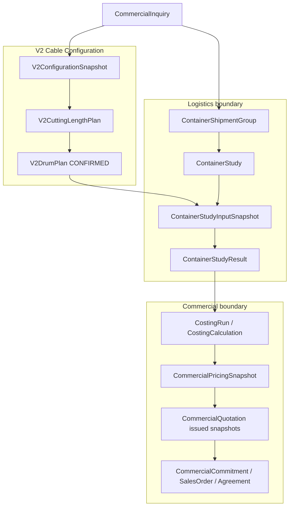
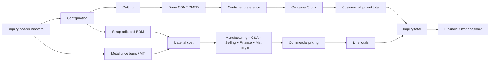

# TASK 05I-DF-A — Container Study & Commercial Calculation Integration Architecture

**Date:** 2026-09-10 (**FINAL** — DF-A-FINAL freeze)  
**Mode:** Canonical architecture (documentation only); **all DF-A decisions FROZEN (DF-A-01…DF-A-35)**  
**Status:** **FINAL / FROZEN** — authoritative architecture for **05I-DF-B** through **05I-DF-F** and E2E validation  

**B4 amendment (design only):** grouping mode `DESTINATION_CLUSTER` and LOCKED-group successor-study semantics are specified in [47](./47_B4_SHIPMENT_GROUP_AND_SHIPPING_COST_ARCHITECTURE_AMENDMENT.md). DF-A-01…35 remain frozen except the D1/D2 amendments named there. **Not implementation-authorized** until 47 is approved.  

**Frozen implementation bases (do not re-open in integration design):**

| Task | Scope | Status |
|------|--------|--------|
| **05I-DD** | Persistence foundation (`ContainerStudy*`, masters, shipment group table) | **FROZEN** — see [44](./44_CONTAINER_STUDY_PERSISTENCE_IMPLEMENTATION.md) |
| **05I-DE** | Rolling engine `LEGACY_FIRST_FIT_V1`, calculate/confirm hardening | **FROZEN** — see [45](./45_CONTAINER_STUDY_ROLLING_ENGINE_IMPLEMENTATION.md) |
| **05I-DF-A** | Integration architecture + **frozen decision register** (this document) | **FROZEN** |
| **05I-DF-B** | Shipment group + drum plan → snapshot (next implementation) | **Authorized** per §29 |

**Governing specs:** [39](./39_CONTAINER_STUDY_BUSINESS_TECHNICAL_SPECIFICATION.md) · [40](./40_CONTAINER_STUDY_ALGORITHM_REVERSE_ENGINEERING.md) · [42](./42_CONTAINER_STUDY_ALGORITHM_DECISION_AND_SAAS_PARITY.md) · [43](./43_CONTAINER_STUDY_MASTER_DATA_AND_ENGINE_DESIGN.md) · [36](./36_INQUIRY_PROCESS_FOUNDATION.md) · [37](./37_WORKFLOW_RUNTIME_FOUNDATION.md) · [38](./38_VIP_FAST_TRACK_CALCULATE_ORCHESTRATOR.md) · [TASK05I](./TASK05I_INQUIRY_PROCESS_WORKFLOW_ARCHITECTURE.md)

---

## Executive architecture

Container Study sits **after** a **CONFIRMED** `V2DrumPlan` and **within** a **Shipment Group**, and **before** logistics-aware costing inputs and commercial pricing. It answers **technical/logistical feasibility** of loading packed drums into governed container types. It does **not** select drums, price metal, resolve BOM conflicts, or issue quotations.



**Integration is not implemented.** Today, studies are created via logistics APIs with manually supplied drum lines on snapshots; there is **no** automated bridge from `V2DrumPlan` → snapshot capture, **no** `CostingRun` / `CostingCalculation` FK to container study results, **no** Shipping Cost Master, and **no** workflow stage adapter for `CONTAINER_STUDY`.

### End-to-end commercial calculation chain (frozen)

```text
Customer Inquiry
  → Cable Configuration (V2ConfigurationSnapshot)
  → Cutting Length (V2CuttingLengthPlan)
  → Drum Plan (V2DrumPlan CONFIRMED)
  → Container Preference (input; not technical authority)
  → Container Study (snapshot → result)
  → Incoterm + Destination Port (governed masters)
  → Customer Shipment Cost (Shipping Cost Master + study quantities)
  → Metal Price Basis (inquiry header, per MT, inquiry currency)
  → Scrap-adjusted BOM consumption
  → Material Cost
  → Manufacturing Cost → G&A → Selling Expense → Finance Cost → Material Margin
  → Internal Cable Cost / commercial cost basis
  → Commercial Pricing
  → Inquiry Total (Σ cable lines + Σ customer shipment)
  → Financial Offer (customer-facing snapshot)
```



Full detail: **§30** (Parts A–Z), **§31–§36** (DF-A-FINAL). Historical Energya commercial offers are a **business reference** for Financial Offer **structure** only — not contractual text for implementation.

### Container Study → customer shipment (frozen logistics chain)

```text
Confirmed Drum Plan
        ↓
Shipment Group (Logistics-owned)
        ↓
Container Preference (customer input; not technical authority)
        ↓
Container Study Input Snapshot (immutable; drum plan provenance + copied packing values)
        ↓
Container Study Result (pinned for costing when used)
        ↓
Container Quantity (from result)
        ↓
Shipping Rate Lookup (Shipping Cost Master: destination + incoterm + container type)
        ↓
Customer Shipment Total (per group → inquiry)
```

**Customer selects:** Incoterm, Destination Port, container type **preference** (governed masters). **Logistics owns:** shipment grouping, shipping rate governance, technical/logistics authority ([DF-A-01](#dfa-01--shipment-group-ownership), [DF-A-30](#dfa-30--shipping-rate-governance)).

---

## 1. Domain ownership

| Domain | Authoritative owner of | Must not own |
|--------|----------------------|--------------|
| **V2 Configuration** | Engineering cable configuration, validation, `V2ConfigurationSnapshot` | Drum packing, container allocation, commercial price |
| **Cutting** | `V2CuttingLengthPlan`, cutting quantity semantics | Drum selection, shipment grouping |
| **Drum Plan** | Drum selection, schedule, `V2DrumPlan` lifecycle (`lifecycleStatus`, lines) | Container stuffing, freight rates |
| **Shipment Group** (Logistics-owned) | `ContainerShipmentGroup` creation, lifecycle, grouping, validation, confirmation | Customer preference as authoritative grouping; packing algorithm; costing |
| **Container Study** | Study lifecycle, input snapshot, calculation, result, utilization, unallocated drums | Manufacturing cost, BOM, Decision 5 |
| **Costing** | `costingEngine.ts` runs, `CostingRun` / `CostingCalculation`, RM inputs, scrap (frozen) | Container geometry, study confirmation |
| **Pricing** | `CommercialPricingSnapshot`, commercial unit/line prices on governed inputs | Container master, drum plan edits, internal cost formulas on customer UI |
| **Quotation / Financial Offer** | Issued commercial snapshots, customer-visible totals and terms | Internal cost build-up, BOM/scrap detail, raw RM cost |
| **Shipping Cost Master** (conceptual) | Governed `customerShipmentRate` by destination + incoterm + container type | Customer edit of rates; metal landed shipping |
| **Commercial Fulfillment** | `CommercialCommitment`, `EpcSalesOrder`, `SalesAgreement`, `AgreementRelease`, fulfillment status | Container study calculation |
| **D365** | Future execution/integration boundary only | Any 05I-DF calculation or validation |

---

## 2. Canonical lineage

### 2.1 End-to-end chain (logical)

```text
CommercialInquiry
  → CommercialInquiryLine
  → V2ConfigurationSnapshot          (immutable, per line)
  → V2CuttingLengthPlan              (immutable version, pins snapshot)
  → V2DrumPlan                       (versioned; CONFIRMED = logistics gate)
  → ContainerShipmentGroup           (inquiry-scoped grouping)
  → ContainerStudy                   (versioned studyNumber)
  → ContainerStudyInputSnapshot      (immutable)
  → ContainerStudyResult             (immutable per calculate)
  → CostingRun / CostingCalculation  (pins drum + snapshot lineage today)
  → CommercialPricingSnapshot
  → CommercialQuotation              (technicalOfferSnapshot / commercialOfferSnapshot)
  → Commercial Fulfillment aggregates
```

### 2.2 Relationship strategy (no redundant lineage)

| From | To | Recommended link type | Rationale |
|------|-----|----------------------|-----------|
| Inquiry line | Current snapshot / cutting / drum | **Mutable pointer** on `CommercialInquiryLine` (`v2Current*Id`) | Operational “current” only |
| Cutting plan | Configuration snapshot | **Direct FK** + `configurationSnapshotVersionNo` | Immutable evidence chain (exists) |
| Drum plan | Cutting plan | **Direct FK** + `cuttingLengthPlanVersionNo` | Immutable evidence chain (exists) |
| Drum plan line | Container study input drum | **Snapshot copy** at capture; optional **provenance FK** (`v2DrumPlanId`, `v2DrumPlanLineId`, `planVersionNo`) on snapshot metadata | Reproducibility = snapshot; audit = optional pins |
| Shipment group | Inquiry | **Direct FK** (exists) | One inquiry, many groups |
| Container study | Shipment group | **Direct FK** (exists) | Study is per group |
| Container study | Input snapshot | **`currentSnapshotId`** + historical snapshot rows | Current vs audit |
| Container study | Result | **`currentResultId`** + historical result rows | No `CALCULATED` status |
| Costing | Drum plan | **FK** `drumPlanId` on `CostingRun` (exists) | Manufacturing lineage |
| Costing | Container study result | **`CostingRun` → specific `ContainerStudyResult`** (immutable pin; **not in schema yet**) | Downstream must not use “latest study/result” ([DF-A-04](#dfa-04--costing-pin)) |
| Quotation line | Costing | **FK** `costingCalculationId` / `costingRunId` (exists) | Issued offer pins |
| Quotation header | Optional logistics | **JSON snapshot** `commercialOfferSnapshot.optionalComponents` (VIP pattern) | Warnings + zero-default semantics |

**Do not** add parallel FK chains that duplicate snapshot content (e.g. storing full drum geometry on `CostingRun` when already on study result).

### 2.3 Inquiry-level vs line-level

- Configuration, cutting, and drum plans are **per inquiry line**.
- Container study is **per shipment group**, which may include **multiple lines** (ENTIRE_INQUIRY) or **one line** (PER_INQUIRY_LINE).
- Costing remains **primarily per line** (`CostingRun.inquiryLineId`, `CostingCalculation.inquiryLineId`); line-level `CostingCalculation` may reference the **already pinned** `CostingRun` logistics dependency ([DF-A-04](#dfa-04--costing-pin)).

---

## 3. Snapshot principle

### 3.1 Current master data vs transaction snapshot

| Class | Examples | Rule |
|-------|----------|------|
| **Current master** | `ContainerTypeVersion`, `DrumPackingProfileVersion`, `AlgorithmConfiguration`, live `DrumMaster` | May change tomorrow; **never** used alone to reinterpret a closed transaction |
| **Transaction snapshot** | `V2ConfigurationSnapshot`, `V2CuttingLengthPlan`, `V2DrumPlan` (captured row), `ContainerStudyInputSnapshot`, `ContainerStudyResult` | **Immutable** after capture/calculate; pins JSON at point in time |

Historical calculation **must** load engine inputs from **snapshot pins** (`containerMasterPinJson`, `packingProfilePinJson`, `algorithmParameterPinJson`, per-drum packed L/W/weight) — as implemented in 05I-DE.

### 3.2 Immutability matrix

| Artifact | Immutable? | When frozen |
|----------|------------|-------------|
| V2 configuration snapshot | Yes | On capture |
| Cutting length plan | Yes | On capture (new version = new row) |
| Confirmed drum plan | Yes as evidence row | New drum version = new row; CONFIRMED row not edited in place |
| Container study input snapshot | Yes | On `captureInputSnapshot` |
| Container study result | Yes | On successful `/calculate` |
| Costing run / calculation output | Yes | On successful costing |
| Pricing snapshot | Yes | On pricing capture |
| Quotation issued snapshot | Yes | On issue / revision |

**CONFIRMED** container study: service layer blocks new snapshot on confirmed study (05I-DD); supersede creates new `versionNo`.

---

## 4. Drum plan → Container Study

### 4.1 Gate: lifecycle status

| `V2DrumPlan.lifecycleStatus` | Container Study |
|------------------------------|-----------------|
| DRAFT | **Block** snapshot capture from plan — no calculate |
| VALIDATED (if used) | **Block** — only **CONFIRMED** is logistics authority |
| **CONFIRMED** | **Allow** orchestrated snapshot build |
| SUPERSEDED | **Block** — consumer must resolve **current** CONFIRMED plan for line |

VIP Calculate already **blocks** without CONFIRMED drum plan ([38](./38_VIP_FAST_TRACK_CALCULATE_ORCHESTRATOR.md) gate C). Container Study orchestration must align: **never calculate from non-confirmed plan data.**

### 4.2 Minimum consumption from CONFIRMED drum plan

| Field / concept | Source | Copied to study snapshot |
|-----------------|--------|---------------------------|
| Drum plan identity | `V2DrumPlan.id`, `planId`, `versionNo` | **Required** provenance on snapshot: `drumPlanId`, `drumPlanVersionNo` ([DF-A-03](#dfa-03--drum-plan--container-study-provenance)) |
| Inquiry ownership | `inquiryLineId` → inquiry `customerId` | `ContainerStudy.customerId` (from inquiry scope, not client body) |
| Shipment group | Selected group for line(s) | `ContainerStudy.shipmentGroupId` |
| Schedule lines | `V2DrumPlanLine` | `ContainerStudyInputDrum` rows |
| Per-line drum code / master | `drumCode`, `drumMasterId` | `drumCode`, `drumMasterId` |
| Quantity | `numberOfDrums` | `quantity` (engine expands instances) |
| Packed geometry | From engineering / packing profile resolution | `packedLengthMm`, `packedWidthMm`, `grossWeightKg` |
| Logical identity | `V2DrumPlanLine.id` | `sourceLineId`; engine uses `sourceLineId:instanceIndex` |
| Cutting/config lineage | On drum plan row | Not re-FK’d on every drum if snapshot records `drumPlanId` once |

**Width/length/weight** must come from **approved packing profile pins** at snapshot time, not live drum master alone ([43](./43_CONTAINER_STUDY_MASTER_DATA_AND_ENGINE_DESIGN.md)).

### 4.3 Superseded drum plan

If a line’s `v2CurrentDrumPlanId` advances after a study snapshot:

- Existing snapshot/result remain valid **for audit** but are **stale** for new costing.
- New snapshot requires **new** CONFIRMED plan version → typically **recalculate** → confirm gate re-evaluated.
- Downstream costing must pin **specific** `containerStudyResultId` used; material drum plan change requires new snapshot → calc → confirm before new consumption ([DF-A-09](#dfa-09--stale-result--new-drum-plan)). Historical results stay immutable; never repoint old costing/quotation pins.

---

## 5. Shipment Group

### 5.1 Definition

**Shipment Group** (`ContainerShipmentGroup`) is the **logistics grouping boundary**: drums that ship together under one destination context for container study and (later) shipment cost.

**Implemented:** table with `inquiryId`, `groupCode`, `deliveryAllocationMode` (`ENTIRE_INQUIRY` \| `PER_INQUIRY_LINE`), optional `destinationKey`. **Not implemented:** automatic group formation from inquiry lines.

### 5.2 Modes

| Mode | Behavior |
|------|----------|
| `ENTIRE_INQUIRY` | Prefer single group; split only when destination/technical rules force |
| `PER_INQUIRY_LINE` | At least one group per line; mixed destinations → **separate groups** |

### 5.3 Ownership and mutability (frozen)

| Question | Position |
|----------|----------|
| Who creates / owns groups? | **Logistics** — creation, lifecycle, grouping, validation, confirmation ([DF-A-01](#dfa-01--shipment-group-ownership)) |
| Sales / customer role | Delivery requirements and **preferences** only — not authoritative grouping ([DF-A-02](#dfa-02--delivery-requirements-vs-grouping-authority)) |
| When created? | Before first Container Study **DRAFT** for that scope (05I-DF-B) |
| Mutable? | Until a study on the group reaches **CONFIRMED**; then **DF-A-07** locking applies |
| Mixed destinations | **Separate groups** — never combine unlike destinations in one group ([DF-A-12](#dfa-12--mixed-destinations)) |
| Delivery allocation authority | **Shipment Group** level; modes `ENTIRE_INQUIRY` \| `PER_INQUIRY_LINE` ([DF-A-08](#dfa-08--delivery-allocation-authority)) |
| vs Container Study | One study aggregate per group per active version; recalc does not change group |

Grouping **implementation** is **05I-DF-B**; persistence shape must preserve the authority rules above.

---

## 6. Container Study lifecycle (as implemented)

There is **no** `CALCULATED` status in `ContainerStudyStatus`.

```text
DRAFT ──validate──► VALIDATED ──confirm──► CONFIRMED ──supersede──► SUPERSEDED (new versionNo)
  │                      │
  │ calculate            │ calculate (allowed)
  ▼                      ▼
 currentResultId set   currentResultId set (status unchanged)
```

| Step | Behavior |
|------|----------|
| **Create** | `ContainerStudy` + shipment group link |
| **Snapshot** | New `ContainerStudyInputSnapshot`; sets `currentSnapshotId`; VALIDATED → DRAFT on re-snapshot |
| **Validate** | Structural checks only; may pass without result |
| **Calculate** | New immutable `ContainerStudyResult`; updates `currentResultId`; failed calc → no result row |
| **Confirm** | Requires current snapshot, current result, supported stuffing/algorithm, **no unallocated drums** (05I-DE) |
| **Supersede** | New study row, same `studyNumber`, `versionNo + 1` |

**“Calculated”** = `currentResultId IS NOT NULL` for the active snapshot context.

---

## 7. Recalculation semantics

| Event | Snapshot | Result | Study status |
|-------|----------|--------|--------------|
| Calculate #1 | unchanged | R1 created; `currentResultId = R1` | unchanged |
| Calculate #2 | unchanged | R2 created; `currentResultId = R2`; **R1 immutable** | unchanged |
| Re-snapshot | S2 created; `currentSnapshotId = S2` | Prior results tied to S1 remain; **new calc required** for S2 | VALIDATED → DRAFT |
| Confirm | frozen | pins `currentResultId` | CONFIRMED |

**Minimum complexity:** recalculation on **same** snapshot = **new result row only**. New snapshot = new result after calculate. **No** overwrite of historical results.

---

## 8. Confirmation gate

Container Study **must not** reach `CONFIRMED` unless:

| Condition | Type |
|-----------|------|
| `currentSnapshotId` present | Mandatory |
| Snapshot structurally valid (approved container dimensions, packed L/W/weight, active algorithm pins) | Mandatory |
| `currentResultId` present and references result for **current** snapshot | Mandatory |
| Result is **current** (`currentResultId` match) | Mandatory |
| No forbidden unallocated drums (per validation) | Mandatory |
| Supported `stuffingMethod` (Rolling); Forklifting blocked | Mandatory |
| Supported algorithm (`LEGACY_FIRST_FIT_V1` for 05I-DE) | Mandatory |

**Technical feasibility vs commercial optimization:** confirmation certifies **feasible packing under pinned masters and algorithm**, not “cheapest freight” or customer preference. Customer delivery preference **cannot** override failed technical validation ([39 §2.3](./39_CONTAINER_STUDY_BUSINESS_TECHNICAL_SPECIFICATION.md)).

---

## 9. VIP fast track

Frozen behavior ([DF-A-06](#dfa-06--vip-container-study-behavior), [38](./38_VIP_FAST_TRACK_CALCULATE_ORCHESTRATOR.md)):

| Dependency | VIP `calculateInquiry` |
|------------|------------------------|
| **CONFIRMED** `V2DrumPlan` | **Mandatory** structural gate — **blocks** Calculate if missing |
| **Container Study** (study exists, confirmed, or logistics calc complete) | **Optional** — **does not** block Calculate |
| Missing optional container / shipment **cost** or logistics metadata | **WARN**; amount **0**; `CONTAINER_DATA_NOT_CONFIGURED` (or equivalent) — **not** a hard block |

**Do not** describe missing Container Study as a mandatory VIP blocker. Confirmed drum plan and optional container study are **different** dependency classes.

**Zero is not “free”:** distinguish **configured zero** vs **missing/not configured defaulted to zero** via warnings and optional-component `source` / `reasonCode` on quotation snapshots.

**Mandatory gates remain mandatory:** configuration/cutting, CONFIRMED drum plan, BOM Gate 2, costing structural gates.

**Dev bypass:** `VIP_CONTAINER_STUDY_DEV_BYPASS` — diagnostics only; not production semantics.

---

## 10. Standard workflow

Canonical stage order ([37](./37_WORKFLOW_RUNTIME_FOUNDATION.md)):

```text
Inquiry Submitted → Technical Review → (clarification) → CONTAINER_STUDY → COSTING → SALES_REVIEW → QUOTATION_APPROVAL
```

| Process | Container Study |
|---------|-----------------|
| `STANDARD_WORKFLOW` | Workflow gate **before Costing only when** the scenario requires logistics/shipment calculation ([DF-A-05](#dfa-05--standard-workflow-container-study-gate)); adapter must be **explicit** — not every inquiry assumes container calculation |
| `VIP_FAST_TRACK` | Container Study **optional** for Calculate; CONFIRMED drum plan **mandatory** ([DF-A-06](#dfa-06--vip-container-study-behavior)) |

Workflow runtime holds **stages only**; business engines stay in domain services.

---

## 11. Costing boundary

### 11.1 Separation of concerns

| Layer | Question |
|-------|----------|
| **Container Study** | How can these drums be loaded into containers? |
| **Costing** | What does this configured product/order **cost** to manufacture? |
| **Pricing** | What **price** should be offered? |

### 11.2 What costing may consume (future adapter)

- **`CostingRun` pins exactly one `ContainerStudyResult`** consumed ([DF-A-04](#dfa-04--costing-pin)) — no “latest study” or “latest result” resolution
- **Allocation summary** from that pinned result (container count, utilization; unallocated drums block **confirm**, not retroactive change to pinned result)
- **Logistics line items** for optional/freight components — **separate** from `costingEngine.ts` material/process/scrap

### 11.3 What costing must not do

- Modify Container Study aggregates
- Change `costingEngine.ts`, Decision 5 metal logic, or BOM scrap semantics
- Treat container study as authoritative for RM consumption

### 11.4 Freight identifiability

Shipment/container monetary amounts must remain **distinct** optional components (`CONTAINER_SHIPMENT`, `SHIPPING`, etc.) in VIP optional-components model — not folded into material cost.

---

## 12. BOM conflict gate (ordering)

**Hard block:** `V2ConfigurationSnapshot.bomGovernanceBlocked === true` (81 unresolved BOM-CONF conflicts) blocks costing and quotation paths ([33](./33_CABLE_BOM_CONFLICT_GOVERNANCE.md), VIP gate `BOM_GATE_2`).

**Gate order (recommended for orchestrators):**

1. Auth + customer scope  
2. Inquiry process / status  
3. Configuration snapshot (valid, current)  
4. Cutting plan  
5. **CONFIRMED drum plan**  
6. **BOM Gate 2** (81 conflicts) — **before costing**  
7. Container Study (Standard: gate when logistics required + CONFIRMED study; VIP: optional — warn/0 only for missing optional logistics **cost** data)  
8. Costing gates / Decision 5 info  
9. Pricing  
10. Quotation  

Container Study integration **must not bypass**, weaken, or auto-resolve BOM Gate 2 ([DF-A-10](#dfa-10--bom-conflict-boundary)).

---

## 13. Decision 5

Decision 5 (LME/base metal costing option) is a **costing-only** concern ([DF-A-11](#dfa-11--decision-5-boundary)). Container Study **does not** implement, reinterpret, or silently resolve Decision 5. It may supply logistics inputs/results to Costing only. VIP orchestrator treats Decision 5 as **informational**, not a Calculate block ([38](./38_VIP_FAST_TRACK_CALCULATE_ORCHESTRATOR.md)).

---

## 14. Failure states matrix

| Condition | Block? | Warn? | Retry? | New snapshot? | New result? | Workflow |
|-----------|--------|-------|--------|---------------|-------------|----------|
| Missing drum plan | Yes (VIP Calculate + CS snapshot) | — | After plan created | — | — | Hold technical/drum stage |
| Unconfirmed drum plan | Yes (VIP Calculate + CS snapshot) | — | After CONFIRM | — | — | Same |
| Missing Container Study (VIP Calculate) | **No** | Yes — 0 + `CONTAINER_DATA_NOT_CONFIGURED` | Optional — run study | — | — | N/A for Calculate |
| Missing Container Study (Standard, logistics required) | Yes (workflow gate) | — | Complete CS → CONFIRM | — | — | `CONTAINER_STUDY` stage |
| Missing optional container/shipment **cost** (VIP) | **No** | Yes — 0 + warning | Configure rate | — | — | N/A |
| Missing shipment group | Yes (study create) | — | Create group (Logistics) | — | — | Logistics task |
| Missing study snapshot | Yes (validate/calc) | — | Capture snapshot | Yes | — | CS DRAFT |
| Invalid container master (unapproved dims) | Yes (validate) | — | Fix master / pins | Re-snapshot | — | Master data |
| Unsupported stuffing (Forklifting) | Yes (validate) | — | Use Rolling or wait | — | — | — |
| Unallocated drums | Yes (**confirm**) | Warn on calc? (engine ok) | Recalc / adjust inputs | Maybe | Yes | CS blocked confirm |
| Calculation failure (`ok: false`) | Yes (API) | — | Fix input | Maybe | No row | — |
| Superseded study version | Yes if consumer pins old version | — | Pin current version | — | — | Supersede flow |
| Stale result (snapshot ≠ result input) | Yes (confirm) | — | Recalculate | — | Yes | — |
| Material drum plan change after CONFIRMED study | No (history) | — | New snapshot path | Yes | Yes | New confirm before downstream pin ([DF-A-09](#dfa-09--stale-result--new-drum-plan)) |
| Confirmed study + mutate shipment group | Yes (lock) | — | New group version / revision path | Yes | — | [DF-A-07](#dfa-07--shipment-group-locking) |
| Missing costing dependency | Yes (costing) | — | Run costing | — | — | COSTING stage |
| BOM conflict (81) | Yes | — | Resolve BOM | — | — | Engineering |
| Decision 5 not approved | No (VIP) | Info | Commercial approval path | — | — | Sales |

---

## 15. Customer isolation

Propagation chain:

```text
CommercialInquiry.customerId / customerMasterId
  → ContainerShipmentGroup (via inquiry)
  → ContainerStudy.customerId (+ optional customerMasterId)
  → Results (via study FK)
  → Costing / Quotation (existing inquiry scope)
```

Rules:

- All reads/writes via `customerScope` + `assertCanAccessInquiryOwnership` (as 05I-DD).
- **Never** trust client-supplied customer id to widen scope.
- Customer role: **VIEW** own studies only (RBAC).

---

## 16. Versioning

| Change | Versioning behavior |
|--------|---------------------|
| Cable configuration change | New `V2ConfigurationSnapshot` |
| Cutting change | New cutting plan `versionNo` / row |
| Drum change | New `V2DrumPlan` version; prior CONFIRMED may be SUPERSEDED |
| Container master change | **Does not** alter existing study snapshots/results |
| Study recalculate (same snapshot) | New `ContainerStudyResult` only |
| Study re-snapshot | New snapshot; status DRAFT if was VALIDATED |
| Study business supersede | New `ContainerStudy.versionNo` |
| Costing recalculate | New `CostingRun` / calculation row |
| Quotation revision | New `versionNo`, `isCurrent` flip |

Avoid cascading version bumps across domains unless a **downstream pin** would otherwise lie about lineage.

---

## 17. Result consumption

Frozen ([DF-A-13](#dfa-13--result-consumption)):

- **`ContainerStudy.currentResultId`** = operational navigation / “current calc” on the active study version only.
- **`CostingRun` (and downstream quotation/calculation pins)** = **specific `ContainerStudyResult`** consumed at transaction time.
- Anti-patterns: `findLatestContainerStudyForInquiry()`, `findLatestResultForStudy()` for historical or costing dependencies.

Audit: all `ContainerStudyResult` rows remain immutable and queryable by `studyId` + `inputSnapshotId`.

---

## 18. Workflow events (conceptual only)

Domain integration contracts — **not** notification implementation:

| Event | Meaning |
|-------|---------|
| `CONTAINER_STUDY_REQUIRED` | Standard path or metadata says study needed before costing |
| `CONTAINER_STUDY_READY` | Snapshot valid + result exists (not necessarily CONFIRMED) |
| `CONTAINER_STUDY_CALCULATED` | New `currentResultId` |
| `CONTAINER_STUDY_CONFIRMED` | Study CONFIRMED |
| `CONTAINER_STUDY_SUPERSEDED` | New study version |
| `CONTAINER_STUDY_BLOCKED` | Validation/confirm/calc failure |

Emit via future workflow adapters / `domainEventBus` — out of scope for 05I-DF-A.

---

## 19. Notification boundary

Business events that **may later** trigger internal email, customer portal, or WhatsApp adapters:

- Study blocked on confirm (unallocated drums)
- Study confirmed (logistics handoff)
- Standard workflow: CS stage complete → costing assignee

**No** notification logic inside container study engine or repository.

---

## 20. D365 boundary

Container Study remains **standalone** for calculation, validation, confirmation, and costing preparation. D365 adapters stay `NOT_CONNECTED` per platform ADR. Future export may reference **pinned result IDs** only.

---

## 21. Integration contract table

| Producer | Consumer | Artifact | Immutable? | Trigger | Required? | Failure |
|----------|----------|----------|------------|---------|-----------|---------|
| Configuration | Inquiry line | `V2ConfigurationSnapshot` | Yes | Capture config | Yes (V2 path) | Block downstream |
| Inquiry line | Cutting | `V2CuttingLengthPlan` | Yes | Cut plan capture | Yes | Block drum/VIP |
| Cutting | Drum plan | `V2DrumPlan` | Versioned row | Drum optimize/confirm | Yes | Block CS/VIP |
| Drum plan | Container Study | Snapshot drum lines + **required** provenance ([DF-A-03](#dfa-03--drum-plan--container-study-provenance)) | Yes (snapshot) | CONFIRMED plan + capture | Standard when logistics required; VIP optional for study/**cost** | Block snapshot if not CONFIRMED |
| Shipment group | Container Study | `shipmentGroupId` | Locked after CONFIRMED study on group ([DF-A-07](#dfa-07--shipment-group-locking)) | Logistics creates group | Yes | Block create / block silent mutation |
| Container Study | Costing (`CostingRun`) | Pinned `ContainerStudyResult` ([DF-A-04](#dfa-04--costing-pin)) | Yes | When costing uses logistics | Per workflow / scenario | Pin required; no latest-result lookup |
| Costing | Quotation line | `costingCalculationId` / material cost | Yes | VIP Calculate / manual | Yes for priced quote | Block issue |
| Pricing | Quotation | `CommercialPricingSnapshot` | Yes | Pricing run | Commercial offer | Block commercial issue |
| Quotation | Fulfillment | Commitment / SO / agreement snapshots | Yes | Customer acceptance | Phase 1 frozen path | Business rules |

---

## 22. State / gate matrix

| Stage | Required state | Allowed action | Blocking conditions | Output |
|-------|----------------|----------------|---------------------|--------|
| Configuration | Valid snapshot | Capture, validate config | BOM unresolved for costing path | `V2ConfigurationSnapshot` |
| Cutting | Plan matches snapshot | Capture cutting | ERROR validation | `V2CuttingLengthPlan` |
| Drum Plan | CONFIRMED for logistics | Select drums, confirm | Not CONFIRMED | `V2DrumPlan` |
| Shipment Group | Inquiry active | Logistics create/edit (pre-lock) | Mixed destinations in one group ([DF-A-12](#dfa-12--mixed-destinations)); post-confirm mutation ([DF-A-07](#dfa-07--shipment-group-locking)) | `ContainerShipmentGroup` |
| Container Study | DRAFT/VALIDATED | Snapshot, validate, calculate, confirm | Non-confirmed drums, bad masters, unallocated at confirm | Snapshot + result |
| Costing | Gates pass | Run costing | BOM 81, missing snapshot/plan | `CostingRun` |
| Pricing | Costing available | Price | Not configured | `CommercialPricingSnapshot` |
| Quotation | Draft / approval rules | Issue revision | BOM, approval | Issued snapshots |
| Fulfillment | Accepted quote | SO / agreement | Phase 1 freeze | Commitment entities |

---

## 23. Target API contracts (design only)

Existing routes (05I-DD/DE) plus **future orchestration** responsibilities:

| Endpoint | Responsibility |
|----------|----------------|
| `POST /api/v2/container-studies` | Create study for `shipmentGroupId`; scope customer from inquiry |
| `POST .../shipment-groups` | Create group under inquiry (exists) |
| `POST .../:id/snapshot` | Capture input; **future:** build from CONFIRMED drum plan(s) in group |
| `POST .../:id/validate` | Structural validation |
| `POST .../:id/calculate` | Engine run → new result → `currentResultId` |
| `POST .../:id/confirm` | Confirm gate |
| `GET .../:id` | Study + current snapshot/result ids |
| `GET .../:id/results/:resultId` | Historical result for audit/downstream pin |

Request bodies must not carry authoritative `customerId`. Drum provenance fields are server-derived from drum plan service.

---

## 24. Target data contracts

### 24.1 Drum Plan → Container Study (minimum)

```json
{
  "drumPlanId": "cuid",
  "drumPlanVersionNo": 1,
  "provenanceRequired": true,
  "inquiryLineId": "cuid",
  "shipmentGroupId": "cuid",
  "lines": [
    {
      "sourceLineId": "V2DrumPlanLine.id",
      "drumCode": "string",
      "drumMasterId": "string|null",
      "quantity": 3,
      "packedLengthMm": 0,
      "packedWidthMm": 0,
      "grossWeightKg": 0,
      "packingProfileVersionId": "cuid|null"
    }
  ]
}
```

### 24.2 Container Study → Costing (minimum)

```json
{
  "containerStudyId": "cuid",
  "studyNumber": "CST26-00001",
  "studyVersionNo": 1,
  "containerStudyResultId": "cuid",
  "resultId": "csr-...-r1",
  "status": "CONFIRMED",
  "stuffingMethod": "ROLLING",
  "algorithmVersionCode": "LEGACY_FIRST_FIT_V1",
  "summary": {
    "containerCount": 0,
    "allocatedDrumCount": 0,
    "unallocatedDrumCount": 0
  },
  "optionalLogisticsCost": {
    "amount": 0,
    "source": "NOT_CONFIGURED|CONFIGURED",
    "warningCode": "CONTAINER_DATA_NOT_CONFIGURED"
  }
}
```

Full allocation tables stay on result aggregate; costing adapter reads summary + pins IDs.

---

## 25. Container Study vs Costing vs Pricing

| | Container Study | Costing | Pricing / Financial Offer |
|--|-----------------|---------|---------------------------|
| **Question** | Load feasibility | Internal cost (material + build-up) | Customer commercial price & document |
| **Engine** | `LEGACY_FIRST_FIT_V1` | `costingEngine.ts` (frozen core) + governed adapters | Commercial pricing service |
| **Mutates other domain** | No | No | No |
| **VIP optional** | Study + **customer shipment** cost may warn/0 ([DF-A-06](#dfa-06--vip-container-study-behavior)) | Structural gates mandatory; optional internal components warn/0 ([DF-A-25](#dfa-25--zero-default-for-optional-cost-components)) | Follows costing + shipment snapshots |

**Terminology:** use **`metalShippingCost`** (per MT, landed metal) vs **`customerShipmentRate`** / **`customerShipmentTotal`** (finished goods). Never a single ambiguous `shipping` field across both ([DF-A-16](#dfa-16--shipping-cost-separation)).

---

## 26. Current implementation status

| Item | Status |
|------|--------|
| 05I-DD persistence | **FROZEN** — models, RBAC, audit, lifecycle |
| 05I-DE rolling engine | **FROZEN** — calculate, result versioning, confirm unallocated guard |
| Drum plan → snapshot orchestration | **Not implemented** |
| Shipment group auto-formation | **Not implemented** |
| Costing ↔ result FK / adapter | **Not implemented** |
| Workflow `CONTAINER_STUDY` adapter | **Not implemented** |
| VIP optional container cost | **Implemented** (metadata + warnings only) |
| Shipping Cost Master | **Not implemented** (concept frozen §30.P, [DF-A-30](#dfa-30--shipping-rate-governance)) |
| Inquiry metal price basis / internal cost build-up snapshots | **Partially implemented** in costing V2; **DF-A-14…34** freeze semantics |
| Financial Offer (enhanced UX) | **Not implemented** — structure frozen §30.U, [DF-A-32](#dfa-32--financial-offer) |
| 05I-DF-A decision register | **FROZEN** (§27, **DF-A-01…DF-A-35**) |
| 05I-DF-B | **Next authorized implementation** (shipment group + drum → snapshot) |

---

## 27. Frozen decision register (DF-A)

All **DF-A-01 through DF-A-35** are **FROZEN**. Implementation tasks **05I-DF-B** onward must conform. No architectural **OPEN** items remain in the decision register (see **§27.2** for **BLOCKED** engine scope only).

### 27.0 Formerly open items — now FROZEN (DF-A-FINAL)

| Former open topic | Frozen decision ID | Summary |
|-------------------|-------------------|---------|
| Shipment group ownership | [DF-A-01](#dfa-01--shipment-group-ownership) | Logistics owns creation, grouping, lifecycle, validation, confirmation |
| Shipment group immutability | [DF-A-07](#dfa-07--shipment-group-locking) | No silent mutation after CONFIRMED study; revision path |
| Delivery allocation | [DF-A-08](#dfa-08--delivery-allocation-authority), [DF-A-12](#dfa-12--mixed-destinations) | `ENTIRE_INQUIRY` \| `PER_INQUIRY_LINE` at group level; mixed destinations → separate groups |
| Drum plan provenance | [DF-A-03](#dfa-03--drum-plan--container-study-provenance) | `drumPlanId`, `drumPlanVersionNo`, line/instance trace + copied engine inputs |
| Costing pin | [DF-A-04](#dfa-04--costing-pin), [DF-A-13](#dfa-13--result-consumption) | `CostingRun` → specific `ContainerStudyResult`; no latest lookup |
| Standard workflow CS gate | [DF-A-05](#dfa-05--standard-workflow-container-study-gate) | CS before Costing only when logistics/shipment required |
| Stale result policy | [DF-A-09](#dfa-09--stale-result--new-drum-plan) | New snapshot → calc → confirm; history pinned |

### Integration, shipment & VIP (DF-A-01 … DF-A-13)

### DF-A-01 — Shipment group ownership

| Field | Value |
|-------|--------|
| **ID** | DF-A-01 |
| **Decision** | **Logistics** owns Shipment Group creation, lifecycle, grouping, validation, and confirmation. Sales and customer-facing functions may supply delivery requirements and preferences; they do **not** determine authoritative shipment grouping. |
| **Status** | **FROZEN** |
| **Owner / Domain** | Logistics / Supply Chain |
| **Rationale** | Shipment grouping is an operational/logistics decision, not a customer preference. |
| **Impact on 05I-DF-B** | RBAC, APIs, and UI for group CRUD default to Logistics; Sales read/submit requirements only. |
| **Implementation note** | Use existing `ContainerShipmentGroup`; no co-ownership model with Sales as mutator. |

### DF-A-02 — Delivery requirements vs grouping authority

| Field | Value |
|-------|--------|
| **ID** | DF-A-02 |
| **Decision** | Sales/customer input may provide destination, requested delivery requirements, delivery allocation **preference**, and shipment-related commercial requirements. **Logistics** determines authoritative Shipment Group structure. Customer preference **must not** override technical/logistics suitability. |
| **Status** | **FROZEN** |
| **Owner / Domain** | Sales (input) · Logistics (authority) |
| **Rationale** | Separates commercial intent from executable logistics plan ([39 §2.3](./39_CONTAINER_STUDY_BUSINESS_TECHNICAL_SPECIFICATION.md)). |
| **Impact on 05I-DF-B** | Grouping service reads inquiry/header/line inputs as hints; validation rejects customer-forced invalid groups. |
| **Implementation note** | Document preference vs authoritative group on inquiry metadata if needed; do not treat preference as FK truth. |

### DF-A-03 — Drum plan → Container Study provenance

| Field | Value |
|-------|--------|
| **ID** | DF-A-03 |
| **Decision** | Every `ContainerStudyInputSnapshot` **must** preserve explicit provenance to the **CONFIRMED** Drum Plan from which it was built: at minimum `drumPlanId`, `drumPlanVersionNo`, and line/source provenance tracing each physical drum to `V2DrumPlanLine` / instance. Physical packing values used by the engine **must** be **copied** into the immutable snapshot. Provenance does **not** replace copied values; the engine **must** calculate from copied snapshot values **only** (no live drum plan read on calculate). |
| **Status** | **FROZEN** |
| **Owner / Domain** | Container Study / Logistics |
| **Rationale** | Audit trail + reproducibility without live master drift. |
| **Impact on 05I-DF-B** | Snapshot builder sets provenance fields; 05I-DF-C orchestration must not skip them. |
| **Implementation note** | Exact Prisma columns vs JSON provenance block is 05I-DF-B schema work — semantics are fixed here. |

### DF-A-04 — Costing pin

| Field | Value |
|-------|--------|
| **ID** | DF-A-04 |
| **Decision** | Authoritative downstream dependency: **`CostingRun` → specific `ContainerStudyResult`**. Costing must reference/pin the exact result consumed. Costing **must not** query latest Container Study, latest result, or dynamically resolve “current” study for historical runs. Line-level `CostingCalculation` may propagate/reference the pinned `CostingRun` dependency; **`CostingRun` remains the authoritative logistics pin boundary** unless a later approved architecture changes this. |
| **Status** | **FROZEN** |
| **Owner / Domain** | Costing |
| **Rationale** | Prevents silent logistics recalculation on closed transactions. |
| **Impact on 05I-DF-B** | None (pin is 05I-DF-D); DF-B must not introduce “latest result” helpers for costing. |
| **Implementation note** | Add FK/column on `CostingRun` in DF-D, not DF-B. |

### DF-A-05 — Standard workflow Container Study gate

| Field | Value |
|-------|--------|
| **ID** | DF-A-05 |
| **Decision** | In `STANDARD_WORKFLOW`, Container Study is a workflow gate before Costing **only when** the quotation/costing scenario requires logistics/shipment calculation. Container Study is **not** universally mandatory for every inquiry. The workflow adapter must make the requirement **explicit** (not assume every inquiry needs container calculation). |
| **Status** | **FROZEN** |
| **Owner / Domain** | Workflow / Commercial process |
| **Rationale** | Avoids blocking non-container scenarios; aligns stage labels in [37](./37_WORKFLOW_RUNTIME_FOUNDATION.md) with conditional business rules. |
| **Impact on 05I-DF-B** | Group/study creation optional until scenario flags logistics required. |
| **Implementation note** | Adapter wiring is **05I-DF-E**; DF-B exposes study lifecycle only. |

### DF-A-06 — VIP Container Study behavior

| Field | Value |
|-------|--------|
| **ID** | DF-A-06 |
| **Decision** | For `VIP_FAST_TRACK`: **CONFIRMED** Drum Plan remains **mandatory**; Container Study remains **optional**; missing optional container/shipment information defaults to **0** with **explicit warning**; missing optional data does **not** block Calculate. **0 ≠ free shipping** — distinguish configured zero vs missing/not-configured zero via warnings/state. Do **not** describe missing Container Study as a mandatory VIP blocker. |
| **Status** | **FROZEN** |
| **Owner / Domain** | VIP orchestrator ([38](./38_VIP_FAST_TRACK_CALCULATE_ORCHESTRATOR.md)) |
| **Rationale** | Preserves 05I-C optional-component model separate from structural drum gate. |
| **Impact on 05I-DF-B** | Snapshot orchestration must not wire VIP Calculate to require CONFIRMED Container Study. |
| **Implementation note** | Quotation optional-components snapshot already defined in 38. |

### DF-A-07 — Shipment group locking

| Field | Value |
|-------|--------|
| **ID** | DF-A-07 |
| **Decision** | Once a Container Study for a Shipment Group reaches **CONFIRMED**, the group **must not** be silently mutated in a way that invalidates the confirmed study. Material grouping/input changes require a controlled new version/revision path; historical confirmed study/result snapshots remain **immutable**. Prefer **versioning/replacement** over destructive update of a locked group. |
| **Status** | **FROZEN** |
| **Owner / Domain** | Logistics |
| **Rationale** | Protects confirmed logistics evidence chain. |
| **Impact on 05I-DF-B** | Enforce lock rules in group mutation APIs; design group versioning if in-place edit is insufficient. |
| **Implementation note** | Rule documented only in DF-A; enforcement implemented in DF-B/C. |

### DF-A-08 — Delivery allocation authority

| Field | Value |
|-------|--------|
| **ID** | DF-A-08 |
| **Decision** | Delivery allocation is authoritative at **Shipment Group** level. Supported modes: `ENTIRE_INQUIRY`, `PER_INQUIRY_LINE`. Mixed destinations → separate shipment groups. Customer preferences are inputs, not authoritative overrides. Detailed persistence (inquiry copy vs group-only enum) is an **implementation concern for 05I-DF-B** and must preserve this authority model. |
| **Status** | **FROZEN** |
| **Owner / Domain** | Logistics |
| **Rationale** | Single place of truth for how lines are bundled for container study. |
| **Impact on 05I-DF-B** | Grouping algorithm and validation must split by destination and mode. |
| **Implementation note** | `ContainerShipmentGroup.deliveryAllocationMode` exists today; extend only as needed for authority, not duplicate on inquiry without design review. |

### DF-A-09 — Stale result / new drum plan

| Field | Value |
|-------|--------|
| **ID** | DF-A-09 |
| **Decision** | Historical `ContainerStudyResult` rows remain valid and **immutable** for audit. When the underlying **CONFIRMED** Drum Plan changes **materially**, existing study/result **must not** be reused as the **current** downstream dependency for the new state. Requires: new snapshot → new calculation → new confirmation before consuming new logistics state. **Never** silently repoint historical costing/quotation records to a new result. |
| **Status** | **FROZEN** |
| **Owner / Domain** | Container Study + Costing lineage |
| **Rationale** | Separates audit history from operational “current” pins. |
| **Impact on 05I-DF-B** | Snapshot capture must detect drum plan version drift vs last snapshot. |
| **Implementation note** | Compare `drumPlanVersionNo` on provenance vs current CONFIRMED plan. |

### DF-A-10 — BOM conflict boundary

| Field | Value |
|-------|--------|
| **ID** | DF-A-10 |
| **Decision** | 81 unresolved BOM-CONF conflicts remain an independent **hard** Costing/Quotation gate. Container Study **must not** auto-resolve BOM conflicts, weaken the BOM gate, reinterpret conflicts as logistics issues, or bypass Technical Office resolution. Container Study and BOM governance are **separate domains**. |
| **Status** | **FROZEN** |
| **Owner / Domain** | Technical Office / Costing ([33](./33_CABLE_BOM_CONFLICT_GOVERNANCE.md)) |
| **Rationale** | Engineering governance precedes logistics and costing. |
| **Impact on 05I-DF-B** | No BOM reads in snapshot builder except optional display; no gate bypass. |
| **Implementation note** | Gate order in §12 unchanged. |

### DF-A-11 — Decision 5 boundary

| Field | Value |
|-------|--------|
| **ID** | DF-A-11 |
| **Decision** | Decision 5 remains a **separate Costing** concern. Container Study **must not** implement, reinterpret, or silently resolve Decision 5. Container Study may provide logistics inputs/results to Costing; Decision 5 stays under existing Costing architecture and workspace freeze. |
| **Status** | **FROZEN** |
| **Owner / Domain** | Costing |
| **Rationale** | Metal pricing option is unrelated to container feasibility. |
| **Impact on 05I-DF-B** | None. |
| **Implementation note** | Do not touch `costingEngine.ts` or Decision 5 docs. |

### DF-A-12 — Mixed destinations

| Field | Value |
|-------|--------|
| **ID** | DF-A-12 |
| **Decision** | Different destinations **must not** be combined into one Shipment Group merely because they share a `CommercialInquiry`. Minimum rule: Destination A → Group A; Destination B → Group B, unless a **future explicitly approved** logistics rule permits otherwise. |
| **Status** | **FROZEN** |
| **Owner / Domain** | Logistics |
| **Rationale** | Container study and freight are destination-specific. |
| **Impact on 05I-DF-B** | Grouping validation is mandatory in DF-B. |
| **Implementation note** | Use `destinationKey` (or equivalent) on `ContainerShipmentGroup`. |

### DF-A-13 — Result consumption

| Field | Value |
|-------|--------|
| **ID** | DF-A-13 |
| **Decision** | Operational UI/navigation uses `currentResultId` on the active Container Study. **Downstream transactional records** must store/reference the **specific** `ContainerStudyResult` they consumed. `currentResultId` = operational pointer; pinned result FK = historical/downstream truth. **Never** use “latest result” as a historical dependency. |
| **Status** | **FROZEN** |
| **Owner / Domain** | Container Study · Costing · Quotation |
| **Rationale** | Aligns with DF-A-04 and immutability of result rows. |
| **Impact on 05I-DF-B** | APIs may expose current result for UX; costing integration waits for DF-D pins. |
| **Implementation note** | See §17. |

---

## 05I-DF-A Final Commercial & Costing Decisions (DF-A-14 … DF-A-35)

All decisions in this section: **STATUS: FROZEN**.

### DF-A-14 — Metal landed cost

| Field | Value |
|-------|--------|
| **ID** | DF-A-14 |
| **Decision** | **Applied Metal Cost / MT** = Base Metal Price / MT + Premium / MT + **Metal Shipping** / MT + Clearance / MT, separately for **Copper** and **Aluminium**, in **Inquiry Currency** after normalization ([DF-A-19](#dfa-19--metal-currency-normalization)). |
| **Status** | **FROZEN** |
| **Owner / Domain** | Costing / Commercial inquiry header |
| **Rationale** | Single landed metal input to material costing per metal. |
| **Impact on 05I-DF-B** | None directly; inquiry capture and snapshots in later increments. |
| **Implementation note** | Use explicit field names; 1 MT = 1,000 KG at consumption boundary ([DF-A-14](#dfa-14--metal-landed-cost), §30.G). |

### DF-A-15 — Scrap-adjusted BOM consumption

| Field | Value |
|-------|--------|
| **ID** | DF-A-15 |
| **Decision** | **Adjusted BOM Quantity** = Base BOM Quantity × (1 + Scrap %). Governed BOM scrap remains **authoritative**; no second independent scrap rule. |
| **Status** | **FROZEN** |
| **Owner / Domain** | Costing (`costingEngine.ts` semantics frozen) |
| **Rationale** | Material consumption for costing uses scrap-adjusted quantity. |
| **Impact on 05I-DF-B** | None. |
| **Implementation note** | Snapshot: base qty, scrap %, adjusted qty, UOM, applied price, extended cost. |

### DF-A-16 — Shipping cost separation

| Field | Value |
|-------|--------|
| **ID** | DF-A-16 |
| **Decision** | **Metal shipping** (per MT, landed metal → material cost) and **customer shipment** (finished goods: destination + incoterm + container type × quantity × rate → inquiry shipment total) are **separate**. Never combine or double-count. Terminology: `metalShippingCost`, `customerShipmentRate`, `customerShipmentTotal`. |
| **Status** | **FROZEN** |
| **Owner / Domain** | Costing vs Logistics/Commercial |
| **Rationale** | Prevents conflating RM logistics with export freight. |
| **Impact on 05I-DF-B** | Customer shipment uses study quantities + Shipping Cost Master (later). |
| **Implementation note** | See §30.E, §30.R. |

### DF-A-17 — Inquiry metal price basis

| Field | Value |
|-------|--------|
| **ID** | DF-A-17 |
| **Decision** | Each inquiry captures **Copper** and **Aluminium** metal price basis **per MT** in **Inquiry Currency** (price, premium, metal shipping, clearance → applied cost per MT per metal). |
| **Status** | **FROZEN** |
| **Owner / Domain** | Commercial inquiry |
| **Rationale** | Commercial metal basis is inquiry-scoped and auditable. |
| **Impact on 05I-DF-B** | Header/metadata design in commercial modules. |
| **Implementation note** | See §30.B. |

### DF-A-18 — Customer currency selection

| Field | Value |
|-------|--------|
| **ID** | DF-A-18 |
| **Decision** | Customer selects any **ACTIVE** currency from approved **Currency Master**. Architecture **must not** hard-code GBP, USD, EUR, or any single commercial currency. |
| **Status** | **FROZEN** |
| **Owner / Domain** | Master data / Inquiry |
| **Rationale** | Multi-currency commercial without code assumptions. |
| **Impact on 05I-DF-B** | None. |
| **Implementation note** | Incoterm and destination port also from masters (§30.A). |

### DF-A-19 — Metal currency normalization

| Field | Value |
|-------|--------|
| **ID** | DF-A-19 |
| **Decision** | Metal price, premium, metal shipping, and clearance **must be in one currency** before summing Applied Metal Cost. **Never** add mixed-currency components directly. |
| **Status** | **FROZEN** |
| **Owner / Domain** | Pricing input boundary |
| **Rationale** | Prevents invalid arithmetic across currencies. |
| **Impact on 05I-DF-B** | None. |
| **Implementation note** | Normalize to Inquiry Currency before DF-A-14 formula. |

### DF-A-20 — FX boundary

| Field | Value |
|-------|--------|
| **ID** | DF-A-20 |
| **Decision** | Protected core **Costing Engine is not an FX engine**. FX normalization occurs at the **pricing/input boundary**; converted inquiry snapshot feeds costing; **FX rate snapshotted** when material to the calculation. No silent FX inside `costingEngine.ts`. |
| **Status** | **FROZEN** |
| **Owner / Domain** | Costing V2 architecture |
| **Rationale** | Preserves engine freeze and auditability. |
| **Impact on 05I-DF-B** | None. |
| **Implementation note** | See §30.D. |

### DF-A-21 — Metal price snapshot

| Field | Value |
|-------|--------|
| **ID** | DF-A-21 |
| **Decision** | Exact metal pricing inputs and **applied** metal costs used in a commercial costing run are **preserved** in the costing snapshot (per metal, per MT, currency, FX if used). |
| **Status** | **FROZEN** |
| **Owner / Domain** | Costing |
| **Rationale** | Reproducibility and quotation lineage. |
| **Impact on 05I-DF-B** | None. |
| **Implementation note** | See §30.N. |

### DF-A-22 — Internal cost components

| Field | Value |
|-------|--------|
| **ID** | DF-A-22 |
| **Decision** | Per **Inquiry + Cable Line**: Manufacturing Cost, G&A, Selling Expense, Finance Cost, Material Margin — **internal** components, not global-only defaults. |
| **Status** | **FROZEN** |
| **Owner / Domain** | Costing configuration |
| **Rationale** | Line-level commercial cost build-up. |
| **Impact on 05I-DF-B** | None. |
| **Implementation note** | See §30.H. |

### DF-A-23 — Value or percentage

| Field | Value |
|-------|--------|
| **ID** | DF-A-23 |
| **Decision** | Each internal cost component supports input method **VALUE** or **PERCENTAGE**. |
| **Status** | **FROZEN** |
| **Owner / Domain** | Costing configuration |
| **Rationale** | Flexible governed inputs without ambiguous literals. |
| **Impact on 05I-DF-B** | None. |
| **Implementation note** | Component record: method, input, basis, calculated value, currency, UOM, version, audit. |

### DF-A-24 — Explicit percentage basis

| Field | Value |
|-------|--------|
| **ID** | DF-A-24 |
| **Decision** | **PERCENTAGE** inputs require an explicit **governed calculation basis** (e.g. `MATERIAL_COST`, `MANUFACTURING_COST`, `COST_SUBTOTAL`, `MATERIAL_PLUS_MANUFACTURING`, `FINAL_COST_BEFORE_MARGIN`). No implicit “5%” without “5% of what”. |
| **Status** | **FROZEN** |
| **Owner / Domain** | Costing configuration |
| **Rationale** | Prevents undocumented arithmetic. |
| **Impact on 05I-DF-B** | None. |
| **Implementation note** | See §30.I. |

### DF-A-25 — Zero default for optional cost components

| Field | Value |
|-------|--------|
| **ID** | DF-A-25 |
| **Decision** | Missing optional internal cost components (Manufacturing, G&A, Selling, Finance, Material Margin) **calculate as 0** and **do not** automatically block costing. Internal status/warning e.g. `COST_COMPONENTS_NOT_CONFIGURED` distinguishes **not configured** from **configured zero**. **Customers do not see** this warning. |
| **Status** | **FROZEN** |
| **Owner / Domain** | Costing |
| **Rationale** | Aligns with VIP optional-component pattern for internal layers. |
| **Impact on 05I-DF-B** | None. |
| **Implementation note** | See §30.L, Part Y. |

### DF-A-26 — Costing snapshot

| Field | Value |
|-------|--------|
| **ID** | DF-A-26 |
| **Decision** | Per Inquiry + Cable Line, snapshot **inputs and outputs**: metal basis, BOM/scrap, internal components (method, basis, calculated value), material and build-up totals, pricing reference, currency, version, timestamp, actor. |
| **Status** | **FROZEN** |
| **Owner / Domain** | Costing |
| **Rationale** | Commercial reproducibility ([DF-A-33](#dfa-33--quotation-snapshot)). |
| **Impact on 05I-DF-B** | None. |
| **Implementation note** | See §30.M, §30.N. |

### DF-A-27 — Internal/customer separation

| Field | Value |
|-------|--------|
| **ID** | DF-A-27 |
| **Decision** | Internal cost build-up (RM, scrap, manufacturing, G&A, selling, finance, material margin, formulas, internal warnings) is **hidden** from customers. Customers see **commercial** results only ([DF-A-32](#dfa-32--financial-offer)). |
| **Status** | **FROZEN** |
| **Owner / Domain** | UX / Quotation |
| **Rationale** | Financial Offer is commercial, not a costing report. |
| **Impact on 05I-DF-B** | None. |
| **Implementation note** | See §30.V. |

### DF-A-28 — Cost vs commercial pricing

| Field | Value |
|-------|--------|
| **ID** | DF-A-28 |
| **Decision** | **Internal cost build-up** and **commercial pricing / offered price** are separate layers. Do not automatically stack an extra margin without **explicit** pricing rules. Material Margin is internal cost architecture, not assumed equal to final selling margin. |
| **Status** | **FROZEN** |
| **Owner / Domain** | Costing · Pricing |
| **Rationale** | Clear governance between cost and price. |
| **Impact on 05I-DF-B** | None. |
| **Implementation note** | See §30.J, §30.K. |

### DF-A-29 — Customer shipment calculation

| Field | Value |
|-------|--------|
| **ID** | DF-A-29 |
| **Decision** | **Customer shipment total** = Σ (container quantity × applicable **customer shipment rate**) per lookup on **Destination Port + Incoterm + Container Type**, explicit currency; sum shipment groups independently then inquiry total ([DF-A-31](#dfa-31--inquiry-total)). |
| **Status** | **FROZEN** |
| **Owner / Domain** | Logistics / Commercial |
| **Rationale** | Finished-goods freight separate from metal shipping. |
| **Impact on 05I-DF-B** | Rates from Shipping Cost Master; quantities from Container Study result. |
| **Implementation note** | See §30.O–§30.R. |

### DF-A-30 — Shipping rate governance

| Field | Value |
|-------|--------|
| **ID** | DF-A-30 |
| **Decision** | **Shipping Cost Master** maintained by **authorized internal users** (destination, country, incoterm, container type, rate, currency, effective dates, active, optional carrier/transit). **Customers cannot** create or edit rates; they select commercial shipment **inputs** only. |
| **Status** | **FROZEN** |
| **Owner / Domain** | Logistics / Master data |
| **Rationale** | Governed export pricing. |
| **Impact on 05I-DF-B** | Master not implemented; study/group work does not replace rate governance. |
| **Implementation note** | See §30.P. |

### DF-A-31 — Inquiry total

| Field | Value |
|-------|--------|
| **ID** | DF-A-31 |
| **Decision** | **Inquiry Total** = Σ **Cable Line Totals** + Σ **Customer Shipment Totals**. Customer shipment is a **separate** financial component ([DF-A-35](#dfa-35--customer-shipment-presentation--allocation)). |
| **Status** | **FROZEN** |
| **Owner / Domain** | Commercial |
| **Rationale** | Transparent product vs freight on offer. |
| **Impact on 05I-DF-B** | Shipment totals depend on study + rate master. |
| **Implementation note** | See §30.T. |

### DF-A-32 — Financial Offer

| Field | Value |
|-------|--------|
| **ID** | DF-A-32 |
| **Decision** | **Financial Offer** is a **customer-facing commercial document** (enhanced UX vs historical Energya offer **structure**): header, commercial summary, cable pricing, shipment/logistics section, commercial terms — **without** internal costing composition. |
| **Status** | **FROZEN** |
| **Owner / Domain** | Sales / Quotation |
| **Rationale** | Single customer artifact for DAP/total/incoterm/validity etc. |
| **Impact on 05I-DF-B** | Not in DF-B scope. |
| **Implementation note** | See §30.U; no copy of contractual/legal boilerplate into code. |

### DF-A-33 — Quotation snapshot

| Field | Value |
|-------|--------|
| **ID** | DF-A-33 |
| **Decision** | **Issued** quotation / Financial Offer pins exact commercial state: lineage through configuration, cutting, drum, shipment group, container study snapshot/result, costing run, pricing, **shipping rate snapshot** — **no** dynamic recalculation from current masters. |
| **Status** | **FROZEN** |
| **Owner / Domain** | Quotation |
| **Rationale** | Rate/master changes do not rewrite issued offers. |
| **Impact on 05I-DF-B** | Group/study snapshots feed lineage. |
| **Implementation note** | See §30.W. |

### DF-A-34 — Customer metal price authority

| Field | Value |
|-------|--------|
| **ID** | DF-A-34 |
| **Decision** | **Master/default** metal price vs **inquiry-entered** metal basis: customer values are **inquiry commercial inputs** subject to Energya **authorization** before final issue where business requires approval — not automatic final truth. |
| **Status** | **FROZEN** |
| **Owner / Domain** | Commercial / Governance |
| **Rationale** | Separates market master from negotiable inquiry input. |
| **Impact on 05I-DF-B** | None. |
| **Implementation note** | See §30.X. |

### DF-A-35 — Customer shipment presentation & allocation

| Field | Value |
|-------|--------|
| **ID** | DF-A-35 |
| **Decision** | Customer shipment cost remains a **separate** financial component of the inquiry. **Inquiry Total** = SUM(Cable Line Totals) + SUM(Customer Shipment Totals). Customer shipment **MUST NOT** be silently allocated into cable unit price. Cable unit price is the **cable commercial price** only (no hidden shipment allocation). **Financial Offer** presentation order: (1) Cable/Product lines, (2) Products Total, (3) Shipping lines, (4) Shipping Total, (5) Final Inquiry Total. Aligns with [DF-A-31](#dfa-31--inquiry-total) and approved business requirement. |
| **Status** | **FROZEN** |
| **Owner / Domain** | Commercial / Quotation |
| **Rationale** | Transparent product vs freight; consistent customer-facing offer structure. |
| **Impact on 05I-DF-B** | Documentation/UX contract only — no costing logic change in DF-B. |
| **Implementation note** | Does not authorize changes to `costingEngine.ts`, schema, or silent unit-price blending. |

### 27.1 Existing frozen decisions — not reopened by DF-A

The following remain **frozen**; DF-A does **not** reopen them:

1. Snapshot-only calculation (engine reads immutable snapshot pins only).  
2. No `CALCULATED` lifecycle state (`currentResultId` instead).  
3. Recalculation creates a new immutable result row.  
4. **CONFIRMED** Drum Plan prerequisite for Container Study snapshot creation.  
5. Confirm blocks unallocated drums.  
6. **Rolling** is the only implemented stuffing path for production calculate.  
7. **Forklifting** is `NOT_IMPLEMENTED` / fail closed.  
8. Virtual second layer is **not** physical allocation.  
9. **6100** post-adjust behavior remains blocked/unverified ([42](./42_CONTAINER_STUDY_ALGORITHM_DECISION_AND_SAAS_PARITY.md)).  
10. Container master approval is required for validate/calculate.  
11. Algorithm/configuration version must be pinned on snapshot.  
12. Customer isolation is mandatory (`customerScope`).  
13. LocalStorage is non-authoritative for container study.  
14. Server-side audit (`AuditEvent`) is authoritative.  
15. No fake Excel parity claim.  
16. BOM conflicts remain a Costing gate (81).  
17. Decision 5 remains a Costing gate.  
18. D365 is **not** a Go-Live dependency for Container Study.  
19. D365 integration remains outside this Container Study implementation wave.

### 27.2 Non-register exceptions (not OPEN)

| Topic | Status | Notes |
|-------|--------|-------|
| Customer shipment vs cable unit price / Financial Offer layout | **FROZEN — [DF-A-35](#dfa-35--customer-shipment-presentation--allocation)** | Separate shipment totals; no silent allocation into unit price; offer sections per DF-A-35 (supersedes former §27.2 OPEN) |
| Forklifting / 6100 engine parity | **BLOCKED** | [42](./42_CONTAINER_STUDY_ALGORITHM_DECISION_AND_SAAS_PARITY.md) — not integration scope |

---

## 28. Security

- RBAC permissions: `LOGISTICS:CONTAINER_STUDY:*` (see doc 44).
- Customer isolation via inquiry ownership chain.
- Audit: `CONTAINER_STUDY_*` server events on lifecycle transitions.
- Idempotent calculate must still create **new** result revision (no silent overwrite).

---

## 29. Implementation sequence (FINAL — post DF-A-FINAL)

| Phase | Task id | Scope |
|-------|---------|--------|
| 1 | **05I-DF-B** | Shipment Group + CONFIRMED `V2DrumPlan` → Container Study input snapshot (provenance + copied values) |
| 2 | **05I-DF-C** | Container Study orchestration + **customer shipment** calculation (study quantities + Shipping Cost Master lookup) |
| 3 | **05I-DF-D** | Costing integration (`CostingRun` pins `ContainerStudyResult`; metal basis / internal build-up snapshots per DF-A-14…26) |
| 4 | **05I-DF-E** | Standard workflow integration (conditional CS gate per DF-A-05) |
| 5 | **05I-DF-F** | UI, customer visibility, **Financial Offer** (commercial document; no internal costing exposure) |
| 6 | **E2E validation** (dedicated increment) | Customer → Inquiry → Cable → Cutting → Drum → Container → Incoterm → Destination → Container Study → Shipping → Costing → Pricing → Inquiry Total → Financial Offer |

**05I-DF-A-FINAL** is complete. **Next implementation increment: 05I-DF-B only.** Do not implement FX engine changes, D365, PDF, or `costingEngine.ts` core changes under DF-B/C without separate approved tasks.

---

## 30. Commercial calculation & Financial Offer (DF-A amendment, Parts A–Z)

### Part A — Inquiry header (governed masters)

Customer selects from **controlled master data** only (no free-text authority):

| Field | Master |
|-------|--------|
| Commercial / Inquiry **Currency** | Currency Master (ACTIVE) |
| **Incoterm** | Incoterm Master |
| **Destination Port** | Destination / Port Master |

### Part B — Metal price basis (inquiry header)

Inquiry Currency defines the commercial currency of the metal basis. Copper and Aluminium are expressed **per MT**:

| Component (each metal) | Conceptual field |
|------------------------|------------------|
| Base | price per MT |
| Adders | premium per MT, **metal shipping** per MT, clearance per MT |
| Result | **applied metal cost per MT** |
| | currency (= Inquiry Currency after normalization) |

**Frozen formula ([DF-A-14](#dfa-14--metal-landed-cost)):**  
Applied Metal Cost / MT = Base + Premium + Metal Shipping + Clearance (per metal, independently).

### Part C — Customer currency

Any **ACTIVE** currency from Currency Master ([DF-A-18](#dfa-18--customer-currency-selection)). No hard-coded commercial currency in architecture.

### Part D — FX boundary

Master values in another currency → **FX at pricing/input boundary** → normalized inquiry snapshot → costing receives **single-currency** applied values. Rate **snapshotted** when material ([DF-A-20](#dfa-20--fx-boundary)). **`costingEngine.ts` is not an FX engine.**

### Part E — Metal shipping vs customer shipment

| Concept | Scope | Feeds |
|---------|--------|--------|
| **Metal shipping** (`metalShippingCost` per MT) | Landed raw metal | Applied metal cost → material cost → cable internal cost |
| **Customer shipment** (`customerShipmentRate`, `customerShipmentTotal`) | Finished goods to customer destination | Inquiry shipment total → inquiry total |

Never combine or double-count ([DF-A-16](#dfa-16--shipping-cost-separation)).

### Part F — BOM scrap

Adjusted BOM Quantity = Base BOM Quantity × (1 + Scrap %) ([DF-A-15](#dfa-15--scrap-adjusted-bom-consumption)). Governed scrap % only. Snapshot preserves base, scrap %, adjusted qty, UOM, applied unit cost, extended cost.

### Part G — Material cost

- **Non-metal RM:** Adjusted Quantity × applicable raw material price.  
- **Metal RM:** Adjusted Quantity × applicable **applied metal cost** (landed per MT with **UOM normalization**, 1 MT = 1,000 KG).  
- All metal adders in **one currency** before applied metal cost ([DF-A-19](#dfa-19--metal-currency-normalization)).

### Part H — Internal cost build-up (per inquiry line)

Components: **Manufacturing Cost**, **G&A**, **Selling Expense**, **Finance Cost**, **Material Margin** ([DF-A-22](#dfa-22--internal-cost-components)). Each supports **VALUE** or **PERCENTAGE** ([DF-A-23](#dfa-23--value-or-percentage)) with governed version, currency, UOM, audit.

### Part I — Percentage basis

Every percentage requires explicit **calculation basis** ([DF-A-24](#dfa-24--explicit-percentage-basis)) from approved controlled codes — never undocumented “X%”.

### Part J — Recommended build-up sequence

1. Material Cost  
2. Manufacturing Cost  
3. G&A  
4. Selling Expense  
5. Finance Cost  
6. Material Margin  
7. **Final internal cable cost / commercial cost basis**  

**INTERNAL COST** ≠ **COMMERCIAL PRICING / OFFERED PRICE** ([DF-A-28](#dfa-28--cost-vs-commercial-pricing)).

### Part K — Material margin

Internal commercial-cost component (VALUE or PERCENTAGE + basis). Not assumed identical to final selling margin.

### Part L — Zero default (internal components)

Unconfigured optional internal components → **0**, internal warning `COST_COMPONENTS_NOT_CONFIGURED`, **does not block** costing ([DF-A-25](#dfa-25--zero-default-for-optional-cost-components)). Not shown to customers.

### Part M — Costing per inquiry + cable line

Each line costing preserves: inquiry/line IDs, configuration, cutting, drum plan ref, BOM version, scrap, RM and metal basis, all build-up components, final cable cost, pricing ref, currency, version, timestamp, actor ([DF-A-26](#dfa-26--costing-snapshot)).

### Part N — Costing snapshot minimum

Metal (per MT, premiums, **metal shipping**, clearance, applied costs, FX), BOM/scrap lines, internal components (method, basis, value), commercial pricing outputs (unit, line total).

### Part O — Customer shipment inputs

Customer selects **Incoterm**, **Destination Port**, **Container Preference** (preference only). Authoritative shipment math: Container Study + Shipping Cost Master. Unsuitable preference (e.g. 40 HQ) **cannot** override technical study outcome ([DF-A-02](#dfa-02--delivery-requirements-vs-grouping-authority)).

### Part P — Shipping Cost Master (conceptual)

Internal-only maintenance: destination port, country, incoterm, container type, **customer shipment rate**, currency, effective dates, active, optional carrier/transit, notes ([DF-A-30](#dfa-30--shipping-rate-governance)). **Not implemented** in 05I-DF-B.

### Part Q — Container Study in shipment chain

CONFIRMED Drum Plan → container preference (input) → **snapshot-driven** Container Study → container quantities → rate lookup → **customer shipment total**. Engine does **not** read live drum plan ([DF-A-03](#dfa-03--drum-plan--container-study-provenance)).

### Part R — Customer shipment calculation

Per group: Σ (container quantity × rate) for (destination port + incoterm + container type). **Total customer shipment** = Σ group totals ([DF-A-29](#dfa-29--customer-shipment-calculation)).

### Part S — Shipment grouping

Logistics authoritative ([DF-A-01](#dfa-01--shipment-group-ownership)); modes `ENTIRE_INQUIRY` | `PER_INQUIRY_LINE`; mixed destinations → separate groups ([DF-A-12](#dfa-12--mixed-destinations)); locking after CONFIRMED study ([DF-A-07](#dfa-07--shipment-group-locking)).

### Part T — Inquiry total

Σ cable line totals + Σ customer shipment totals ([DF-A-31](#dfa-31--inquiry-total), [DF-A-35](#dfa-35--customer-shipment-presentation--allocation)). Product totals and shipping remain separate; no unit-price allocation of shipment.

### Part U — Financial Offer (structure reference)

Customer document sections (modern Energya-branded UX): **Header** (branding, quotation #, dates, customer/refs, contacts); **Commercial summary** (products total, shipping total, final total, incoterm, destination); **Cable pricing** (description, cutting length where appropriate, qty, Cu/Al weights, unit price, line total); **Shipment/logistics** (destination, incoterm, container type, count, rate, shipment total); **Commercial terms** (metal basis/adjustment where shown, packing, tolerance, delivery, period, payment, manufacturer, origin, validity, VAT, acceptance, warranty). Historical offer = **structure reference** only — no contractual text in implementation.

### Part V — Customer visibility

**Must not see:** RM cost, BOM/scrap, internal build-up, formulas, internal warnings, approval metadata. **May see:** description, qty, cutting/drum/shipment where commercial, unit/line prices, incoterm, destination, **customer shipment** amount, inquiry total, approved terms ([DF-A-27](#dfa-27--internalcustomer-separation)).

### Part W — Quotation / offer snapshot lineage

```text
CommercialInquiry → Line → V2ConfigurationSnapshot → V2CuttingLengthPlan → V2DrumPlan
  → ContainerShipmentGroup → ContainerStudy → InputSnapshot → Result
  → CostingRun → CostingCalculation → PricingSnapshot → ShippingRateSnapshot
  → Quotation → Financial Offer
```

Issued documents **pin** rates and costs; master changes affect **new revisions only** ([DF-A-33](#dfa-33--quotation-snapshot)).

### Part X — Customer metal price vs authority

Inquiry metal basis may include customer-entered values; remains subject to internal **authorization** before final issue when required ([DF-A-34](#dfa-34--customer-metal-price-authority)).

### Part Y — VIP fast track

Customer path: cable → configure → cutting → drum → container preference → incoterm → destination → **Calculate**. **CONFIRMED drum plan mandatory**; **Container Study optional**; missing optional logistics/customer shipment → **0 + warning**, not Calculate block. BOM 81 and structural costing gates **mandatory**. Decision 5 **separate** costing gate. Optional internal cost components → 0 + internal warning ([DF-A-06](#dfa-06--vip-container-study-behavior), [DF-A-25](#dfa-25--zero-default-for-optional-cost-components)).

### Part Z — Standard workflow

Inquiry Submitted → Technical Review → clarification → logistics/container study **when required** → Costing → Sales Review → Quotation Approval → **Financial Offer** → Customer Approval → Commitment → SO/Agreement → Fulfillment. Container Study blocks Costing **only when** scenario requires logistics/shipment calculation ([DF-A-05](#dfa-05--standard-workflow-container-study-gate)).

---

## 31. VIP rules (explicit — DF-A-FINAL)

| Rule | VIP `VIP_FAST_TRACK` |
|------|----------------------|
| **CONFIRMED** `V2DrumPlan` | **Mandatory** — hard block if missing |
| **Container Study** | **Optional** — **not** a mandatory VIP blocker |
| Missing optional **customer shipment** / container logistics **cost** data | **0** + **explicit customer-visible warning** — **no** hard block on Calculate |
| Missing optional **internal** cost components (Mfg, G&A, Selling, Finance, Material Margin) | **0** + **internal** warning (e.g. `COST_COMPONENTS_NOT_CONFIGURED`) — **no** hard block; **customer does not see** |
| BOM Gate 2 (81 conflicts) | **Mandatory** hard block |
| Other structural costing gates | **Mandatory** hard blocks |
| Decision 5 | **Separate** costing gate — Container Study does not resolve |

**Forbidden wording:** “VIP requires Container Study” (unless clearly meaning optional logistics calculation). **Correct:** VIP requires **confirmed drum plan**; Container Study is optional for Calculate.

---

## 32. Complete financial calculation chain (DF-A-FINAL)

```text
BOM Quantity × (1 + Scrap %) = Adjusted BOM Quantity

Metal material cost:
  Adjusted Metal Quantity × (Metal Price/MT + Premium/MT + Metal Shipping/MT + Clearance/MT)
  = Metal Material Cost
  (UOM: 1 MT = 1,000 KG; all metal adders in Inquiry Currency before sum)

Non-metal material cost:
  Adjusted Quantity × Raw Material Price = Material Cost

Internal cable cost:
  Material Cost
  + Manufacturing Cost
  + G&A
  + Selling Expense
  + Finance Cost
  + Material Margin
  = Internal Cable Cost

Commercial layer:
  Internal Cable Cost → Commercial Pricing → Cable Unit Price → Cable Line Total

Inquiry financial total:
  SUM(Cable Line Totals) + SUM(Customer Shipment Totals) = Inquiry Total
```

Optional internal components and missing customer shipment cost default to **0** with warnings per [DF-A-25](#dfa-25--zero-default-for-optional-cost-components), [DF-A-06](#dfa-06--vip-container-study-behavior). **Do not** silently fold **customer shipment** into cable unit cost ([DF-A-31](#dfa-31--inquiry-total)).

---

## 33. Customer financial view (DF-A-FINAL)

**CABLE PRICING (customer-visible)**

| Cable | Cutting length | Drum (where shown) | Quantity | Unit price | Line total |

**SHIPPING (customer-visible — customer shipment only)**

| Destination | Incoterm | Container type | Quantity | Rate | Shipment total |

**SUMMARY**

```text
Products total (Σ cable line totals)
+ Shipping total (Σ customer shipment totals)
= Final inquiry total
```

Customer **does not** see: material cost, BOM/scrap, metal shipping/clearance/premiums as internal build-up, manufacturing, G&A, selling, finance, material margin, formulas, or internal warnings ([DF-A-27](#dfa-27--internalcustomer-separation)).

---

## 34. Line-level costing (DF-A-FINAL)

Every **Inquiry cable line** has its **own** costing result scoped to:

`CommercialInquiry` + `CommercialInquiryLine` + `V2ConfigurationSnapshot` + `V2CuttingLengthPlan` + `V2DrumPlan` (pinned).

Per line (internal, snapshotted): Material Cost, Manufacturing Cost, G&A, Selling Expense, Finance Cost, Material Margin, Internal Cable Cost, Commercial Price, Line Total. Customer shipment is **inquiry/shipment-group** level, not blended into line unit cost by default.

---

## 35. BOM, Decision 5, and D365 boundaries (DF-A-FINAL)

| Boundary | Rule |
|----------|------|
| **BOM Gate 2** (81 unresolved BOM-CONF) | Independent **hard** Costing/Quotation gate — unchanged |
| **Decision 5** | Separate **Costing** gate — Container Study **must not** implement, bypass, or reinterpret |
| **Container Study** | **Must not** resolve BOM conflicts or weaken BOM gate ([DF-A-10](#dfa-10--bom-conflict-boundary)) |
| **D365** | **Not** a Go-Live dependency for Container Study, shipment calculation, Costing, or Financial Offer; **no** D365 dependencies in DF-B…F without future ADR |

---

## 36. DF-A-FINAL consistency checklist

| # | Invariant | Decision refs |
|---|-----------|----------------|
| 1 | VIP: Container Study optional | DF-A-06, §31 |
| 2 | VIP: CONFIRMED drum mandatory | DF-A-06, §31 |
| 3 | Metal shipping ≠ customer shipment | DF-A-16, §30.E |
| 4 | Metal price per MT | DF-A-14, §30.B |
| 5 | Scrap before material cost | DF-A-15, §32 |
| 6 | Internal components VALUE or % | DF-A-23 |
| 7 | Explicit % basis | DF-A-24 |
| 8 | Missing optional internal → 0 + internal warn | DF-A-25 |
| 9 | Customer hides internal costing | DF-A-27 |
| 10 | Customer shipment separate from cable cost; no unit-price allocation | DF-A-31, DF-A-35 |
| 11 | Inquiry total = lines + shipment; Financial Offer layout | DF-A-31, DF-A-35, §32–33 |
| 12 | `CostingRun` pins `ContainerStudyResult` | DF-A-04, DF-A-13 |
| 13 | Issued quote pins state; no latest masters | DF-A-33 |
| 14 | FX outside `costingEngine.ts` | DF-A-20 |
| 15 | BOM 81 + Decision 5 independent | DF-A-10, DF-A-11, §35 |

---

*End of TASK 05I-DF-A-FINAL / DF-A-FINAL-CLOSURE — canonical frozen architecture (DF-A-01…DF-A-35).*
