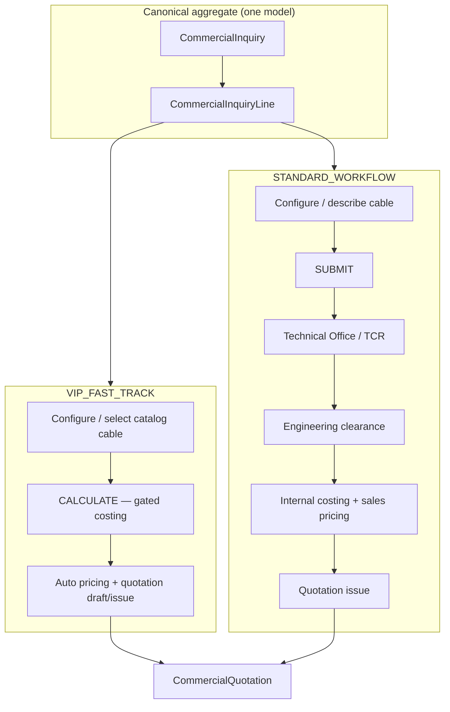
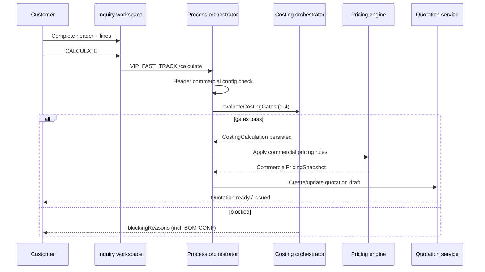
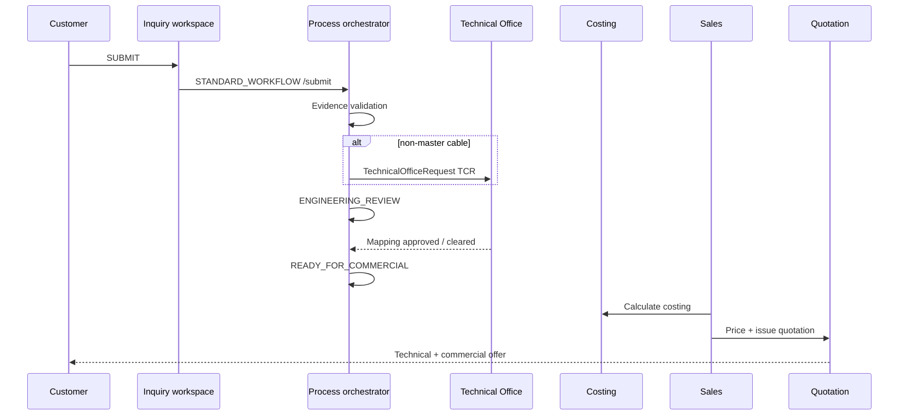
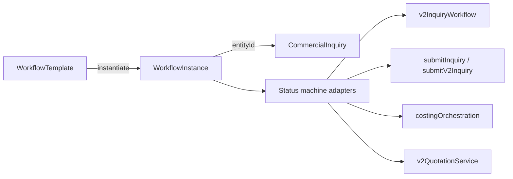
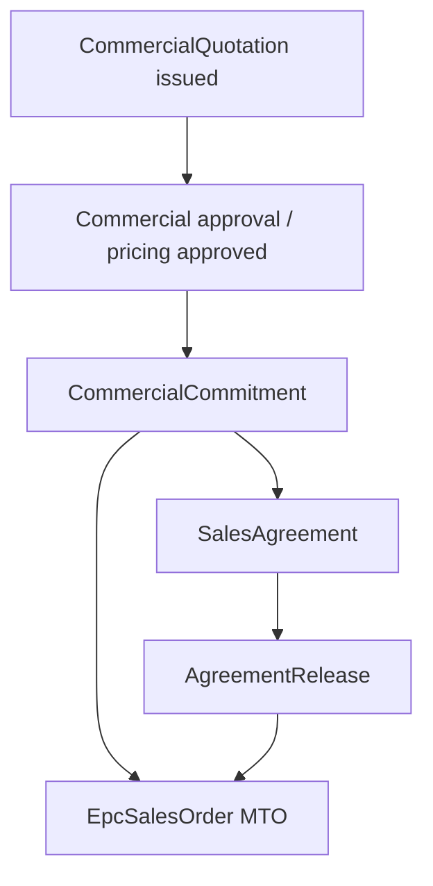
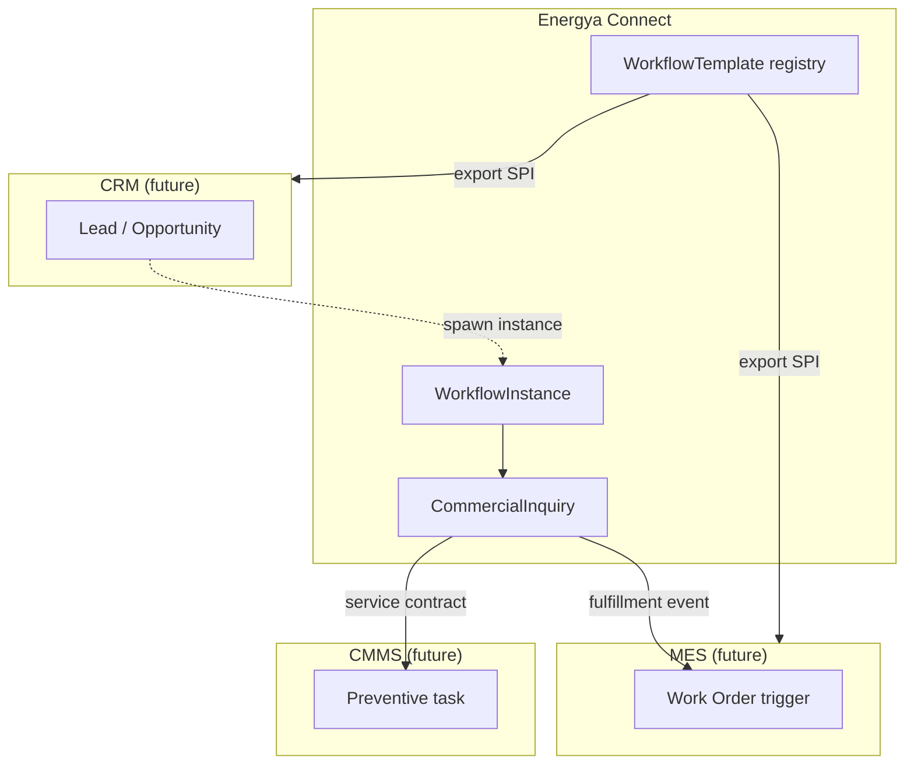

# TASK 05I — Inquiry Process & Configurable Workflow Architecture

**Date:** 2026-09-05  
**Mode:** ANALYSIS / DESIGN ONLY — no code, schema, migration, or API changes in this task  
**Base commits (reference):** `a04e871` (inquiry workspace restored), `53b0cf7` (05H commitment lineage), `ac360f9` (V2 configurator only)  
**Prior readiness:** 05B–05F (`docs/v2/35_*`, `TASK05C–F_READINESS.md`)  
**Status:** Architecture report — **PO decisions required before implementation**

---

## Executive summary

The platform already has **one canonical commercial document** (`CommercialInquiry` + `CommercialInquiryLine`) and a **partial V2 technical chain** (configuration snapshot → cutting plan → drum plan → costing → quotation preview). What is **missing** is an explicit **business-process layer** that distinguishes **VIP_FAST_TRACK** (customer Calculate → auto downstream) from **STANDARD_WORKFLOW** (Submit → Technical Office → Costing → Sales → Quotation) while both converge on the same quotation → commitment → fulfillment path.

Today, process behavior is **implicitly encoded** in:

| Signal | Current meaning |
|--------|-----------------|
| `commercialMetadata.workflowChannel = 'V2_CONFIGURATION'` | V2 configurator + V2 APIs — **not** VIP vs Standard |
| V1 `submitInquiry` | Requires pre-calculate + technical offer attachments → `SUBMITTED` |
| V2 `submitV2Inquiry` | Requires config snapshots → engineering review path |
| `canShowInquiryCalculate` / `canShowInquirySubmit` | UI gates on **status only** — no process profile |

**Recommendation:** Introduce a **Workflow Process Profile** (template + instance metadata) **without** new inquiry/line tables. Pin `inquiryProcessCode` on `CommercialInquiry.commercialMetadata` (phase 1) and evolve to `WorkflowInstance` rows (phase 2) when CRM/MES reuse is needed. Reuse restored `CommercialInquiryDetail` + `inquiryWorkspaceTabs` with **process-aware action resolver** (CALCULATE vs SUBMIT vs V2 configure).

**Hard blockers unchanged:** 81 BOM conflicts (Gate 2), Decision 5 unsigned, frozen `costingEngine`, Phase 1 fulfillment freeze, D365 not phase 1.

---

## Section index (A–AK)

| Sec | Topic |
|-----|-------|
| A | Purpose & scope |
| B | Canonical document model |
| C | Two business processes (not V1/V2 entities) |
| D | Current vs target discrimination |
| E | Prisma — CommercialInquiry |
| F | Prisma — CommercialInquiryLine |
| G | Prisma — V2 snapshot chain |
| H | Prisma — CostingRun & CostingCalculation |
| I | Prisma — CommercialPricingSnapshot |
| J | Prisma — CommercialQuotation |
| K | Prisma — TechnicalOfficeRequest / TCR |
| L | Prisma — Customer & assignment |
| M | Prisma — Fulfillment models |
| N | UI — CommercialInquiryDetail (restored workspace) |
| O | UI — inquiryWorkspaceTabs |
| P | UI — Customer portal |
| Q | Services — v2InquiryWorkflow |
| R | Services — costingEngine (read-only) |
| S | Services — v2Quotation |
| T | Services — commercialCommitment |
| U | Services — TCR / Technical Office |
| V | Infrastructure — notifications & email |
| W | Infrastructure — attachments |
| X | Infrastructure — RBAC & customerScope |
| Y | Infrastructure — AuditEvent & numbering |
| Z | Git / history notes (a04e871, pre-05B) |
| AA | Existing workflow / metadata models |
| AB | VIP_CALCULATE ↔ four costing gates |
| AC | STANDARD submit ↔ TCR mapping |
| AD | Non-standard cable without Cable Master corruption |
| AE | Configurable workflow engine — exists vs gaps |
| AF | Customer-to-process assignment |
| AG | Inquiry tabs — process-specific actions |
| AH | V2 lineage without replacing inquiry line |
| AI | Convergence — quotation → commitment → fulfillment |
| AJ | Frozen domains (do not modify) |
| AK | Open PO decisions & phasing |

---

## A. Purpose & scope

**In scope (05I):** Architecture for dual inquiry processes on the **existing** `CommercialInquiry` aggregate; workflow template/instance design; gap analysis across 25 investigation areas; mermaid flows; decision table; implementation phasing 05I-A–H.

**Out of scope:** Implementation, schema migrations, API routes, UI changes, BOM conflict resolution, Decision 5, costing engine edits, D365, fulfillment domain changes.

---

## B. Canonical document model

**Decision (locked for 05I):** ONE header + ONE line table for all processes.

```
CommercialInquiry (header, status, commercialMetadata, versioning)
  └── CommercialInquiryLine[] (cable identity, quantities, legacy + V2 pointers)
        ├── V2ConfigurationSnapshot[] (immutable config evidence)
        ├── V2CuttingLengthPlan[]
        ├── V2DrumPlan[]
        ├── CostingCalculation / CostingRun (engineering)
        └── CommercialInquiryLineAttachment[] (technical offer, etc.)
```

Quotations remain **downstream revisions**, not parallel inquiry roots (`docs/INQUIRY_QUOTATION_DOMAIN_MODEL.md` option B aligns with current Prisma).

**Anti-pattern rejected:** `VIP_Inquiry` / `Standard_Inquiry` tables or V1/V2 duplicate headers.

---

## C. Two business processes (not V1/V2 entities)

| Process code | Actor journey | Primary CTA | Internal handoffs |
|--------------|---------------|-------------|-------------------|
| **VIP_FAST_TRACK** | Trusted customer / pre-mapped cables | **CALCULATE** (then auto pricing + quotation draft) | Skip formal TO queue when `EXISTING_CABLE` + gates pass; optional sales review only |
| **STANDARD_WORKFLOW** | General customer / new configs | **SUBMIT** | Technical Office (TCR) → Engineering clearance → Costing → Sales → Quotation |

**Convergence point:** `CommercialQuotation` (technical + commercial offer) → `CommercialCommitment` → `EpcSalesOrder` / `SalesAgreement` (Phase 1 frozen).

**Clarification:** `workflowChannel = 'V2_CONFIGURATION'` describes **configuration technology** (V2 configurator snapshots). **Process** (`VIP_FAST_TRACK` | `STANDARD_WORKFLOW`) is orthogonal — a VIP customer may still use V2 configurator for non-catalog cables.

---

## D. Current vs target discrimination

| Layer | Today | Target |
|-------|-------|--------|
| Process identity | Not stored | `commercialMetadata.inquiryProcessCode` or `WorkflowInstance.processCode` |
| Channel / tech | `workflowChannel: 'V2_CONFIGURATION'` | Unchanged — tech channel |
| VIP Calculate path | V1 `calculateInquiryLineCost` + submit requires calc | VIP: Calculate triggers gated auto-chain; may bypass SUBMITTED wait |
| Standard Submit path | V1 submit + V2 submitV2Inquiry (different rules) | Unified submit validator per process profile |
| Quotation | V1 create + partial V2 (`v2QuotationService`) | Process-agnostic quotation issue with lineage pins (05F/05H) |

---

## E. Prisma — CommercialInquiry

**Model:** `prisma/schema.prisma` L685–725

| Field | Role |
|-------|------|
| `inquiryNumber` | V2: `INQ_COMMERCIAL` sequence; V1 legacy: stamp+random |
| `status` | `InquiryStatus` — V2 extended with `ENGINEERING_REVIEW`, `ENGINEERING_BLOCKED`, `READY_FOR_COMMERCIAL` |
| `commercialMetadata` | JSON — `workflowChannel`, metal rates, FX, `v2EngineeringSummary`; **candidate for `inquiryProcessCode`** |
| `versionNo`, `isCurrent`, `inquiryGroupKey` | Revision family |
| `customerMasterId` | FK to `Customer` (B2 isolation) |

**Gap:** No `inquiryProcessCode`, `workflowInstanceId`, or `processAssignedAt`.

---

## F. Prisma — CommercialInquiryLine

**Model:** L782–838

| Field group | VIP relevance | Standard relevance |
|-------------|---------------|-------------------|
| `materialNumber`, `cableDescription` | Fast path when mapped | May be null until TO maps |
| `configurationPayload` | Legacy V1 config | TO input |
| `cableAuthorityStatus`, `technicalOfficeRequestId` | Skip when `EXISTING_CABLE` | Required for `TECHNICALLY_VALID_NOT_MASTER` |
| `costingCalculationId`, `costingRunId`, `materialCost` | Post-CALCULATE pins | Post-TO + internal costing |
| `v2CurrentSnapshotId`, `v2CurrentCuttingPlanId`, `v2CurrentDrumPlanId` | V2 chain (optional on VIP if catalog cable uses legacy scalars) | Full V2 chain for configured cables |
| `cuttingLengthMeters`, `drumSchedule`, `drumType` | V1 legacy — still used by `buildCostingRequestFromInquiryLine` | Mutable until snapshotted |

**Design rule:** V2 pointers **augment** the line; they do not replace `CommercialInquiryLine` as the line SoT.

---

## G. Prisma — V2 snapshot chain

| Model | Immutability | Process notes |
|-------|--------------|---------------|
| `V2ConfigurationSnapshot` | Versioned append-only | Created on config save; TCR on `TECHNICALLY_VALID_NOT_MASTER` |
| `V2CuttingLengthPlan` | Versioned | VIP may auto-create from defaults when profile allows |
| `V2DrumPlan` | Versioned; `lifecycleStatus` includes CONFIRMED | VIP Calculate blocked until CONFIRMED (same as Standard) per 05E |

Downstream handoff: `DrumPlanHandoffDto` (`v2DrumPlanService`) — costing must consume CONFIRMED plan only.

---

## H. Prisma — CostingRun & CostingCalculation

| Model | Key lineage fields |
|-------|-------------------|
| `CostingRun` | `inquiryLineId`, `drumPlanId`, `configurationVersionId`, `blockingReasons` |
| `CostingCalculation` | `inputSnapshot`, `referenceSnapshot`, `outputSnapshot`, `configurationSnapshotId`, `cuttingLengthPlanId`, `drumPlanId`, `workflowChannel` |

**VIP mapping:** CALCULATE action = invoke orchestrator with process profile `autoPersist: true` and readiness bundle checks.

**Four gates** (frozen in `costingEngine.ts`): Engineering Approved → BOM Approved → RM Master → RM Price. VIP does **not** bypass gates; it bypasses **organizational** waits (TO queue, manual sales steps) when data already satisfies gates.

---

## I. Prisma — CommercialPricingSnapshot

Immutable commercial layer on `CommercialQuotationLine` (L1481–1518): frozen `materialCost`, rule snapshot, `finalSellingPrice`, optional `v2CostingCalculationId`, `drumPlanId`.

VIP_FAST_TRACK target: after successful CALCULATE, auto-invoke pricing preview persist (today `previewV2CommercialPricing` only — 05F gap).

---

## J. Prisma — CommercialQuotation

Shared header for V1/V2 (`CommercialQuotation` L1002+). V2 extensions (05F): `workflowChannel`, `issuedAt`, `inquirySnapshot`, `technicalOfferStatus`, `commercialOfferStatus`.

Lineage on lines: `v2ConfigurationSnapshotId`, `v2CuttingLengthPlanId`, `v2DrumPlanId`, `lineageSnapshot` JSON (05H).

Process profiles converge here — quotation code must branch on **readiness**, not on duplicate aggregates.

---

## K. Prisma — TechnicalOfficeRequest / TCR

**Model:** L459–475 — standalone `configuration` JSON, `requestNumber`, status strings.

**Linkage:** `CommercialInquiryLine.technicalOfficeRequestId` (string store of request number).

**Creation paths:**

1. V1 `addCommercialInquiryLine` — `createTechnicalOfficeRequest` when unmapped (`commercialRepository.ts` ~L386)
2. V2 `persistV2ConfigurationSnapshot` — TCR when `validationStatus === 'TECHNICALLY_VALID_NOT_MASTER'` (`v2InquiryConfigurationRepository.ts` ~L692–710)

**STANDARD_WORKFLOW:** Submit transitions inquiry to engineering states; TCR is the work queue for TO UI (`TechnicalOffice.tsx`, `TechnicalOfficeTcrQueue.tsx`).

**VIP_FAST_TRACK:** TCR created only when cable authority requires it; VIP does not eliminate TCR for true non-master configs.

---

## L. Prisma — Customer & assignment

**Model:** `Customer` L1700–1720 — `type` enum (`EPC_CUSTOMER`, `DISTRIBUTOR`, `UTILITY`, `OTHER`).

**Gap:** No `defaultInquiryProcessCode`, `customerGroupId`, or VIP flag.

**Assignment:** `CustomerUser` → exactly one active customer per commercial actor (`customerScope.ts`).

**Recommendation:** Add `Customer.commercialProcessProfile` (enum or FK to `WorkflowTemplate`) in a future migration — not Customer body/query override.

---

## M. Prisma — Fulfillment models

Phase 1 **frozen** (`docs/PHASE1_QUOTE_TO_CASH_FREEZE.md`):

- `CommercialCommitment` — `workflowChannel`, `inquiryId` (05H)
- `EpcSalesOrder` / `EpcSalesOrderLine` — snapshot scalars + `lineageSnapshot`
- `SalesAgreement` / `AgreementRelease`

Process choice affects **how fast** quotation is issued, not fulfillment mechanics.

---

## N. UI — CommercialInquiryDetail (restored workspace)

**File:** `src/components/inquiry-quotation/CommercialInquiryDetail.tsx` (restored in `a04e871`)

| Capability | State |
|------------|-------|
| Header form + summary bar | Live |
| Line grid + cable picker | Live |
| Calculate (V1 API) | `canShowInquiryCalculate` — DRAFT or UNDER_REVIEW |
| Submit (V1 API) | `canShowInquirySubmit` — DRAFT only |
| V2 tabs via `InquiryV2TabBridge` | When `isV2InquiryMetadata` |
| Quotation / fulfillment panels | Live (V1 + partial V2 quotation fetch) |

**Gap:** No `inquiryProcessCode`-aware CTA; V2 inquiries still expose V1 Calculate/Submit buttons unless gated separately.

---

## O. UI — inquiryWorkspaceTabs

**File:** `src/components/inquiry-quotation/inquiryWorkspaceTabs.ts`

| Audience | Tabs |
|----------|------|
| Internal canonical | overview, lines, costing, drum_plan, cutting, documents, quotation, activity |
| Customer portal | overview, lines, documents, quotation, activity |
| Extended internal | + technical_offer, notes, history, audit |

**Design:** `resolveInquiryWorkspaceTabs` should accept `processProfile` to hide VIP-internal tabs (e.g. skip engineering wait messaging) or show Calculate-first copy.

---

## P. UI — Customer portal

`CustomerInquiryDetail.tsx` wraps `CommercialInquiryDetail` with `portalMode="customer"`.

`customerInquiryJourneyService.ts` builds 9-stage journey (config → cutting → drum → engineering → commercial → quotation → commitment → fulfillment) — **maps to STANDARD_WORKFLOW**, not VIP.

`ElandProcessFlowDiagram.tsx` labels "VIP Customer Journey" in marketing copy but **no backend VIP process**.

**Target:** VIP portal shows shortened journey (Inquiry → Configure/Select → Calculate → Quotation) when profile dictates.

---

## Q. Services — v2InquiryWorkflow

**File:** `src/domain/v2InquiryWorkflow.ts`

- `V2_INQUIRY_STATUSES` + `ALLOWED_TRANSITIONS`
- `isV2InquiryMetadata()` — checks `workflowChannel === 'V2_CONFIGURATION'`
- `derivePostSubmitStatus()` — BOM / engineering → `ENGINEERING_BLOCKED` | `READY_FOR_COMMERCIAL` | `ENGINEERING_REVIEW`

**Repository:** `submitV2Inquiry`, `transitionV2InquiryEngineeringStatus` in `v2InquiryConfigurationRepository.ts`.

**Gap:** No process profile parameter on transitions; no VIP auto-advance to `READY_FOR_COMMERCIAL` after calculate.

---

## R. Services — costingEngine (read-only)

**Frozen** per `.cursor/rules/costing-v2-freeze.mdc`.

`evaluateCostingGates()` — Gate 1–4 blocking reasons.

VIP_CALCULATE must call existing orchestration (`costingOrchestrationService.executeCostingForInquiryLine` / V2 `v2CostingRunRepository`) — **no gate shortcuts**.

Commercial config (metal rates in header metadata) feeds Gate 4 via `inquiryMetalPricing` / `buildCostingRequestFromInquiryLine`.

---

## S. Services — v2Quotation

**Files:** `v2QuotationService.ts`, `v2QuotationRepository.ts`, `v2QuotationApiService.ts`

- `evaluateLineQuotationReadiness()` — stages: CREATE_DRAFT → PRICE → READY_FOR_APPROVAL → APPROVE → ISSUE
- BOM block + Decision 5 block on ISSUE
- `V2_QUOTATION_WORKFLOW_CHANNEL = 'V2_CONFIGURATION'`

VIP target: optional `autoCreateQuotationDraft` after pricing persist when profile allows.

---

## T. Services — commercialCommitment

**File:** `commercialCommitmentRepository.ts`

- `isV2IssuedQuotation()` — requires `workflowChannel` + `issuedAt`
- `buildLineageSnapshotFromQuotationLine()` — copies V2 pins to SO/agreement lines
- Phase 1 immutability rules frozen

Process-agnostic after quotation issue.

---

## U. Services — TCR / Technical Office

**Authority:** `evaluateCableAuthority()` (`cableAuthority.ts`) — `EXISTING_CABLE` | `TECHNICALLY_VALID_NOT_MASTER` | `INVALID_CONFIGURATION` | `CONFIGURATION_REQUIRED`.

Non-master valid configs never write to `CableMaster` directly; TO approval creates mapping workflow (`processMappingWorkflowAction`) — Increment 6/7 tests.

V2 snapshot stores config in `V2ConfigurationSnapshot.configInput` — **isolated from master**.

---

## V. Infrastructure — notifications & email

**File:** `notificationService.ts` — `notifyInquirySubmitted()` on V1 submit (SMTP optional).

**Gap:** No notification on VIP calculate-complete, engineering cleared, quotation issued, or V2 submit.

**Design:** Hook `WorkflowTransition` events to notification templates per process step.

---

## W. Infrastructure — attachments

- `CommercialInquiryAttachment` — header docs
- `CommercialInquiryLineAttachment` — `TECHNICAL_OFFER` kind required for V1 submit (`linesMissingTechnicalOffer`)
- `CableMasterAttachment` — copy-on-add to line

**VIP profile option:** Waive technical-offer attachment prerequisite when auto-generated technical bundle exists at quotation issue (05F target).

---

## X. Infrastructure — RBAC & customerScope

- `resolveCustomerScope(actor)` — never trust body `customerId`
- `assertCanAccessInquiryOwnership` on all inquiry mutations
- Costing: `COSTING / COSTING_RUN / CALCULATE` permission
- `commercialProjection.ts` — strips costs from customer views

**Process profiles** must not weaken isolation — VIP is not elevated cross-customer access.

---

## Y. Infrastructure — AuditEvent & numbering

| Mechanism | Usage |
|-----------|-------|
| `AuditEvent` | Generic entity audit |
| `appendAudit` / `appendServerAudit` | V1 vs V2 paths inconsistent on quotation |
| `NumberSequence` | `INQ_COMMERCIAL` for V2 inquiries; quotation still ad hoc `QUO-*` on V1 create |

**Workflow audit:** Each transition should log `processCode`, `fromStep`, `toStep`, `actorId`.

---

## Z. Git / history notes

**Referenced bases (per task brief):**

| Commit | Intended meaning |
|--------|------------------|
| `a04e871` | Inquiry workspace restored — `CommercialInquiryDetail`, `inquiryWorkspaceTabs`, tabbed UX |
| `53b0cf7` | 05H — commitment / quotation lineage pins |
| `ac360f9` | V2 configurator-only scope |

**Pre-05B inquiry history:** V1 `/api/inquiries` + `commercialRepository` remain live; V2 added parallel `/api/v2/inquiries` without replacing V1 routes (`docs/v2/35_V2_INQUIRY_CONFIGURATION_PERSISTENCE.md`).

**Observation:** Dual API surfaces must be unified at the **workflow orchestration** layer in implementation — not by merging routes prematurely.

---

## AA. Existing workflow / metadata models

| Asset | Exists? | Notes |
|-------|---------|-------|
| `WorkflowTemplate` / `WorkflowInstance` / `WorkflowStep` | **NO** | Conceptual only in `INQUIRY_QUOTATION_DOMAIN_MODEL.md` |
| `PlatformFieldDefinition` | **YES** | UI metadata overlay (`docs/v2/14_METADATA_FOUNDATION.md`) |
| `moduleRegistry` WORKFLOW module | **PARTIAL** | Invariant: "No generic free-form workflow engine in Task 02" |
| Entity status enums | **YES** | `InquiryStatus`, `InquiryLineStatus`, `QuotationStatus`, `PriceWorkflowStatus`, etc. |
| `v2InquiryWorkflow` transitions | **YES** | Hard-coded graph — template for process engine adapter |
| `effectiveAccess` workflow layer | **YES** | Record `workflowStatus` mutate guards |

**Conclusion:** Platform has **status machines**, not a **configurable workflow engine**. 05I should define templates that **compile to** existing enums + transition functions before introducing generic engine tables.

---

## AB. VIP_CALCULATE ↔ four costing gates + commercial config

### VIP_CALCULATE gating stack (recommended)

```text
1. Process profile = VIP_FAST_TRACK
2. Line readiness (per profile):
   - Catalog: materialNumber + EXISTING_CABLE OR valid V2 snapshot with catalogAuthoritative
   - Quantities + cutting + CONFIRMED drum plan (or profile waiver for single-cut catalog SKUs — PO decision)
3. Header commercial config complete (Cu/Al rates, destination, incoterms — reuse collectInquirySubmitMissingItems subset)
4. evaluateCostingGates (1–4) — HARD STOP
5. Persist CostingCalculation + CostingRun
6. Auto commercial pricing (if gates + Decision 5 policy allow)
7. Auto quotation DRAFT / issue per profile
```

### Mapping to existing gates

| Gate | VIP behavior | Standard behavior |
|------|--------------|-------------------|
| Gate 1 Engineering | Pass if `EXISTING_CABLE` / approved mapping | TO may be required first |
| Gate 2 BOM | **Blocked** if any `BOM-CONF-*` open — same | Same |
| Gate 3 RM Master | Required | Required |
| Gate 4 RM Price | Uses inquiry header metal + approved RM prices | Same; internal may override |

### Commercial config

Header `commercialMetadata` stores metal rates (Option B LME/base). `collectInquirySubmitMissingItems` already enforces Cu/Al/destination/incoterms — **reuse for VIP pre-CALCULATE validation**.

**VIP does not bypass:** 81 BOM conflicts, Decision 5 unsigned issue block, customer isolation.

---

## AC. STANDARD submit ↔ TCR mapping

### STANDARD_WORKFLOW submit pipeline

```text
Customer/Sales SUBMIT
  → Validate header (metal, destination, lines)
  → Per line: configuration evidence (V2 snapshot OR V1 configurationPayload)
  → If TECHNICALLY_VALID_NOT_MASTER → TechnicalOfficeRequest (TCR-INQ-*-L*)
  → Inquiry status: SUBMITTED → ENGINEERING_REVIEW → (ENGINEERING_BLOCKED | READY_FOR_COMMERCIAL)
  → Internal TO queues clear blocking → READY_FOR_COMMERCIAL
  → Internal costing + sales pricing
  → Quotation issue
```

### V1 vs V2 submit differences today

| Check | V1 `submitInquiry` | V2 `submitV2Inquiry` |
|-------|-------------------|----------------------|
| Costing calculated | **Required** | Not required |
| Technical offer attachment | **Required** | Not required |
| V2 snapshot | N/A | **Required** |
| Post-submit status | `SUBMITTED` | Engineering derivation |

**Unification recommendation:** `STANDARD_WORKFLOW` validator selects rule set by `workflowChannel` + line evidence type; single `POST .../submit` orchestrator delegates to profile handlers.

---

## AD. Non-standard cable without Cable Master corruption

**Principles (already partially implemented):**

1. **Never** insert unapproved config into `CableMaster` from inquiry persist.
2. Store intent in `configurationPayload` (V1) or `V2ConfigurationSnapshot.configInput` (V2).
3. `evaluateCableAuthority` classifies without mutating master.
4. `TECHNICALLY_VALID_NOT_MASTER` → `TechnicalOfficeRequest` + line `technicalOfficeRequestId`.
5. TO approval path promotes to governed mapping → then `EXISTING_CABLE`.

**VIP nuance:** VIP may allow Calculate only when authority is `EXISTING_CABLE` (or profile-listed allowlist SKUs). Non-master configs **fall back** to STANDARD_TO_REQUIRED sub-state.

---

## AE. Configurable workflow engine — exists vs gaps

### Exists

- Hard-coded transition maps (`v2InquiryWorkflow`, pricing/mapping `PriceWorkflowStatus`)
- Engineering derivation on submit
- Customer journey stage builder (UI-only)
- RBAC + workflow status guards in `effectiveAccess.ts`

### Missing

| Capability | Priority |
|------------|----------|
| `WorkflowTemplate` (processCode, steps[], transitions[], gates[]) | P0 design |
| `WorkflowInstance` (entityType, entityId, currentStepId, context JSON) | P1 |
| Admin UI to edit templates | P2 |
| CRM/MES template reuse | P3 |

### Recommended template shape (logical)

```typescript
interface WorkflowTemplate {
  processCode: 'VIP_FAST_TRACK' | 'STANDARD_WORKFLOW';
  version: number;
  steps: WorkflowStepDefinition[];
  transitions: WorkflowTransitionDefinition[];
  actionBindings: Record<string, 'CALCULATE' | 'SUBMIT' | 'ISSUE_QUOTATION'>;
}
```

**Runtime:** `WorkflowInstance` stores `templateCode`, `templateVersion`, `currentStep`, `completedSteps[]` — **references** `CommercialInquiry.id`.

---

## AF. Customer-to-process assignment

### Options

| Option | Pros | Cons |
|--------|------|------|
| A. `Customer.defaultProcessCode` | Simple | One process per customer |
| B. `CustomerGroup` + group profile | Supports Eland VIP group | New master entity |
| C. Rule engine (revenue, type, SKU) | Flexible | Overkill phase 1 |

**Recommendation (phase 1):** `Customer.commercialProcessProfile` nullable enum; default `STANDARD_WORKFLOW`; VIP customers explicitly set; fallback to STANDARD when null.

**Override:** Sales admin may switch process on inquiry header before first submit (audit required).

---

## AG. Inquiry tabs — process-specific actions

### Action matrix (target)

| Process | Primary CTA | Visible when | API |
|---------|-------------|--------------|-----|
| VIP_FAST_TRACK | **Calculate** | DRAFT + lines + header valid | V2 costing route if V2; V1 calculate if legacy |
| VIP_FAST_TRACK | View quotation | After auto-issue | V2 quotation GET |
| STANDARD_WORKFLOW | **Submit** | DRAFT + evidence complete | Unified submit |
| STANDARD_WORKFLOW | (wait) | SUBMITTED / ENGINEERING_* | Read-only customer |
| Both | Configure cable | DRAFT/SUBMITTED (customer) | V2 snapshot persist |

### Tab visibility

| Tab | VIP | Standard |
|-----|-----|----------|
| costing | After calculate | Internal only after READY_FOR_COMMERCIAL |
| drum_plan / cutting | Required pre-calculate | Required pre-submit |
| technical_offer | Auto/Hidden if waived | Required attachments |
| activity | Show workflow events | Show workflow events |

Implement via `resolveInquiryWorkspaceTabs({ processProfile, ... })` extension.

---

## AH. V2 lineage without replacing inquiry line

**Pattern:** `CommercialInquiryLine` remains mutable **pointer hub**; immutable evidence in child tables.

| Pointer on line | Immutable evidence |
|-----------------|-------------------|
| `v2CurrentSnapshotId` | `V2ConfigurationSnapshot` version chain |
| `v2CurrentCuttingPlanId` | `V2CuttingLengthPlan` |
| `v2CurrentDrumPlanId` | `V2DrumPlan` CONFIRMED |
| `costingCalculationId` | `CostingCalculation` + snapshots |
| Quotation line `lineageSnapshot` | Copy at issue (05H) |

**Rule:** Quotation/SO/agreement copies **pins + JSON snapshot**, never re-reads live master for issued docs.

Legacy scalars (`cuttingLengthMeters`, `drumSchedule`) remain for V1 backward compatibility — V2 path should treat them as **projections** from current plans for display only.

---

## AI. Convergence — quotation → commitment → fulfillment

Both processes merge at quotation readiness (`evaluateLineQuotationReadiness`):

```text
CommercialQuotation (issued)
  → commercialApprovalStatus + fulfillmentType (V1 path)
  → OR V2 issued + PRICING_APPROVED (v2 path)
  → CommercialCommitment
  → EpcSalesOrder (MTO) / SalesAgreement (release path)
```

`commercialCommitmentRepository` already discriminates V2 issued quotations — process-agnostic.

---

## AJ. Frozen domains (document only)

| Domain | Freeze source |
|--------|---------------|
| `costingEngine.ts` + tests | costing-v2-freeze.mdc, Decision 5 |
| BOM governance (81 conflicts) | 04B / Gate 2 |
| Drum Master / optimization internals | 05D readiness |
| V1 cable configurator | Task scope |
| Phase 1 fulfillment | PHASE1_QUOTE_TO_CASH_FREEZE.md |
| Audit model shape | `AuditEvent` |
| Customer isolation | CUSTOMER_ISOLATION.md |
| D365 | NOT phase 1 |

---

## AK. Open PO decisions & implementation phasing

### Open PO decisions

| ID | Question | Options |
|----|----------|---------|
| PO-1 | VIP requires CONFIRMED drum plan before CALCULATE? | A: Yes (strict 05E) / B: Waiver for single-cut catalog |
| PO-2 | VIP auto-issue quotation or stop at DRAFT? | A: DRAFT only / B: Auto-issue if pricing approved |
| PO-3 | Customer process assignment | A: Customer field / B: CustomerGroup |
| PO-4 | Unify V1/V2 submit endpoints? | A: Single orchestrator / B: Keep parallel during migration |
| PO-5 | Technical offer attachment for VIP | A: Waive when auto bundle / B: Always require upload |
| PO-6 | Workflow engine storage phase 1 | A: metadata JSON only / B: WorkflowInstance table immediately |
| PO-7 | STANDARD requires pre-calculate on submit? | A: V1 rules / B: Allow submit with snapshot only (V2 style) |

### Decision table

| Decision | Recommendation | Existing Support | Change Required | Risk | Approval Needed |
|----------|----------------|------------------|-----------------|------|-----------------|
| Single inquiry aggregate | Keep `CommercialInquiry` + lines | Full Prisma + APIs | None | Low | No |
| Process vs tech channel | Add `inquiryProcessCode` orthogonal to `workflowChannel` | `commercialMetadata` JSON | Metadata schema + validators | Medium | PO |
| VIP_FAST_TRACK | Customer CALCULATE-driven auto chain | V1 calculate + partial V2 costing | Workflow orchestrator, auto pricing/quote | High | Yes |
| STANDARD_WORKFLOW | SUBMIT → TO → commercial | V1+V2 submit, TCR | Unified submit validator | Medium | Yes |
| Costing gates for VIP | No bypass | `evaluateCostingGates` | Document + UX messaging | Low | No |
| BOM 81 block | No bypass | Gate 2 live | None until 04B-13 | High | Business |
| Decision 5 block on issue | Keep | `v2QuotationService` | None | Medium | Business |
| TCR for non-master | Mandatory | `createTechnicalOfficeRequest` | None | Low | No |
| Workflow templates | Introduce logical templates → compile to enums | Status machines only | New tables or JSON + service | Medium | PO-6 |
| Customer profile | `Customer.commercialProcessProfile` | `Customer.type` only | Migration + admin UI | Low | PO-3 |
| Inquiry tabs/actions | Process-aware resolver | `inquiryWorkspaceTabs.ts` | Extend API + UI | Medium | No |
| V2 lineage on line | Pointer + immutable children | 05B–05H models | Projection sync job optional | Low | No |
| Notifications | Per-transition templates | Submit only | `notificationService` extend | Low | No |
| Quotation numbering | `NumberSequence` QUO_COMMERCIAL | Ad hoc V1 | Seed sequence + wire create | Low | No |
| D365 | Out of scope | Placeholders only | None phase 1 | — | — |

### Implementation phasing

| Phase | ID | Deliverable | Depends on |
|-------|-----|-------------|------------|
| 1 | **05I-A** | Process codes in metadata + resolution service + tests | PO-3, PO-6 |
| 2 | **05I-B** | Unified submit orchestrator (STANDARD rules) | 05I-A |
| 3 | **05I-C** | VIP CALCULATE orchestrator (gates + auto pricing draft) | 05I-A, 05E costing boundary |
| 4 | **05I-D** | Process-aware UI actions + tab resolver | 05I-A, restored `CommercialInquiryDetail` |
| 5 | **05I-E** | `WorkflowTemplate` / `WorkflowInstance` Prisma (if PO-6=B) | 05I-A |
| 6 | **05I-F** | Customer admin assignment + audit | 05I-A, PO-3 |
| 7 | **05I-G** | Notification hooks per transition | 05I-B,C |
| 8 | **05I-H** | CRM/MES adapter SPI (read-only template export) | 05I-E |

---

## Diagrams

### 1. Common Inquiry + Two Processes



### 2. VIP Fast Track



### 3. Standard Workflow



### 4. Workflow Engine (target)



### 5. Inquiry → V2 → Costing → Quotation


### 6. Quotation → Commitment → Fulfillment



### 7. Future CRM / MES / CMMS reuse



---

## Files inspected (primary)

| Area | Path |
|------|------|
| Schema | `prisma/schema.prisma` |
| V2 workflow domain | `src/domain/v2InquiryWorkflow.ts` |
| V2 inquiry repo | `src/server/v2InquiryConfigurationRepository.ts` |
| V1 commercial repo | `src/server/commercialRepository.ts` |
| Costing engine | `src/domain/costingEngine.ts` |
| V2 costing | `src/domain/v2CostingRequestService.ts` |
| V2 quotation | `src/domain/v2QuotationService.ts` |
| Commitment | `src/server/commercialCommitmentRepository.ts` |
| Cable authority | `src/domain/cableAuthority.ts` |
| Inquiry UI | `src/components/inquiry-quotation/CommercialInquiryDetail.tsx` |
| Tabs | `src/components/inquiry-quotation/inquiryWorkspaceTabs.ts` |
| Customer journey | `src/services/customerInquiryJourneyService.ts` |
| Header/submit gates | `src/services/inquiryHeaderFormService.ts` |
| V2 tab bridge | `src/components/inquiry-quotation/InquiryV2TabBridge.tsx` |
| Notifications | `src/server/notificationService.ts` |
| Customer scope | `src/server/customerScope.ts` |
| Module registry | `src/platform/moduleRegistry.ts` |
| Docs | `docs/FINAL_INQUIRY_ARCHITECTURE.md`, `docs/INQUIRY_DOMAIN_MODEL.md`, `docs/v2/35_*`, `docs/v2/TASK05C–F_READINESS.md`, `docs/PHASE1_QUOTE_TO_CASH_FREEZE.md`, `docs/CUSTOMER_ISOLATION.md` |

---

## Confirmation

- **NO** application code changes were made in Task 05I.
- **NO** Prisma schema, migration, or API changes were made.
- **ONLY** deliverable created: `docs/v2/TASK05I_INQUIRY_PROCESS_WORKFLOW_ARCHITECTURE.md`
